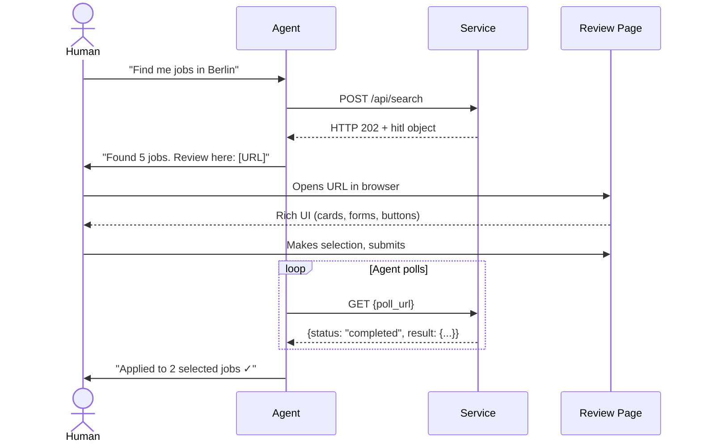

<p align="center">
  
</p>
<p align="center">
  <h1 align="center">HITL Protocol</h1>
  <p align="center">
    <strong>Human-in-the-Loop Protocol for Autonomous Agent Services</strong>
  </p>
  <p align="center">
    <a href="https://github.com/rotorstar/hitl-protocol/blob/main/LICENSE"></a>
    <a href="https://github.com/rotorstar/hitl-protocol/releases"></a>
    <a href="https://github.com/rotorstar/hitl-protocol/issues"></a>
    <a href="https://github.com/rotorstar/hitl-protocol/pulls"></a>
  </p>
</p>

---

**HITL Protocol** is to human decisions what OAuth is to authentication — a standardized three-party flow between **Agent**, **Service**, and **Human**.

When an autonomous agent (OpenClaw, Claude Code, Codex, Goose) calls a service API and the service needs a human decision — approval, selection, data entry, confirmation, or escalation — the service returns HTTP 202 with a `hitl` object containing a review URL. The agent forwards this URL to the human. The human opens it in a browser, interacts with a rich UI, and submits their decision. The agent retrieves the result by polling.

**No SDK required. No UI framework mandated. Just HTTP + URL + polling.**

## The Problem

Autonomous agents communicate with humans via text channels (Telegram, Slack, CLI). When a human decision is needed:

1. The agent dumps a wall of text describing options
2. The human types a freeform response ("option 2 please")
3. The agent parses unreliably
4. No forms, no buttons, no visual previews

This works for yes/no. It fails for selecting from 5+ options with rich details, providing structured input, reviewing complex artifacts, or multi-field forms.

## The Solution



## Quick Start

### For Service Implementors

Return HTTP 202 with a `hitl` object when human input is needed:

```json
{
  "status": "human_input_required",
  "message": "5 matching jobs found. Please select which ones to apply for.",
  "hitl": {
    "spec_version": "0.5",
    "case_id": "review_abc123",
    "review_url": "https://yourservice.com/review/abc123?token=K7xR2mN4pQ8sT1vW3xY5zA9bC...",
    "poll_url": "https://api.yourservice.com/v1/reviews/abc123/status",
    "type": "selection",
    "prompt": "Select which jobs to apply for",
    "timeout": "24h",
    "default_action": "skip",
    "created_at": "2026-02-22T10:00:00Z",
    "expires_at": "2026-02-23T10:00:00Z"
  }
}
```

### For Agent Implementors

Handle HTTP 202 responses — that's it:

```python
response = httpx.post("https://api.jobboard.com/search", json=query)

if response.status_code == 202:
    hitl = response.json()["hitl"]

    # 1. Forward URL to human
    send_to_user(f"{hitl['prompt']}\n{hitl['review_url']}")

    # 2. Poll for result
    while True:
        poll = httpx.get(hitl["poll_url"], headers=auth).json()
        if poll["status"] == "completed":
            result = poll["result"]  # structured data
            break
        if poll["status"] in ("expired", "cancelled"):
            break
        time.sleep(30)
```

No SDK. No library. No UI rendering. Just HTTP + URL forwarding + polling.

## Five Review Types

| Type | Actions | Use Case |
|------|---------|----------|
| **Approval** | approve, edit, reject | Artifact ready for review (CV, email draft, deployment plan) |
| **Selection** | select | Multiple options to choose from (job listings, candidates) |
| **Input** | submit | Missing data agent cannot infer (salary, dates, preferences) |
| **Confirmation** | confirm, cancel | Irreversible action imminent (send emails, deploy to prod) |
| **Escalation** | retry, skip, abort | Error or unexpected state (deployment failed, rate limit hit) |

## Three Transport Modes

| Transport | Agent needs public endpoint? | Real-time? | Complexity |
|-----------|:---:|:---:|:---:|
| **Polling** (default) | No | No | Minimal |
| **SSE** (optional) | No | Yes | Low |
| **Callback** (optional) | Yes | Yes | Medium |

Polling is the baseline. Every HITL-compliant service MUST support it. SSE and callbacks are optional enhancements.

## Protocol Standards Landscape

HITL Protocol fills a gap no existing standard addresses:

| Standard | What it solves | HITL Protocol's role |
|----------|---------------|---------------------|
| **SKILL.md** | How agents discover skills | HITL extends SKILL.md metadata |
| **A2A** (agent.json) | Agent-to-agent communication | HITL complements A2A's `input-required` |
| **MCP** | Agent tool/resource access | HITL handles complex UI that MCP Elicitation can't |
| **AG-UI** (CopilotKit) | Agent ↔ embedded frontend | HITL serves agents with no frontend (CLI, Telegram) |
| **OAuth 2.0** | User authentication | HITL follows the same three-party pattern |

## Repository Structure

```
protocol/hitl/
├── README.md                          ← You are here
├── LICENSE                            ← Apache 2.0
├── CONTRIBUTING.md                    ← How to contribute
├── CHANGELOG.md                       ← Version history
├── SECURITY.md                        ← Security reporting
│
├── spec/
│   └── v0.5/
│       └── hitl-protocol.md           ← Full specification (normative)
│
├── schemas/
│   ├── hitl-object.schema.json        ← JSON Schema: HITL object
│   └── poll-response.schema.json      ← JSON Schema: Poll response
│
├── examples/
│   ├── 01-job-search-selection.json   ← Selection flow
│   ├── 02-deployment-approval.json    ← Approval flow
│   ├── 03-content-review-edit.json    ← Multi-round approval
│   ├── 04-input-form.json            ← Input flow
│   ├── 05-confirmation-gate.json      ← Confirmation flow
│   ├── 06-escalation-error.json       ← Escalation flow
│   └── 07-well-known-hitl.json        ← Discovery endpoint example
│
├── agents/
│   └── checklist.md                   ← Agent implementation checklist
│
├── playground/
│   ├── index.html                     ← Interactive playground
│   └── README.md                      ← How to use the playground
│
├── implementations/
│   └── README.md                      ← Known implementations
│
└── .github/
    ├── ISSUE_TEMPLATE/
    │   ├── spec-change.md             ← Propose spec changes
    │   ├── bug-report.md              ← Report spec ambiguity
    │   └── implementation-report.md   ← Register an implementation
    └── PULL_REQUEST_TEMPLATE/
        └── default.md                 ← PR template
```

## Interactive Playground

<p align="center">
  <a href="https://rotorstar.github.io/hitl-protocol/playground/index.html">
    
  </a>
</p>
<p align="center">
  <a href="https://rotorstar.github.io/hitl-protocol/playground/index.html"><strong>Try the Interactive Playground →</strong></a>
</p>

## Versioning

The specification follows [Semantic Versioning](https://semver.org/). Breaking changes increment the major version. The `spec_version` field in all HITL objects enables forward compatibility.

| Version | Status | Date |
|---------|--------|------|
| 0.5 | Draft | 2026-02-22 |

## Contributing

We welcome contributions from anyone building autonomous agent systems. See [CONTRIBUTING.md](CONTRIBUTING.md) for guidelines.

**Ways to contribute:**
- Propose spec changes via [issues](https://github.com/rotorstar/hitl-protocol/issues)
- Submit implementations
- Improve examples and documentation
- Build reference implementations in new languages
- Report ambiguities or edge cases

## Adopters

Building with HITL Protocol? [Open an issue](https://github.com/rotorstar/hitl-protocol/issues/new?template=implementation-report.md) to be listed here.

| Implementation | Language | Transport | Status |
|----------------|----------|-----------|--------|
| — | — | — | *Be the first to add your implementation!* |

## License

Apache License 2.0 — see [LICENSE](LICENSE) for details.

## Links

- [Full Specification (v0.5)](spec/v0.5/hitl-protocol.md)
- [JSON Schemas](schemas/)
- [Examples](examples/)
- [Interactive Playground](playground/)
- [Agent Implementation Checklist](agents/checklist.md)

---

*HITL Protocol is an open standard. Contributions, feedback, and implementations are welcome.*

*Copyright 2026 Torsten Heissler. Licensed under Apache License 2.0.*
