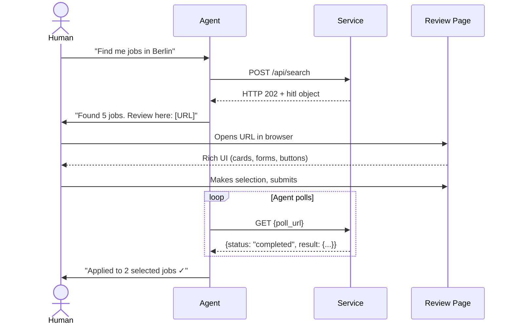
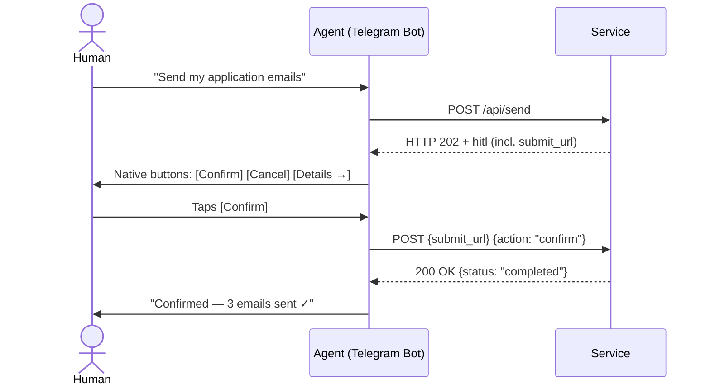
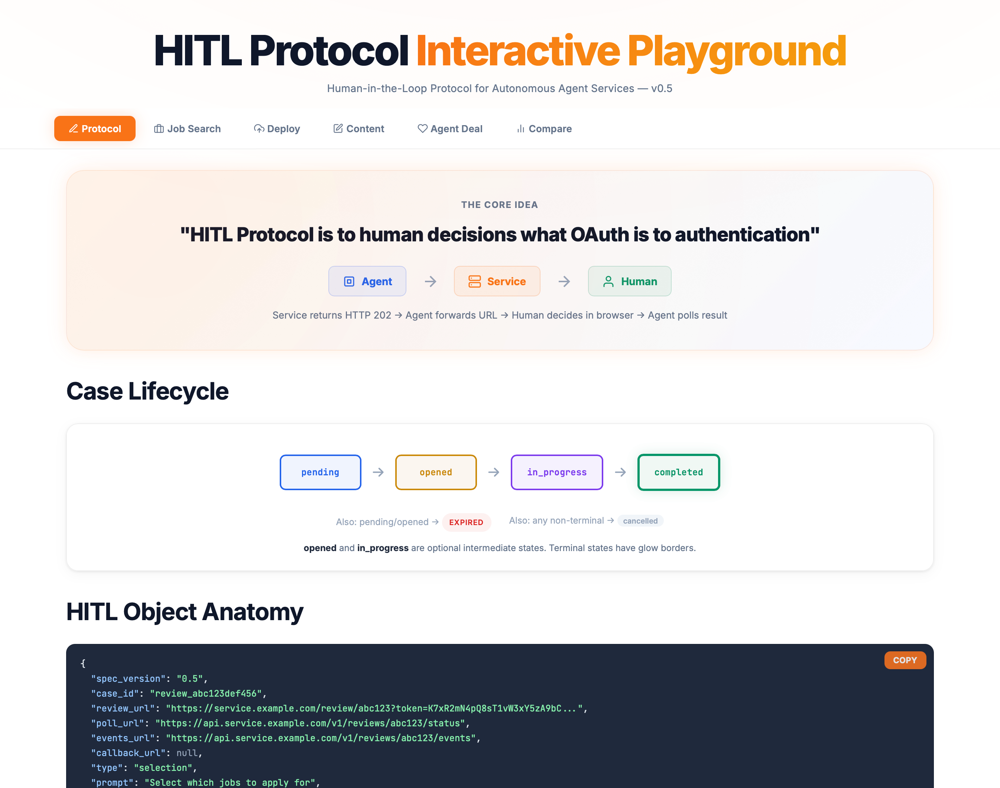

<p align="center">
  
</p>
<p align="center">
  <h1 align="center">HITL Protocol</h1>
  <p align="center">
    <strong>The Open Standard for Human Decisions in Agent Workflows</strong>
  </p>
  <p align="center">
    <a href="https://github.com/rotorstar/hitl-protocol/blob/main/LICENSE"></a>
    <a href="https://github.com/rotorstar/hitl-protocol/releases"></a>
    <a href="https://github.com/rotorstar/hitl-protocol/issues"></a>
    <a href="https://github.com/rotorstar/hitl-protocol/pulls"></a>
  </p>
</p>

---

You run a website or service, and you know that AI agents will increasingly visit it on behalf of their users: searching, booking, applying, purchasing. But some decisions should not be left to an agent alone. An agent can hallucinate, misinterpret, or make the wrong call at a critical moment — cancel the wrong insurance policy, book a non-refundable trip to the wrong city, wire money to the wrong account. HITL Protocol ("Human in the Loop") is an open standard that puts you in control of these moments. Your users stay in their favorite messenger — Telegram, WhatsApp, Slack. They either tap a decision button right there or follow a link to a web page with a comfortable UI: cards, forms, buttons. No wall of text. No blind agent decisions. Honest, transparent communication in everyone's interest.

**HITL Protocol** is to human decisions what OAuth is to authentication — an open standard connecting **Services**, **Agents**, and **Humans**.

Any website or API integrates HITL to become agent-ready: when human input is needed, return HTTP 202 with a review URL. Any autonomous agent (OpenClaw, Claude Code, Codex, Goose) handles the `hitl` response — forward the URL, poll for the result. The human opens the URL, gets a rich browser UI (not a chat wall of text), and makes an informed decision.

**No SDK required. No UI framework mandated. Just HTTP + URL + polling.**

## Who Is This For?

**For Services & Websites** — Add HITL endpoints to make your service accessible to any autonomous agent. You host the review page, you control the UI, you own the data. Sensitive information stays in the browser — never passes through the agent. This repository includes [reference implementations](implementations/reference-service/) in 4 frameworks (Express, Hono, Next.js, FastAPI), [HTML templates](templates/) for all review types, an [OpenAPI spec](schemas/openapi.yaml), and [compliance tests](tests/) — everything needed to integrate.

**For Agent Developers** — Handle HTTP 202 responses. Forward the review URL to your user via any channel (CLI, Telegram, Slack, WhatsApp) — or render native messaging buttons for simple decisions (Telegram, Slack, Discord, WhatsApp, Teams). Poll for the structured result. No SDK, no UI rendering, no framework dependency. ~15 lines of code.

**For Humans** — Instead of typing "option 2" in a chat, you get a real web page: cards to browse, forms to fill, buttons to click, artifacts to review. Your decision is structured, validated, and auditable.

## The Gap

**For agents:** Text channels are terrible for complex decisions. Walls of text, freeform parsing, no structured input.

**For services:** There's no standard way to request human input from an agent. Every agent framework has its own mechanism — or none at all. Your service either builds custom integrations or stays invisible to AI agents.

**For humans:** You're either excluded from agent workflows entirely, or squeezed through text-only channels.

**HITL Protocol closes this gap** with one standardized flow that works across all services, all agents, and all messaging channels.

## The Solution

<p align="center">
  <a href="https://rotorstar.github.io/hitl-protocol/hitl-protocol-flow.html">
    
  </a>
  <br>
  <a href="https://rotorstar.github.io/hitl-protocol/hitl-protocol-flow.html">▶ Interactive Flow durchspielen</a>
</p>



For simple decisions (confirm/cancel, approve/reject), agents can render **native messaging buttons** directly in the chat — no browser switch needed:



## Quick Start

### For Service Implementors

Return HTTP 202 with a `hitl` object when human input is needed:

```json
{
  "status": "human_input_required",
  "message": "5 matching jobs found. Please select which ones to apply for.",
  "hitl": {
    "spec_version": "0.7",
    "case_id": "review_abc123",
    "review_url": "https://yourservice.com/review/abc123?token=K7xR2mN4pQ8sT1vW3xY5zA9bC...",
    "poll_url": "https://api.yourservice.com/v1/reviews/abc123/status",
    "type": "selection",
    "prompt": "Select which jobs to apply for",
    "timeout": "24h",
    "default_action": "skip",
    "created_at": "2026-02-22T10:00:00Z",
    "expires_at": "2026-02-23T10:00:00Z"
  }
}
```

### For Agent Implementors

Handle HTTP 202 responses — that's it:

```python
response = httpx.post("https://api.jobboard.com/search", json=query)

if response.status_code == 202:
    hitl = response.json()["hitl"]

    # v0.7: Check for inline submit support
    if "submit_url" in hitl and "submit_token" in hitl:
        # Render native buttons in messaging platform (Telegram, Slack, Discord)
        send_inline_buttons(hitl["prompt"], hitl["inline_actions"], hitl["review_url"])
        # When human taps button → POST to submit_url (see Agent Integration Guide)
    else:
        # Standard flow: forward URL to human
        send_to_user(f"{hitl['prompt']}\n{hitl['review_url']}")

    # Poll for result (standard flow or fallback)
    while True:
        poll = httpx.get(hitl["poll_url"], headers=auth).json()
        if poll["status"] == "completed":
            result = poll["result"]  # structured data
            break
        if poll["status"] in ("expired", "cancelled"):
            break
        time.sleep(30)
```

No SDK. No library. No UI rendering. Just HTTP + URL forwarding + polling.

**Ready to integrate?** This repository provides everything you need: [reference implementations](implementations/reference-service/) in 4 frameworks (Express 5, Hono, Next.js, FastAPI), [HTML review templates](templates/) for all 5 types, an [OpenAPI 3.1 spec](schemas/openapi.yaml), [JSON Schemas](schemas/) for validation, and [compliance test suites](tests/) in Node.js and Python.

## Five Review Types

| Type | Actions | Multi-round | Form Fields | Use Case |
|------|---------|:-----------:|:-----------:|----------|
| **Approval** | approve, edit, reject | Yes | No | Artifact review (CV, deployment plan) |
| **Selection** | select | No | No | Choose from options (job listings) |
| **Input** | submit | No | Yes | Structured data entry (salary, dates) |
| **Confirmation** | confirm, cancel | No | No | Irreversible action gate (send emails) |
| **Escalation** | retry, skip, abort | No | No | Error recovery (deployment failed) |

**Input forms** support structured field definitions via `context.form` — including typed fields (text, number, date, select, range, ...), validation rules, conditional visibility, and multi-step wizard flows. See [Spec Section 10.3](spec/v0.7/hitl-protocol.md#103-input) for details.

**Multi-round workflows:** Approval reviews support iterative cycles — submit, request edits, resubmit, approve. Agents can chain multiple HITL interactions for complex multi-step processes (see `previous_case_id` / `next_case_id` in the [spec](spec/v0.7/hitl-protocol.md)).

## Three Transport Modes

| Transport | Agent needs public endpoint? | Real-time? | Complexity |
|-----------|:---:|:---:|:---:|
| **Polling** (default) | No | No | Minimal |
| **SSE** (optional) | No | Yes | Low |
| **Callback** (optional) | Yes | Yes | Medium |

Polling is the baseline. Every HITL-compliant service MUST support it. SSE and callbacks are optional enhancements.

## Channel-Native Inline Actions (v0.7)

For simple decisions, agents can render **native messaging buttons** instead of sending a URL. The human taps a button directly in the chat — no browser switch needed.

**How it works:** The service includes `submit_url` + `submit_token` in the HITL object. The agent detects these fields and renders platform-native buttons. When the human taps a button, the agent POSTs the action to `submit_url`.

| Review type | Inline possible? | Reason |
|-------------|:----------------:|--------|
| **Confirmation** | Yes | 2 buttons: Confirm / Cancel |
| **Escalation** | Yes | 3 buttons: Retry / Skip / Abort |
| **Approval** (simple) | Yes | 2 buttons: Approve / Reject |
| **Selection** | URL only | Needs list/cards UI |
| **Input** | URL only | Needs form fields |

Always include a URL fallback button (e.g. "Details →") linking to `review_url` — the human can always switch to the full review page. See [Agent Integration Guide](skills/references/agent-integration.md) for platform-specific rendering patterns (Telegram, Slack, Discord, WhatsApp, Teams).

## Protocol Standards Landscape

HITL Protocol fills a gap no existing standard addresses:

| Standard | What it solves | HITL Protocol's role |
|----------|---------------|---------------------|
| **SKILL.md** | How agents discover skills | HITL extends SKILL.md metadata |
| **A2A** (agent.json) | Agent-to-agent communication | HITL complements A2A's `input-required` |
| **MCP** | Agent tool/resource access | HITL handles complex UI that MCP Elicitation can't |
| **AG-UI** (CopilotKit) | Agent ↔ embedded frontend | HITL serves agents with no frontend (CLI, Telegram) |
| **OAuth 2.0** | User authentication | HITL follows the same three-party pattern |

## Repository Structure

```
hitl-protocol/
├── README.md                          ← You are here
├── SKILL.md                           ← Agent skill (protocol knowledge)
├── LICENSE                            ← Apache 2.0
├── CONTRIBUTING.md                    ← How to contribute
├── CHANGELOG.md                       ← Version history
├── SECURITY.md                        ← Security reporting
│
├── spec/v0.7/
│   └── hitl-protocol.md              ← Full specification (normative)
│
├── schemas/
│   ├── hitl-object.schema.json       ← JSON Schema: HITL object
│   ├── poll-response.schema.json     ← JSON Schema: Poll response
│   ├── form-field.schema.json        ← JSON Schema: Form field definitions
│   └── openapi.yaml                  ← OpenAPI 3.1 spec (all endpoints)
│
├── examples/                          ← 12 end-to-end example flows
│
├── templates/                         ← Review page HTML templates
│   ├── approval.html                 ← Approval review page
│   ├── selection.html                ← Selection review page
│   ├── input.html                    ← Input form (multi-step wizard)
│   ├── confirmation.html             ← Confirmation review page
│   └── escalation.html              ← Escalation review page
│
├── implementations/
│   ├── README.md                     ← Known implementations
│   └── reference-service/            ← Reference implementations
│       ├── express/                  ← Express 5 (Node.js)
│       ├── hono/                     ← Hono (Edge/Deno/Bun)
│       ├── nextjs/                   ← Next.js App Router (TypeScript)
│       └── python/                   ← FastAPI (Python)
│
├── docs/
│   ├── quick-start.md                ← Quick Start Guide (5 frameworks)
│   └── sdk-guide.md                  ← SDK Design Guide
│
├── tests/                             ← Compliance test suites
│   ├── node/                         ← Vitest (schema + state machine)
│   └── python/                       ← pytest (schema + state machine)
│
├── agents/
│   └── checklist.md                  ← Agent implementation checklist
│
├── skills/
│   ├── README.md                     ← Skill publishing guide
│   └── references/                   ← Detailed integration guides
│       ├── service-integration.md   ← For service builders
│       └── agent-integration.md     ← For agent developers
│
├── playground/
│   └── index.html                    ← Interactive playground
│
└── .github/                           ← Issue + PR templates
```

## Interactive Playground

<p align="center">
  <a href="https://rotorstar.github.io/hitl-protocol/playground/index.html">
    
  </a>
</p>
<p align="center">
  <a href="https://rotorstar.github.io/hitl-protocol/playground/index.html"><strong>Try the Interactive Playground →</strong></a>
</p>

## Versioning

The specification follows [Semantic Versioning](https://semver.org/). Breaking changes increment the major version. The `spec_version` field in all HITL objects enables forward compatibility.

| Version | Status | Date |
|---------|--------|------|
| 0.7 | Draft | 2026-02-24 |
| 0.6 | Draft | 2026-02-23 |
| 0.5 | Draft | 2026-02-22 |

## Contributing

We welcome contributions from anyone building autonomous agent systems. See [CONTRIBUTING.md](CONTRIBUTING.md) for guidelines.

**Ways to contribute:**
- Propose spec changes via [issues](https://github.com/rotorstar/hitl-protocol/issues)
- Submit implementations
- Improve examples and documentation
- Build reference implementations in new languages
- Report ambiguities or edge cases

## Adopters

Building with HITL Protocol? [Open an issue](https://github.com/rotorstar/hitl-protocol/issues/new?template=implementation-report.md) to be listed here.

| Implementation | Language | Transport | Status |
|----------------|----------|-----------|--------|
| — | — | — | *Be the first to add your implementation!* |

## License

Apache License 2.0 — see [LICENSE](LICENSE) for details.

## Links

- [Full Specification (v0.7)](spec/v0.7/hitl-protocol.md)
- [Quick Start Guide](docs/quick-start.md) — Get started in 5 minutes
- [OpenAPI Spec](schemas/openapi.yaml) — All endpoints documented
- [JSON Schemas](schemas/) — HITL object, poll response, form field definitions
- [Review Page Templates](templates/) — HTML templates for all 5 review types
- [Reference Implementations](implementations/reference-service/) — Express, Hono, Next.js, FastAPI
- [Examples](examples/) — 12 end-to-end flows (incl. inline confirmation, escalation, hybrid approval)
- [Compliance Tests](tests/) — Schema + state machine tests (Node.js + Python)
- [Interactive Playground](playground/)
- [Agent Implementation Checklist](agents/checklist.md)
- [Agent Skill (SKILL.md)](SKILL.md) — Teach agents the HITL Protocol
- [SDK Design Guide](docs/sdk-guide.md) — Build a community SDK

---

*HITL Protocol is an open standard. Contributions, feedback, and implementations are welcome.*

*Copyright 2026 Torsten Heissler. Licensed under Apache License 2.0.*
