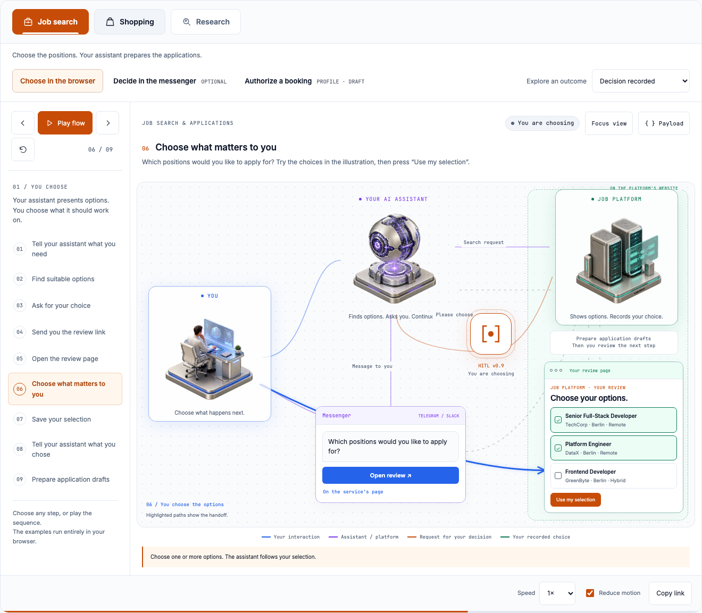
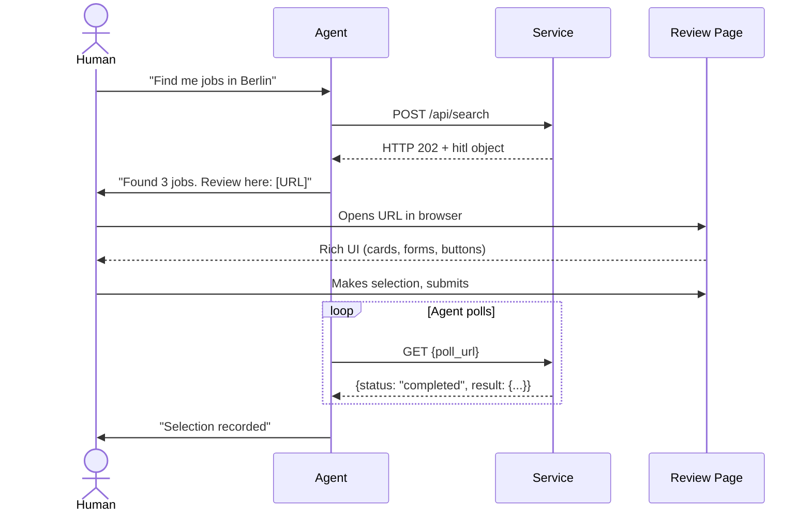
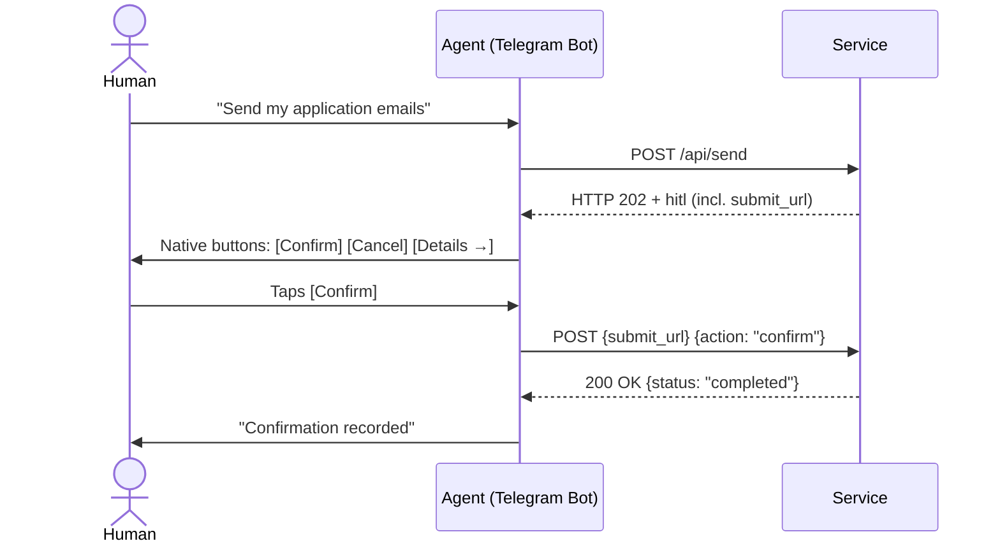
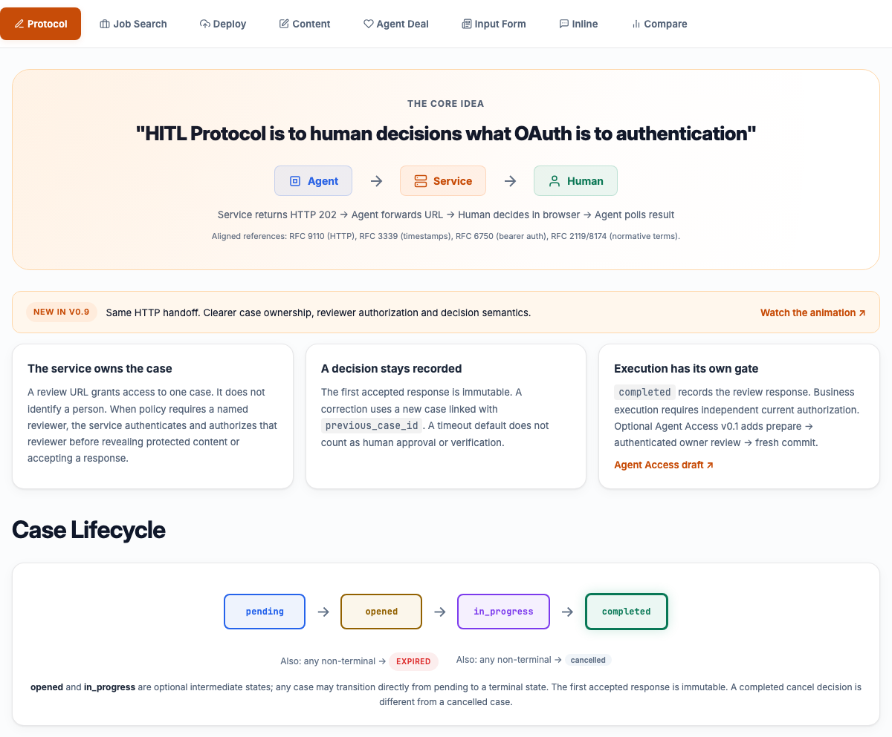

<p align="center">
  
</p>
<p align="center">
  <h1 align="center">HITL Protocol</h1>
  <p align="center">
    <strong>The Open Standard for Human Decisions in Agent Workflows</strong>
  </p>
  <p align="center">
    <a href="https://github.com/rotorstar/hitl-protocol/blob/main/LICENSE"></a>
    <a href="https://github.com/rotorstar/hitl-protocol/releases"></a>
    <a href="https://github.com/rotorstar/hitl-protocol/issues"></a>
    <a href="https://github.com/rotorstar/hitl-protocol/pulls"></a>
  </p>
</p>

---

You run a website or service, and you know that AI agents will increasingly visit it on behalf of their users: searching, booking, applying, purchasing. But some decisions should not be left to an agent alone. An agent can hallucinate, misinterpret, or make the wrong call at a critical moment — cancel the wrong insurance policy, book a non-refundable trip to the wrong city, wire money to the wrong account. HITL Protocol ("Human in the Loop") is an open standard that puts you in control of these moments. Your users stay in their favorite messenger — Telegram, WhatsApp, Slack. They either tap a decision button right there or follow a link to a web page with a comfortable UI: cards, forms, buttons. No wall of text. No blind agent decisions. Honest, transparent communication in everyone's interest.

**HITL Protocol** is to human decisions what OAuth is to authentication — an open standard connecting **Services**, **Agents**, and **Humans**.

Any website or API integrates HITL to become agent-ready: when human input is needed, return HTTP 202 with a review URL. Any autonomous agent (OpenClaw, Claude Code, Codex, Goose) handles the `hitl` response — forward the URL, poll for the result. The human opens the URL, gets a rich browser UI (not a chat wall of text), and makes an informed decision.

**No SDK required. No UI framework mandated. Just HTTP + URL + polling.**

**Current contract: [HITL v0.9](spec/v0.9/hitl-protocol.md).** Default schema-package imports select v0.9; explicit `/v0.8` imports preserve historical consumers. Existing HTTP/MCP demos, templates and end-to-end example JSON remain explicitly v0.8 demonstrations.

The optional [Agent Access profile](profiles/agent-access/v0.1/README.md) connects verified initiator, bounded delegation, immutable business operation, owner review and explicit execution. Its [persistent reference service](implementations/agent-access/README.md) implements public signed catalogue reads, real OAuth/DPoP enrollment, browser review, PostgreSQL transactions and local bookings. Public identity, user authorization and human decision remain separate. Both v0.9 and the profile are drafts; broad provider acceptance is not implied.

HITL is deliberately **not** a frontend framework or embedded UI protocol. It standardizes the decision handoff between service, agent, and human. Optional declarative surface interoperability lives in separate profiles above the core, and `review_url` remains the required fallback.

Built on established Internet standards: [RFC 9110](https://www.rfc-editor.org/rfc/rfc9110) (HTTP semantics), [RFC 3339](https://www.rfc-editor.org/rfc/rfc3339) (timestamps), [RFC 6750](https://www.rfc-editor.org/rfc/rfc6750) (auth), [RFC 2119](https://www.rfc-editor.org/rfc/rfc2119) (normative language).

## Who Is This For?

**For Services & Websites** — Add HITL endpoints to request human input from an agent. You host the review page and control which fields appear in agent-visible results. Sensitive input requires an explicit data-disclosure policy: structured review results can contain human-entered data. This repository includes [local reference demonstrations](implementations/reference-service/) in 4 frameworks (Express, Hono, Next.js, FastAPI), [HTML templates](templates/), [OpenAPI](schemas/openapi.yaml), and [compliance tests](tests/).

**For Agent Developers** — Handle HTTP 202 responses. Forward the review URL to your user via any channel (CLI, Telegram, Slack, WhatsApp) — or render native messaging buttons for simple decisions (Telegram, Slack, Discord, WhatsApp, Teams). Poll for the structured result. No SDK, no UI rendering, no framework dependency. ~15 lines of code.

**For Humans** — Instead of typing "option 2" in a chat, you get a real web page: cards to browse, forms to fill, buttons to click, artifacts to review. Your decision is structured, validated, and auditable.

## The Gap

**For agents:** Text channels are terrible for complex decisions. Walls of text, freeform parsing, no structured input.

**For services:** There's no standard way to request human input from an agent. Every agent framework has its own mechanism — or none at all. Your service either builds custom integrations or stays invisible to AI agents.

**For humans:** You're either excluded from agent workflows entirely, or squeezed through text-only channels.

**For regulated workflows:** The EU AI Act includes [human-oversight requirements for high-risk systems (Article 14)](https://ai-act-service-desk.ec.europa.eu/en/ai-act/article-14). Under the [updated application timeline](https://digital-strategy.ec.europa.eu/en/news/ai-omnibus-enters-force), the relevant high-risk rules apply from **2 December 2027** for Annex III systems and **2 August 2028** for Annex I product systems. A service-owned HITL case can record the structured decision and its timestamp; identifying the reviewer requires the service's authentication and authorization policy.

**HITL Protocol closes this gap** with one standardized flow that works across all services, all agents, and all messaging channels.

## "Don't agents already have approvals?"

Yes — for **their own actions**. OpenClaw asks before running a dangerous command. Hermes Agent has `/approve` and `/deny`. LangGraph has `interrupt()`. OpenAI's Agents SDK can pause a tool call. All of these gate what the *agent itself* is about to do, inside that one framework.

HITL Protocol answers a different question: **how does a service the agent calls request a structured decision from the human?** A job board that found 5 matches. A bank that needs explicit confirmation. A deployment service that wants a plan reviewed. None of the framework-internal mechanisms reach that far — and none of them are portable across agents.

| | Framework approvals (OpenClaw, Hermes, LangGraph, …) | HITL Protocol |
|---|---|---|
| **Who asks?** | The agent, about its own tool call | The service, about its own domain decision |
| **Decision shape** | Approve / deny | 5 typed review flows with structured, validated results |
| **UI** | Chat prompt | Service-hosted review page + native buttons |
| **Portability** | Locked to one framework | Any agent, plain HTTP |
| **Where the state lives** | Agent context / prompt | Service-side protocol state |

That last row matters more than it looks. Prompt-based instructions can be compacted, drowned out, or forgotten. A HITL case stores the review decision on the service side, independently of the agent's context window. The service must still enforce its separate business authorization and execution boundary; `completed` records a decision, not an executed action.

The same applies to MCP's newer plumbing: URL-mode elicitation and the 2026-07-28 Tasks extension (`input_required` + polling) standardize how an *MCP server* hands a pending decision to *its* client — inside one MCP session. HITL standardizes that moment at the open HTTP layer, for any agent with or without MCP, and defines the typed decision behind the URL.

Use both: let your agent runtime gate its own dangerous actions, and let services request human decisions via HITL. See the [approval-mechanism landscape](docs/feature-matrix.md#approval-mechanism-landscape) for the full comparison.

## The Solution

<p align="center">
  <a href="https://rotorstar.github.io/hitl-protocol/assets/hitl-protocol-flow.html#story=jobs&amp;flow=browser&amp;step=6">
    <picture>
      <source media="(prefers-color-scheme: dark)" srcset="assets/hitl-flow-v0.9-preview-dark.png">
      
    </picture>
  </a>
  <br>
  <a href="https://rotorstar.github.io/hitl-protocol/assets/hitl-protocol-flow.html#story=jobs&amp;flow=browser&amp;step=6">▶ Explore the v0.9 Interactive Architecture</a>
</p>

Choose **Job search**, **Shopping** or **Research** in the horizontal tabs, then explore **browser review**, **optional inline decisions**, and the **Agent Access prepare → review → commit** flow across 29 outcome variants. The animated architecture includes an optional payload inspector, shareable steps, keyboard controls, light/dark themes, and reduced motion. [Screenshots and feature comparison](docs/animation-review/README.md).

The preview shows the current job-selection step. Choose positions, save the selection and continue to application drafts; sending requires a separate confirmation. The examples run locally in the browser with illustrative data. The animation and playground share their orange/slate palette and locally bundled Inter / JetBrains Mono fonts.


```mermaid
sequenceDiagram
    actor H as Human
    participant A as Agent
    participant S as Service
    participant P as Review Page

    H->>A: "Find me jobs in Berlin"
    A->>S: POST /api/search
    S-->>A: HTTP 202 + hitl object
    A->>H: "Found 3 jobs. Review here: [URL]"
    H->>P: Opens URL in browser
    P-->>H: Rich UI (cards, forms, buttons)
    H->>P: Makes selection, submits
    loop Agent polls
        A->>S: GET {poll_url}
        S-->>A: {status: "completed", result: {...}}
    end
    A->>H: "Selection recorded"
```

For simple decisions (confirm/cancel, approve/reject), agents can render **native messaging buttons** directly in the chat — no browser switch needed:


```mermaid
sequenceDiagram
    actor H as Human
    participant A as Agent (Telegram Bot)
    participant S as Service

    H->>A: "Send my application emails"
    A->>S: POST /api/send
    S-->>A: HTTP 202 + hitl (incl. submit_url)
    A->>H: Native buttons: [Confirm] [Cancel] [Details →]
    H->>A: Taps [Confirm]
    A->>S: POST {submit_url} {action: "confirm"}
    S-->>A: 200 OK {status: "completed"}
    A->>H: "Confirmation recorded"
```

## Quick Start

`completed` records the review decision. Business execution follows the service's separate authorization contract. The Agent Access profile requires an explicit, freshly authorized commit and does not offer inline submission.

### For Service Implementors

Return HTTP 202 with a v0.9 `hitl` object when human input is needed. This illustrative response describes a selection review; the service hosts the page and authorizes the reviewer when its policy requires it:

```json
{
  "status": "human_input_required",
  "message": "3 matching jobs found. Please select which ones to apply for.",
  "hitl": {
    "spec_version": "0.9",
    "case_id": "review_abc123",
    "review_url": "https://yourservice.com/review/abc123?token=K7xR2mN4pQ8sT1vW3xY5zA9bC...",
    "poll_url": "https://api.yourservice.com/v1/reviews/abc123/status",
    "type": "selection",
    "prompt": "Select which jobs to apply for",
    "timeout": "24h",
    "default_action": "skip",
    "created_at": "2026-10-06T10:00:00Z",
    "expires_at": "2026-10-07T10:00:00Z"
  }
}
```

### For Agent Implementors

Handle HTTP 202 responses — that's it:

```python
response = httpx.post("https://api.jobboard.com/search", json=query)

if response.status_code == 202:
    hitl = response.json()["hitl"]

    # Validate using the advertised version; never silently accept an unknown draft.
    if hitl["spec_version"] != "0.9":
        raise ValueError("Unsupported HITL version")

    # Optional inline submit support and verification preflight
    if "submit_url" in hitl and "submit_token" in hitl:
        if (
            "verification_policy" in hitl
            and "inline_submit" in hitl["verification_policy"]["required_for"]
            and not agent_can_satisfy_proof(hitl["verification_policy"])
        ):
            send_to_user(f"{hitl['prompt']}\n{hitl['review_url']}")
        else:
            # Render native buttons in messaging platform (Telegram, Slack, Discord)
            send_inline_buttons(hitl["prompt"], hitl["inline_actions"], hitl["review_url"])
            # When human taps button → POST to submit_url (see Agent Integration Guide)
    else:
        # Standard flow: forward URL to human
        send_to_user(f"{hitl['prompt']}\n{hitl['review_url']}")

    # Poll for result (standard flow or fallback)
    while True:
        poll = httpx.get(hitl["poll_url"], headers=auth).json()
        if poll["status"] == "completed":
            result = poll["result"]  # structured data
            break
        if poll["status"] in ("expired", "cancelled"):
            break
        time.sleep(30)
```

No SDK. No library. No UI rendering. Just HTTP + URL forwarding + polling.

This is a schematic handoff. Validate the full HITL and poll bodies against the [matching schemas](schemas/README.md), use authenticated polling, and honor retry/error handling. Inline `403 action_not_inline`, `verification_required` or `verification_failed` responses fall back to the original `review_url`. An expired timeout default is not human approval; business execution requires independent current authorization.

**Ready to integrate?** This repository provides everything you need: [reference implementations](implementations/reference-service/) in 4 frameworks (Express 5, Hono, Next.js, FastAPI), [HTML review templates](templates/) for all 5 types, an [OpenAPI 3.1 spec](schemas/openapi.yaml), [JSON Schemas](schemas/) for validation, and [compliance test suites](tests/) in Node.js and Python.

## Five Review Types

| Type | Actions | Multi-round | Form Fields | Use Case |
|------|---------|:-----------:|:-----------:|----------|
| **Approval** | approve, edit, reject | Yes | No | Artifact review (CV, deployment plan) |
| **Selection** | select | No | No | Choose from options (job listings) |
| **Input** | submit | No | Yes | Structured data entry (salary, dates) |
| **Confirmation** | confirm, cancel | No | No | Irreversible action gate (send emails) |
| **Escalation** | retry, skip, abort | No | No | Error recovery (deployment failed) |

**Input forms** support structured field definitions via `context.form` — including typed fields (text, number, date, select, range, ...), validation rules, conditional visibility, and multi-step wizard flows. See [Spec Section 10.3](spec/v0.9/hitl-protocol.md#103-input) for details.

**Multi-round workflows:** Approval reviews support iterative cycles — submit, request edits, resubmit, approve. Each accepted decision stays immutable; a revision creates a new linked case. Agents can chain multiple HITL interactions for complex multi-step processes (see `previous_case_id` / `next_case_id` in the [v0.9 spec](spec/v0.9/hitl-protocol.md#153-content-review--approval-with-edit-cycle)).

**Quality improvement signals:** Services can include `improvement_suggestions` in successful responses — structured hints agents act on by asking the human targeted questions and re-submitting enriched data. The agent always shares the primary result first, then optionally offers up to 2 improvement cycles. See [Agent Checklist — Quality Improvement Loop](agents/checklist.md#enhanced-quality-improvement-loop) and [Example 13](examples/13-quality-improvement-loop.json).

## Three Transport Modes

| Transport | Agent needs public endpoint? | Real-time? | Complexity |
|-----------|:---:|:---:|:---:|
| **Polling** (default) | No | No | Minimal |
| **SSE** (optional) | No | Yes | Low |
| **Callback** (optional) | Yes | Yes | Medium |

Polling is the baseline. Every HITL-compliant service MUST support it. SSE and callbacks are optional enhancements.

## Channel-Native Inline Actions

For simple decisions, agents can render **native messaging buttons** instead of sending a URL. The human taps a button directly in the chat — no browser switch needed. Introduced in earlier drafts, inline submission remains optional in [v0.9](spec/v0.9/hitl-protocol.md#75-inline-submit-optional).

**How it works:** The service includes `submit_url` + `submit_token` in the HITL object. The agent detects these fields, preflights any `verification_policy` declared for `inline_submit`, and renders platform-native buttons only if the inline path is both UI-compatible and policy-satisfiable. When the human taps a button, the agent POSTs the action to `submit_url`.

| Review type | Inline possible? | Reason |
|-------------|:----------------:|--------|
| **Confirmation** | Yes | 2 buttons: Confirm / Cancel |
| **Escalation** | Yes | 3 buttons: Retry / Skip / Abort |
| **Approval** (simple) | Yes | 2 buttons: Approve / Reject |
| **Selection** | URL only | Needs list/cards UI |
| **Input** | URL only | Needs form fields |

Always include a URL fallback button (e.g. "Details →") linking to `review_url` — the human can always switch to the full review page. See [Agent Integration Guide](skills/references/agent-integration.md) for platform-specific rendering patterns (Telegram, Slack, Discord, WhatsApp, Teams).

## Verification Evidence

The optional verification layer introduced in v0.8 remains available in [v0.9](spec/v0.9/hitl-protocol.md#76-verification-evidence-extension-optional):

- `verification_policy` lets the service declare when proof is optional, required, or step-up-only.
- `verification_evidence` can be relayed only on agent-authenticated `submit_url` requests.
- `submission_context.verification_result` returns only normalized, provider-agnostic results to the polling agent.
- Browser review remains the preferred step-up path for high-stakes actions, and browser-path verification is always service-hosted.

The normative v0.9 core standardizes only `proof_of_human`. Identity, authorization, and agent binding remain separate concerns. A review URL is not proof of reviewer identity; services authenticate and authorize a named reviewer when their policy requires it.

## Agent Auth Composition

HITL transport auth and external agent-auth systems solve different problems:

- HITL covers `review_url`, `poll_url`, optional `submit_url`, and the human decision transport itself.
- External agent-auth/control-plane systems cover per-agent identity, capability grants, escalation, and revocation.

`supports_agent_binding` may be advertised only when the service enforces the initiator → stored operation → review → execution chain. Correlation IDs or signatures alone do not establish that guarantee. The [Agent Access OpenAPI 3.2.1 contract](profiles/agent-access/v0.1/openapi.json) declares operation-specific security; the core OpenAPI and historical demos retain their separate transport scope.

## Protocol Standards Landscape

HITL Protocol fills a gap no existing standard addresses:

| Standard | What it solves | HITL Protocol's role |
|----------|---------------|---------------------|
| **SKILL.md** | How agents discover skills | HITL extends SKILL.md metadata |
| **A2A** (v1.0, Linux Foundation) | Agent-to-agent communication | HITL complements A2A's `input-required` — A2A signals *that* input is needed, HITL defines the review page and typed result |
| **MCP** | Agent tool/resource access | URL-mode elicitation delivers a HITL `review_url`; the 2026-07-28 revision adds async human-approval plumbing *inside* MCP (MRTR, Tasks `input_required`) — HITL standardizes the same handoff on the open HTTP layer, for any agent, and defines the typed decision at the URL ([binding](docs/mcp-elicitation-binding.md)) |
| **AG-UI** (CopilotKit) | Agent ↔ embedded frontend | HITL serves agents with no frontend (CLI, Telegram) |
| **AP2 / ACP / x402** | Payment authorization & agentic checkout | Domain-locked to commerce; HITL covers the same "human authorizes the critical action" moment for **any** domain, with the service hosting the review UI |
| **CHEQ** (IETF drafts, expired) | Human confirmation of agent decisions | Closest prior art: `draft-rosenberg-cheq-00` (07/2025) used 202 + URI package + polling; its successor pivoted to signed objects carried over MCP/A2A and both drafts expired without WG adoption — HITL is the active standard for this pattern at the HTTP layer ([details](docs/feature-matrix.md#adjacent-standards-landscape-july-2026)) |
| **OAuth 2.0** | User authentication | HITL follows the same three-party pattern |

## Optional Surface Interop Profiles

The HITL core stays intentionally small: service-hosted review page, signed URL, polling, optional inline submit. If a client also wants to render declarative UI inline, use an optional profile rather than extending the core `hitl` object with renderer-specific payloads.

- [Surface Interop Profile v0.1](profiles/surface-interop/v0.1/README.md) defines a portable wrapper for declarative surfaces
- [Feature Matrix](docs/feature-matrix.md) compares HITL core, `json-render`, and A2UI with evidence
- [Flow Verification](docs/flow-verification.md) checks Mermaid flows against real HITL semantics and fallback rules

## Repository Structure

```
hitl-protocol/
├── README.md                          ← You are here
├── SKILL.md                           ← Agent skill (protocol knowledge)
├── LICENSE                            ← Apache 2.0
├── CONTRIBUTING.md                    ← How to contribute
├── CHANGELOG.md                       ← Version history
├── SECURITY.md                        ← Security reporting
│
├── spec/
│   ├── v0.9/hitl-protocol.md          ← Current draft specification
│   └── v0.8/hitl-protocol.md          ← Historical draft
│
├── schemas/
│   ├── hitl-object.schema.json        ← JSON Schema: HITL object
│   ├── poll-response.schema.json      ← JSON Schema: Poll response
│   ├── form-field.schema.json         ← JSON Schema: Form field definitions
│   ├── discovery-response.schema.json ← JSON Schema: discovery response
│   ├── openapi.yaml                   ← Current core OpenAPI 3.1 transport
│   └── v0.8/                          ← Archived schemas and OpenAPI for demos
│
├── examples/                          ← 16 historical v0.8 example flows
│
├── packages/
│   ├── schemas/                       ← Schema-derived v0.9 types and validators
│   ├── core/                          ← Shared local demo helpers
│   └── agent-access/                  ← Optional profile runtime and schemas
│
├── profiles/
│   ├── README.md                      ← Optional interoperability profiles
│   ├── agent-access/v0.1/             ← Draft public/delegated agent bindings
│   └── surface-interop/v0.1/          ← Optional declarative surface profile
│
├── templates/                         ← Review page HTML templates
│   ├── approval.html                  ← Approval review page
│   ├── selection.html                 ← Selection review page
│   ├── input.html                     ← Input form (multi-step wizard)
│   ├── confirmation.html              ← Confirmation review page
│   └── escalation.html                ← Escalation review page
│
├── implementations/
│   ├── README.md                      ← Known implementations
│   ├── mcp-server/                    ← Historical v0.8 MCP elicitation demo
│   ├── agent-access/                  ← Persistent v0.9 OAuth/DPoP/PostgreSQL reference
│   └── reference-service/             ← Historical v0.8 local demonstrations
│       ├── express/                   ← Express 5 (Node.js)
│       ├── hono/                      ← Hono (Node.js in this demonstration)
│       ├── nextjs/                    ← Next.js App Router (TypeScript)
│       └── python/                    ← FastAPI (Python)
│
├── docs/
│   ├── quick-start.md                 ← Historical demo Quick Start (5 frameworks)
│   ├── sdk-guide.md                   ← SDK Design Guide
│   ├── mcp-elicitation-binding.md     ← HITL via MCP URL mode elicitation
│   ├── feature-matrix.md              ← Evidence-backed comparison matrix
│   ├── flow-verification.md           ← Mermaid flow verification
│   ├── animation-review/              ← Original/current animation comparison
│   ├── playground-review/             ← v0.8/v0.9 playground comparison
│   └── readme-review.md               ← README image/content audit
│
├── tests/                             ← Compliance test suites
│   ├── node/                          ← Vitest (schema + state machine)
│   └── python/                        ← pytest (schema + state machine)
│
├── agents/
│   └── checklist.md                   ← Agent implementation checklist
│
├── skills/
│   ├── README.md                      ← Skill publishing guide
│   └── references/                    ← Detailed integration guides
│       ├── service-integration.md     ← For service builders
│       └── agent-integration.md       ← For agent developers
│
├── playground/
│   └── index.html                     ← Detailed v0.9 playground (8 tabs)
│
├── assets/
│   ├── hitl-protocol-flow.html        ← Illustrated v0.9 animation (3 stories)
│   ├── hitl-typography.css            ← Shared local font definitions
│   └── fonts/                         ← Inter / JetBrains Mono and licences
│
├── scripts/                           ← Browser checks and reproducible captures
│
└── .github/                           ← Issue + PR templates
```

## Interactive Playground

<p align="center">
  <a href="https://rotorstar.github.io/hitl-protocol/playground/index.html#tab=protocol">
    
  </a>
</p>
<p align="center">
  <a href="https://rotorstar.github.io/hitl-protocol/playground/index.html#tab=protocol"><strong>Try the v0.9 Interactive Playground →</strong></a>
</p>

The detailed playground preserves all eight tabs: **Protocol**, **Job Search**, **Deploy**, **Content**, **Agent Deal**, **Input Form**, **Inline** and **Compare**. Existing controls explore v0.9 wire examples, five review types, multi-round cases, three transports, native messenger buttons and verification step-up. Its overview explains reviewer authorization, immutable decisions and separate execution. All 226 configurations and 552 wire messages pass the browser/schema checks. [Before/after screenshots and checks](docs/playground-review/README.md).

Both README previews are captured from the current HTML with the same local fonts. Run `pnpm capture:animation` and `pnpm capture:playground` to regenerate the cropped previews and full comparison screenshots. [README audit and capture sources](docs/readme-review.md).

## Versioning

The specification uses [Semantic Versioning](https://semver.org/). Before 1.0, a minor draft may change normative semantics. Validate the advertised `spec_version`; unknown versions must not be silently interpreted as supported. Poll and submit bodies use the initiating case's versioned contract. See [v0.9 versioning](spec/v0.9/hitl-protocol.md#versioning).

| Version | Status | Date |
|---------|--------|------|
| 0.9 | Draft | 2026-10-06 |
| 0.8 | Draft | 2026-03-26 |
| 0.7 | Draft | 2026-02-23 |
| 0.6 | Draft | 2026-02-23 |
| 0.5 | Draft | 2026-02-22 |

## RFC Alignment

HITL Protocol aligns with established Internet standards where applicable:

| RFC | Scope in HITL Protocol | Where Implemented |
|-----|------------------------|-------------------|
| **[RFC 9110](https://www.rfc-editor.org/rfc/rfc9110)** | HTTP semantics (`202 Accepted`, `304 Not Modified`, `ETag`, `If-None-Match`, `Retry-After`) | [Spec v0.9](spec/v0.9/hitl-protocol.md), [OpenAPI](schemas/openapi.yaml), version-labelled reference implementations |
| **[RFC 2119](https://www.rfc-editor.org/rfc/rfc2119)** + **[RFC 8174](https://www.rfc-editor.org/rfc/rfc8174)** | Normative requirement language (`MUST`, `SHOULD`, `MAY`) | [Spec terminology conventions](spec/v0.9/hitl-protocol.md#4-terminology) |
| **[RFC 3339](https://www.rfc-editor.org/rfc/rfc3339)** | Timestamp formats (`created_at`, `expires_at`, status timestamps) | [JSON Schemas](schemas/), [OpenAPI](schemas/openapi.yaml) |
| **[RFC 6750](https://www.rfc-editor.org/rfc/rfc6750)** | Bearer token usage and security boundaries for API auth and inline submit auth | [Spec security sections](spec/v0.9/hitl-protocol.md#13-security-considerations), [OpenAPI security schemes](schemas/openapi.yaml) |


## Contributing

We welcome contributions from anyone building autonomous agent systems. See [CONTRIBUTING.md](CONTRIBUTING.md) for guidelines.

**Ways to contribute:**
- Propose spec changes via [issues](https://github.com/rotorstar/hitl-protocol/issues)
- Submit implementations
- Improve examples and documentation
- Build reference implementations in new languages
- Report ambiguities or edge cases

## Adopters & Ecosystem

The [HITL Protocol skill on ClawHub](https://clawhub.ai/skills/hitl-protocol) (`openclaw skills install hitl-protocol`) teaches OpenClaw agents the protocol.

Building with HITL Protocol? [Open an issue](https://github.com/rotorstar/hitl-protocol/issues/new?template=implementation-report.md) to be listed here.

| Implementation | Role | Spec | Review Types | Transport |
|----------------|------|:----:|--------------|-----------|
| [Etienne](https://github.com/bullorosso/etienne) — agent harness integration layer (Claude Agent SDK, OpenCode, Codex) | Agent harness | 0.8 | Approval, Selection, Input, Confirmation | Polling |
| *Your implementation here* | | | | |

## License

Code and specification: Apache License 2.0 — see [LICENSE](LICENSE). The bundled Inter and JetBrains Mono fonts retain their [SIL Open Font License 1.1 notices](assets/fonts/README.md).

## Links

- [Full Specification (v0.9)](spec/v0.9/hitl-protocol.md)
- [Historical Specification (v0.8)](spec/v0.8/hitl-protocol.md)
- [Agent Access Profile](profiles/agent-access/v0.1/README.md) — Optional draft public/delegated bindings
- [Persistent Agent Access Reference](implementations/agent-access/README.md) — OAuth, PostgreSQL, native browser forms and reproducible evals
- [Quick Start Guide](docs/quick-start.md) — Run the historical v0.8 demonstrations
- [OpenAPI Spec](schemas/openapi.yaml) — All endpoints documented
- [JSON Schemas](schemas/) — HITL object, poll response, form field, discovery response
- [Review Page Templates](templates/) — Historical demo HTML templates for all 5 review types
- [Reference Implementations](implementations/reference-service/) — Historical v0.8 Express, Hono, Next.js and FastAPI demos
- [MCP Server Demo](implementations/mcp-server/) — Historical v0.8 HITL via MCP 2025-11-25 URL elicitation
- [MCP Elicitation Binding](docs/mcp-elicitation-binding.md) — Informative binding for MCP delivery
- [Examples](examples/) — 16 historical v0.8 flows, including verification and step-up
- [Compliance Tests](tests/) — Schema + state machine tests (Node.js + Python)
- [Interactive Architecture](https://rotorstar.github.io/hitl-protocol/assets/hitl-protocol-flow.html) — Illustrated v0.9 stories and human choices
- [Interactive Playground](https://rotorstar.github.io/hitl-protocol/playground/index.html) — Detailed v0.9 examples and controls
- [Agent Implementation Checklist](agents/checklist.md)
- [Agent Skill (SKILL.md)](SKILL.md) — Teach agents the HITL Protocol
- [SDK Design Guide](docs/sdk-guide.md) — Build a community SDK
- [Surface Interop Profile](profiles/surface-interop/v0.1/README.md) — Optional declarative surface profile
- [Feature Matrix](docs/feature-matrix.md) — Evidence-backed comparison
- [Flow Verification](docs/flow-verification.md) — Mermaid flows checked against HITL semantics

---

*HITL Protocol is an open standard. Contributions, feedback, and implementations are welcome.*

*Copyright 2026 Torsten Heissler. Licensed under Apache License 2.0.*
