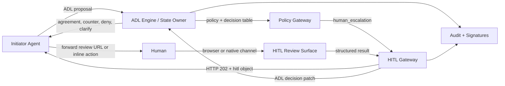
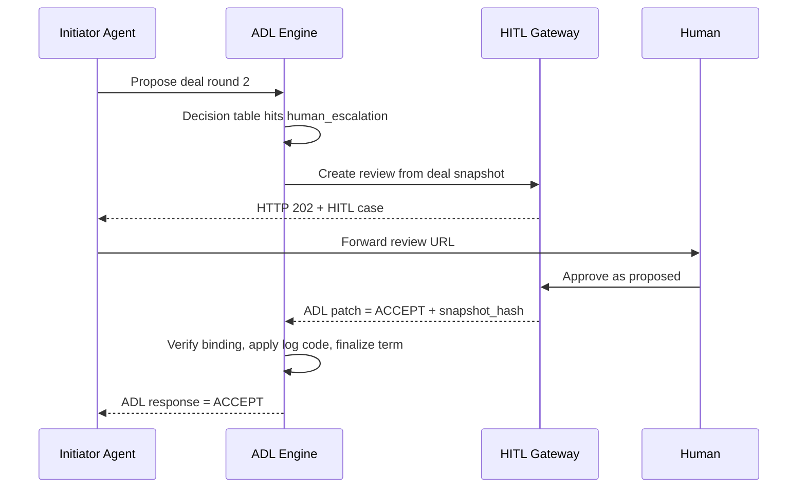
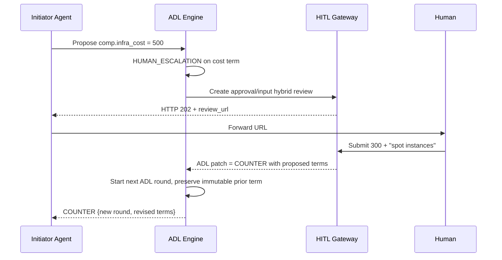
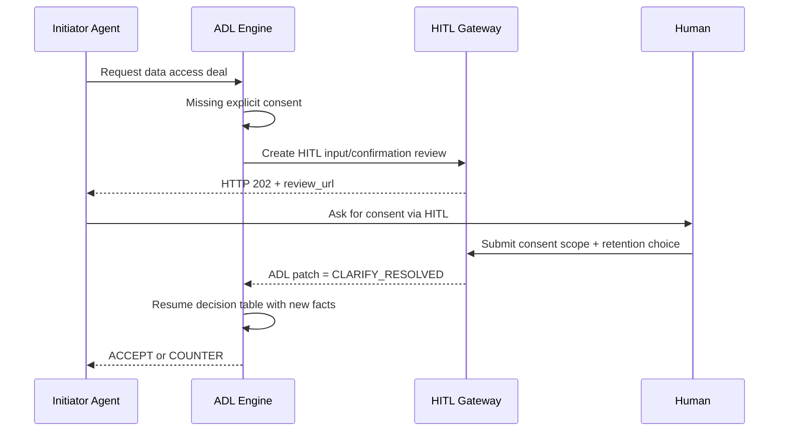

# ADL + HITL Integration Concept

## Thesis

ADL and HITL should not compete for the same responsibility.

- **ADL** should remain the canonical layer for deal semantics, policy evaluation, rounds, and auditability.
- **HITL** should remain the canonical layer for human review transport, delivery, review UX, and structured response capture.
- The combined model should be: **deterministic machine negotiation with explicit human checkpoints**.

The ideal integration is therefore **not** "ADL with some review URLs attached" and also **not** "HITL that understands full negotiation semantics". The ideal integration is an **adapter contract** between:

1. an **ADL deal snapshot** that explains what needs a decision, and
2. a **HITL review case** that collects the human resolution in a structured way,
3. then returns an **ADL decision patch** back into the deterministic deal engine.

## Core Principle

**ADL owns truth. HITL owns interaction.**

That implies five normative rules:

1. A HITL case is always a **derived projection** of an ADL deal or term set, never the canonical deal itself.
2. The ADL state owner remains the **source of truth** for round state, signatures, policy logs, and final agreement.
3. A human response never mutates committed ADL terms in place. It produces an **accept / deny / clarify / counter patch** for the next ADL step.
4. Every HITL review must bind to a **specific ADL snapshot hash**, round number, and affected term IDs.
5. Policy decides whether HITL is required. Agents only forward, poll, and relay.

## Best-Fit Operating Model

The cleanest default is:

- **Platform-mediated ADL** as the canonical state owner
- **Same platform** also acting as the HITL service

This minimizes split-brain risk:

- one audit authority
- one policy engine
- one signature authority
- one correlation graph across deal rounds and review cases

Bilateral and MCP-tool modes still work, but they need an explicit adapter and stronger signature binding because deal ownership and review delivery are more likely to live on different systems.

## Reference Architecture



## Ideal Integration Contract

### 1. Declarative bridge in ADL

The ADL bridge should stay declarative. It should describe that human escalation is allowed and under which risk constraints.

```json
{
  "bridge": {
    "bridge_type": "human_escalation",
    "escalation_urgency": "high",
    "human_sla_iso": "PT4H",
    "review": {
      "protocol": "hitl/0.7",
      "review_type": "approval",
      "risk_tier": "high",
      "allow_inline": false,
      "require_signature": true,
      "require_responded_by": true
    }
  }
}
```

This is important because runtime HITL URLs do **not** belong in the immutable term definition. They belong in execution state owned by the responder/platform.

### 2. ADL binding inside the HITL case

The HITL case should include an explicit ADL binding in `hitl.context`.

```json
{
  "hitl": {
    "spec_version": "0.7",
    "case_id": "review_deal_7f3a",
    "type": "approval",
    "prompt": "Approve the counter-offer for infrastructure cost",
    "review_url": "https://platform.example/review/deal_7f3a?token=...",
    "poll_url": "https://api.platform.example/reviews/deal_7f3a/status",
    "context": {
      "adl": {
        "deal_id": "deal-550e8400",
        "round_no": 2,
        "term_ids": ["term-cost-1"],
        "snapshot_hash": "sha256:ad9b...",
        "response_expected": "ACCEPT_OR_COUNTER_OR_DENY",
        "initiator_party_id": "agent-a",
        "responder_party_id": "platform-x"
      }
    }
  }
}
```

### 3. ADL decision patch inside the HITL result

The HITL result should remain human-facing, but it should optionally include a machine-safe ADL patch payload.

```json
{
  "status": "completed",
  "case_id": "review_deal_7f3a",
  "result": {
    "action": "edit",
    "data": {
      "approved_budget": 300,
      "note": "Use spot instances only for staging"
    },
    "adl_patch": {
      "response": "COUNTER",
      "affected_terms": ["term-cost-1"],
      "proposed_terms": [
        {
          "category": "Compensation",
          "key": "comp.infra_cost",
          "operator": "=",
          "value": 300,
          "stance": "NEGOTIATE"
        },
        {
          "category": "Execution",
          "key": "exec.instance_strategy",
          "operator": "=",
          "value": "spot",
          "stance": "NEGOTIATE"
        }
      ]
    }
  }
}
```

## End-to-End Flows

### Flow A: Human approves a proposed term



### Flow B: Human makes a counter-offer



### Flow C: Human clarifies missing data



## Feature Matrix

| Concern | ADL today | HITL today | Ideal combined model | Gap found | Recommendation |
|---------|-----------|------------|----------------------|-----------|----------------|
| Negotiation semantics | Strong | Minimal | ADL only | No real gap | Keep semantics exclusively in ADL |
| Human review transport | Weak | Strong | HITL only | No real gap | Keep transport exclusively in HITL |
| Runtime link between deal and review | Informal | Informal | Explicit binding object | Major | Standardize `context.adl` |
| Canonical source of truth | Strong | Service-local | ADL state owner | Medium | Require one canonical state owner per deal |
| Multi-round counters | Strong | Supported indirectly | Deterministic patch -> next round | Major | Add `result.adl_patch` |
| Partial acceptance of multi-term deals | Weak | Weak | Review selected term subset | Major | Support `affected_terms[]` and per-term resolutions |
| Integrity between reviewed content and accepted content | Partial | Partial | Snapshot hash + response signature | Major | Bind HITL case to `snapshot_hash` |
| Policy/risk gating | Strong | Guidance only | Policy-driven channel choice | Medium | Add normative risk tier rules |
| Inline submit for low-risk actions | N/A | Strong | Limited to safe ADL actions | Medium | Allow only accept/reject for low-risk terms |
| Identity of actual human respondent | Abstract | Optional | Required for high-stakes deals | Medium | Make `responded_by` mandatory by policy tier |
| Timeout/default behavior | ADL TTL exists | HITL `default_action` exists | Deterministic ADL mapping | Major | Standardize timeout -> ADL response/log code |
| Discovery and capability negotiation | Partial | `.well-known/hitl.json` | Joint capability discovery | Medium | Add ADL/HITL compatibility advertisement |
| Audit correlation | Strong per deal | Strong per case | Unified correlation chain | Major | Add shared correlation IDs and audit bundle |
| Browser vs inline UX policy | No concept | Security guidance only | Category-aware and risk-aware | Medium | Define defaults by ADL category |

## Gaps Exposed by the Matrix

### 1. Missing adapter contract

The specs describe the relationship conceptually, but there is no normative machine contract for:

- which deal snapshot was reviewed
- which term IDs were in scope
- which ADL response shape the HITL result should produce

Without this, implementations will drift.

### 2. Runtime data is mixed into declarative deal logic

ADL's bridge definition is clean and declarative. The appendix example that places `hitl_review_url` and `hitl_poll_url` into the term shape blurs runtime execution data with immutable negotiation structure.

That should be split into:

- **term declaration**: "human escalation may be used"
- **execution state**: "this deal snapshot created review case X"

### 3. No standard for per-term or partial decisions

HITL review types capture one human interaction well, but ADL may require:

- accept term A
- counter term B
- deny term C

in a single round. There is no standard partial-resolution model yet.

### 4. Weak integrity binding

HITL can sign a result, and ADL can sign deal snapshots, but there is no standardized way to prove:

> this exact human response applies to this exact immutable deal snapshot.

That missing proof is the biggest audit gap.

### 5. Timeout semantics are underspecified across the boundary

HITL has `default_action`. ADL has deal TTL and deterministic log codes. The cross-protocol mapping is not standardized yet:

- `expired` -> `DENY`?
- `expired` -> `CLARIFY`?
- `expired` -> policy-defined `COUNTER`?

This needs a strict mapping table.

### 6. Security posture is not aligned to deal risk

HITL correctly warns against inline submit for high-stakes actions. ADL classifies high-stakes content such as compensation, data, security, compliance, and SLA terms. But the protocols do not yet join these ideas into one normative risk model.

### 7. Discovery is one-sided

HITL has `.well-known/hitl.json`. ADL currently has no matching discovery shape for:

- supported review types for escalations
- signature requirements
- inline submit restrictions
- policy tiers per term category

## Recommended Spec Additions

### A. Add a first-class `review` object to the ADL `human_escalation` bridge

Purpose:

- declare review protocol
- declare risk tier
- declare allowed delivery modes
- declare signature and identity requirements

### B. Standardize `hitl.context.adl`

Required fields:

- `deal_id`
- `round_no`
- `term_ids`
- `snapshot_hash`
- `response_expected`
- `state_owner`

### C. Standardize `result.adl_patch`

Required fields:

- `response`
- `affected_terms`
- optional `proposed_terms`
- optional `resolution_reason`

### D. Add an ADL/HITL timeout mapping table

Example:

| HITL terminal event | ADL mapping | Default log code |
|---------------------|-------------|------------------|
| `completed` + approve | `ACCEPT` | `HUMAN_APPROVED` |
| `completed` + reject | `DENY` | `HUMAN_REJECTED` |
| `completed` + edit/submit | `COUNTER` | `HUMAN_COUNTERED` |
| `expired` | policy-defined | `HUMAN_ESCALATION_TIMEOUT` |
| `cancelled` | `DENY` unless policy overrides | `HUMAN_ESCALATION_CANCELLED` |

### E. Add a shared audit bundle

Every resolved escalation should produce an audit bundle containing:

- `deal_id`
- `round_no`
- `term_ids`
- `snapshot_hash`
- `case_id`
- `result_hash`
- `responded_by`
- optional `result.signature`

### F. Add capability discovery

Either:

- extend `.well-known/hitl.json` with ADL escalation capabilities, or
- define a sibling `.well-known/adl-hitl.json`

The key requirement is discoverability of:

- review types
- signature support
- identity verification level
- inline support by risk tier
- timeout policy support

## Decision Policy Defaults

These defaults make the combined system safer and more predictable:

| ADL category | Default HITL mode | Inline allowed? | Identity required? | Signature required? |
|--------------|-------------------|-----------------|--------------------|---------------------|
| `comp.*` | approval/input | No | Yes | Yes |
| `data.*` | input/confirmation | No | Yes | Yes |
| `sec.*` | approval | No | Yes | Yes |
| `compl.*` | approval | No | Yes | Yes |
| `sla.*` | approval | No | Yes | Yes |
| `exec.*` | confirmation/approval | Sometimes | Policy-based | Optional |
| `res.*` | confirmation/approval | Sometimes | Policy-based | Optional |
| `cap.*` | approval/selection | Sometimes | Optional | Optional |

## Suggested Rollout

### Phase 1: Adapter profile

Define a non-breaking integration profile:

- `human_escalation.review`
- `hitl.context.adl`
- `result.adl_patch`

This is enough to make implementations interoperable.

### Phase 2: Audit-grade binding

Add:

- snapshot hash binding
- result hash binding
- mandatory correlation IDs
- mandatory respondent identity for high-risk categories

### Phase 3: Multi-term review semantics

Add support for:

- mixed outcomes in one review
- partial accept/counter/deny in a single round
- UI patterns for grouped term decisions

### Phase 4: Discovery and profiles

Publish:

- compatibility profiles
- risk tiers
- capability discovery for marketplaces and agent frameworks

## Bottom Line

The ideal concept is:

- **ADL as the deterministic contract and policy engine**
- **HITL as the human decision transport and UI layer**
- **an explicit adapter contract between them**

The biggest missing piece today is not UI and not negotiation logic. It is the **standardized binding layer** that proves:

1. which exact ADL snapshot was shown to the human,
2. what structured human decision came back,
3. how that decision deterministically changed the next ADL state.

If that adapter layer is standardized, the combination becomes much stronger than either protocol alone:

- ADL gains trustworthy human escalation without becoming a UI protocol.
- HITL gains deterministic business semantics without becoming a negotiation engine.
