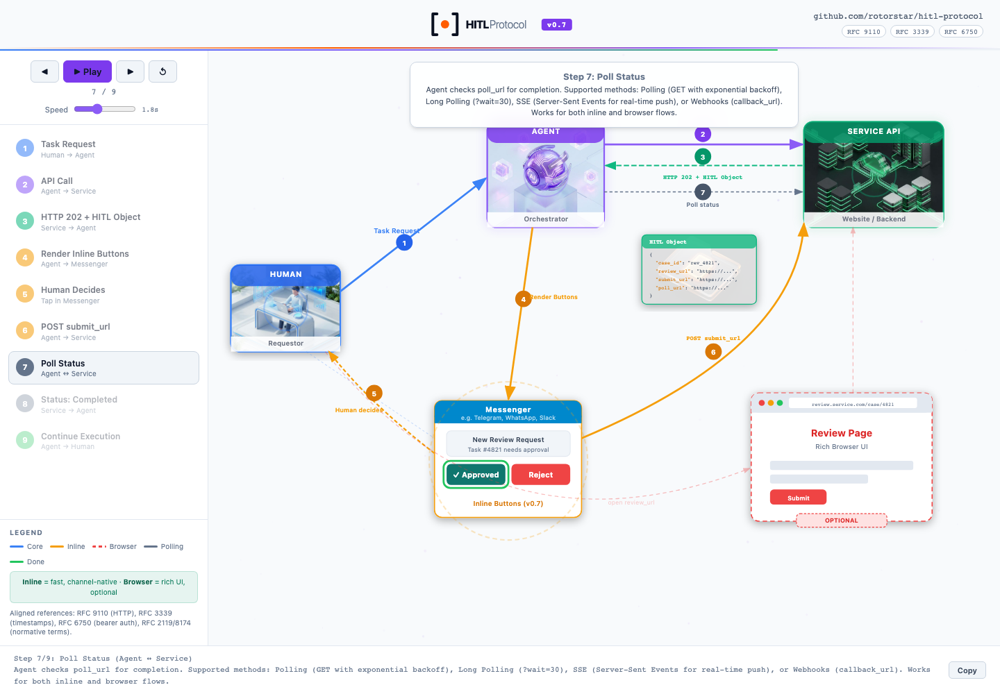
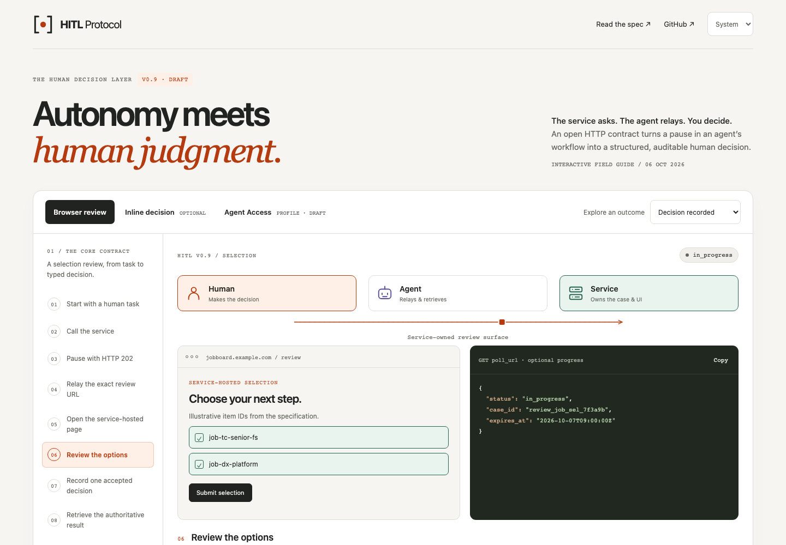
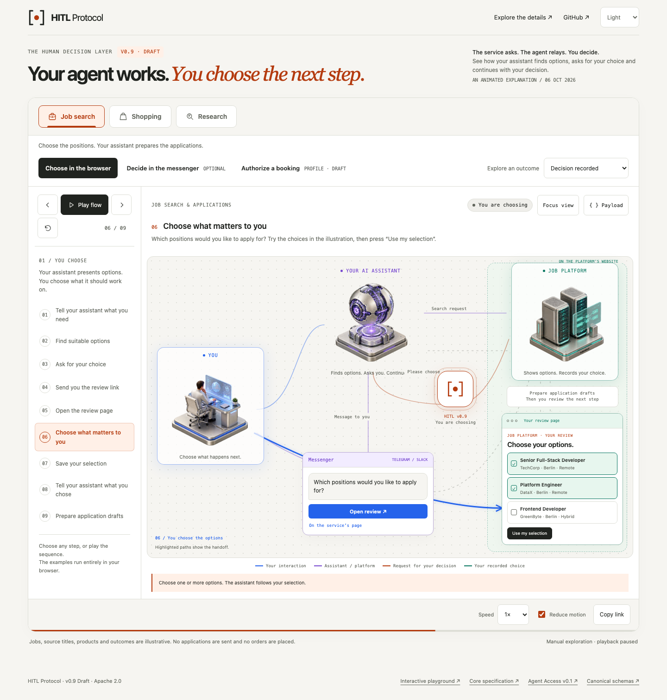
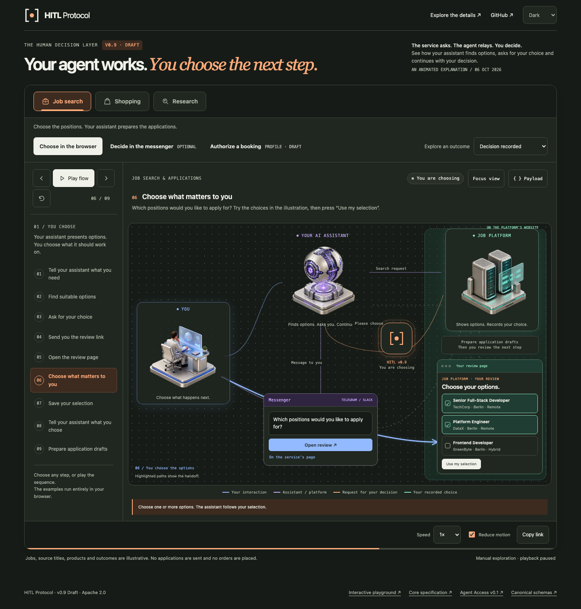
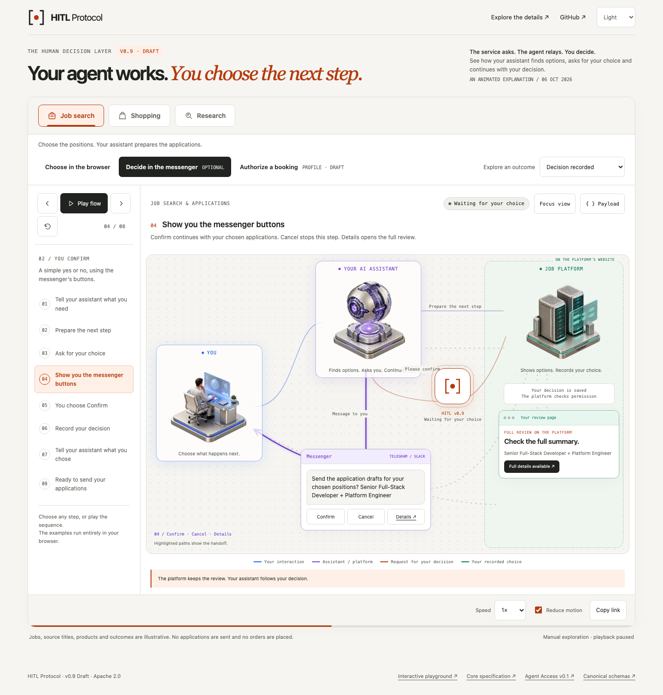
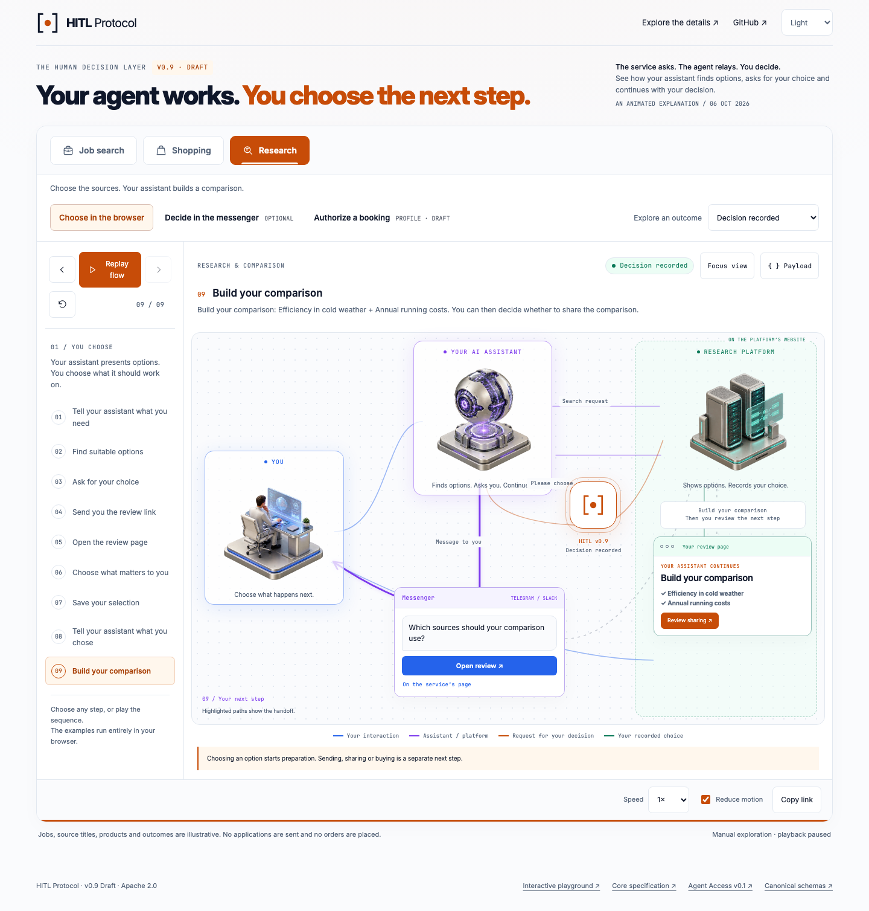
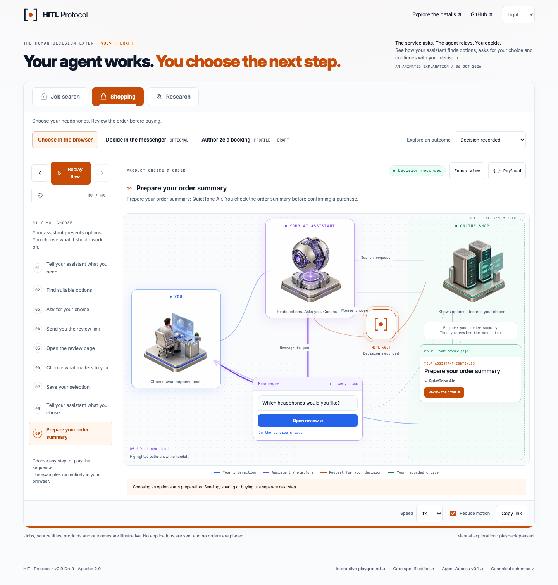

# HTML animation: visual and feature comparison

Reviewed 2026-10-06. The original linked HTML identifies itself as v0.7; the previous README GIF identifies itself as v0.8. This review compares that original, the rejected first v0.9 redesign, and the final graphical v0.9 redesign. Screenshots use the same 1440-pixel desktop width.

## Original



The original's strongest feature is its spatial explanation: the human, agent, API, messaging channel, and hosted review remain visible together. Illustrations, numbered routes and moving packets make the handoff memorable. Its content needs correction: it foregrounds optional inline submit, labels the browser path optional, includes `error` as a review status, and suggests execution follows completion without an independent authorization boundary. It uses small text, click-only step elements, clipped viewport layouts and an unconditional particle loop.

## First v0.9 redesign — rejected



This version improves contract accuracy, outcomes, keyboard access, responsive layouts and motion controls. However, it replaces the architecture with small participant icons and separate content cards. It loses the original's illustrated scale, visible topology, and relationship between the messenger and browser. Its documentation quality does not compensate for the weaker animation experience.

## Final v0.9 redesign



Detailed type, lifecycle and transport reference stays in the [existing playground](../../playground/index.html). The animation links to it directly.

The root README uses dedicated crops of the current explorer in [light](../../assets/hitl-flow-v0.9-preview.png) and [dark](../../assets/hitl-flow-v0.9-preview-dark.png) mode. They include story tabs, playback, the messenger and selectable jobs. The full-page comparison screenshots above remain separate; `pnpm capture:animation` regenerates both sizes. See the [README audit](../readme-review.md).

The final version adds understandable job, research and product stories, with interactive choices and concrete follow-up actions. It restores an illustrated architecture as the primary surface. Human, autonomous agent, service API, messenger, service-owned browser review and the HITL case hub stay visible together. Colored connection paths accumulate as the flow advances; packets follow the current route. The service ownership boundary and separate execution gate are explicit. Playback controls remain beside the graphic; the payload inspector opens on demand.



## Concrete stories and messenger actions

**Job search**, **Shopping** and **Research** are directly visible as horizontal tabs with distinct icons. Each tab updates the illustration, choices, messenger prompt and next steps; browser/messenger delivery stays a separate control.

The job review displays **Senior Full-Stack Developer · TechCorp** and **Platform Engineer · DataX**, rather than wire identifiers. The human chooses positions, saves the selection, and sees **Prepare application drafts**. **Review sending** starts a separate confirmation.



The research variant uses descriptive source titles and continues with a comparison before asking whether to share it.



The product variant allows one headphone selection, then prepares an order summary for a separate purchase review.



## Feature matrix

| Feature | Original | First redesign | Final redesign |
|---|---|---|---|
| Large illustrated architecture | Yes | Lost | Restored, with unified transparent 3D illustrations |
| Spatial human / agent / service relationships | Yes | One connection at a time | Persistent topology and active route |
| Messenger and hosted browser shown together | Yes | Separate scenes | Yes, with working illustrative buttons and a service ownership boundary |
| Animated packet movement | Yes | Straight participant connection | SVG geometry with native Web Animations playback |
| Persistent completed connection paths | Yes | No | Yes |
| Visible case hub and execution gate | Partial | Text explanations | Explicit graphical elements |
| Play / pause / reset / individual steps / speed | Yes | Yes | Yes, with visible sidebar controls |
| Focus view | No | No | Yes, with Escape to exit |
| Inspect and copy current payload | Narrative text copy | Always-visible payload | Optional inspector, copy and clipboard fallback |
| Browser review as the baseline | Mispositioned | Yes | Yes |
| Optional inline submit and browser step-up | Inline emphasized | Yes | Dedicated flow and fallback outcome |
| Optional Agent Access v0.1 draft | No | Yes | Illustrated prepare → review → commit sequence |
| All six review statuses | Inaccurate | Yes | Shown in the relevant flow steps |
| Decision vs operation status | Not distinguished | Explained | Explained and visualized |
| Five typed review categories | Not interactive | Interactive reference | In the existing detailed playground |
| Alternative outcomes | No | 12 | 29 across the three stories |
| Directly visible story tabs | No | No | Job search, Shopping and Research, including keyboard navigation |
| Shared flow / outcome / step URLs | No | Yes | Yes; also story and exact human choices |
| Responsive layout | Fixed/clipped | Yes | Adaptive diagram, including 320-pixel screens |
| System, light and dark themes | Light only | Yes | Yes, including theme-aware README previews |
| Reduced motion and visibility pause | No | Yes | Yes, including packet, orbit and illustration movement |
| Keyboard semantics and status announcements | Incomplete | Yes | Yes |
| Offline operation | Local imagery | Self-contained | HTML, one local illustration asset and shared local fonts; no external requests |
| Wire-example schema checks | No | Added during verification | Canonical core, profile and commit schemas |

## Flow, data and state model

- **Browser review:** human task → API call → HTTP 202 → exact URL delivery → service-owned review → atomic decision → authenticated poll → next step under the business contract.
- **Inline decision:** explicit human button action → optional authenticated submit → direct completion. Unsatisfied service policy redirects the human to the original full-review URL.
- **Agent Access:** public origin verification and delegated enrollment remain separate; prepare stores an immutable operation snapshot; the authorized owner reviews it; a fresh DPoP commit rechecks authority before local transactional execution.
- **Outcomes:** core completion, expiry and case withdrawal; inline cancellation and browser step-up; Agent Access success, owner cancellation, grant revocation, material term changes and expiry.
- **State:** one local step model drives labels, narration, routes, participant highlights, displayed payload and lifecycle status. The URL records story, choices, flow, outcome and step. Choices are editable before submission and read-only after the illustrated response is recorded. Playback, speed and presentation controls do not trigger real requests.
- **Stories:** job search → application drafts → review sending; research sources → comparison → review sharing; product choice → order summary → review purchase. Titles and companies are readable in the graphic; wire IDs stay in the optional inspector.
- **Data:** job identifiers build on specification §15.1; the extra job, source titles and product names are explicitly illustrative fixtures. Business examples and tokens are explicitly illustrative. The displayed booking snapshot uses integer EUR cents; its JCS/SHA-256 digest is reproducible. The guide performs no enrollment, submission or booking.

## Acceptance criteria and verification

### Horizontal story tabs — 2026-10-06 refinement

Problem: the example selector hides the available stories. Show **Job search**, **Shopping** and **Research** as horizontal tabs above the decision-path controls. Keep the existing story data, URL keys, choices and protocol flows as the source of truth.

1. **Discoverability and layout:** all three labelled, illustrated tabs are visible together from 320 to 1440 pixels; the active tab has a clear colour and border treatment. The story summary belongs to its panel. The booking profile keeps its separate flow control.
2. **State and interaction:** choosing a different story pauses playback, resets its selection and outcome, and starts at step one while retaining the browser/messenger path. Selecting the already active tab preserves progress. The URL restores the selected tab and exact choices. Tab, Arrow Left/Right, Home, End, Enter and Space follow the [W3C tabs pattern](https://www.w3.org/WAI/ARIA/apg/patterns/tabs/); tab navigation does not advance animation steps.
3. **Verification and screenshots:** update browser checks for tab semantics, state transitions, keyboard navigation and mobile placement; preserve all 29 outcome variants and 85 wire validations. Refresh the actual light/dark README and story screenshots after the visual change.

### Existing acceptance criteria

1. **Contract accuracy:** every displayed HITL object, PollResponse, inline SubmitRequest, profile context and commit body must pass the repository's canonical schemas. Unknown versions are not presented as supported; `cancel` decisions remain distinct from `cancelled` cases. Only a separate successful operation establishes execution.
2. **Visual architecture:** all three participants, messenger and service-owned review must remain visible. Each of the three stories has readable options, editable selections, a concrete next step and a follow-up confirmation. Current paths have direction and color; visited paths persist. Illustrations share one rendering style. Payload detail is optional.
3. **Interaction:** manual navigation interrupts playback; pause freezes movement; replay resets a completed sequence. URL restoration, keyboard navigation, clipboard fallback, focus view and reduced motion work. Hidden tabs pause playback.
4. **Delivery:** no external runtime request is required. Layouts at 320, 375, 390, 768, 1024 and 1440 pixels must have no horizontal overflow. README previews are captured from the actual HTML in both themes.

### Playground palette alignment — 2026-10-06 refinement

The animation adopts the existing playground's orange brand colour, cool white/slate surfaces, blue/purple/green supporting colours and typography. Story data, illustrations and interaction contracts remain as verified above.

| Task | Acceptance criteria |
|---|---|
| Transfer the light palette | Primary orange is `#c74c08`, its darker text/hover shade is `#a73e05`; text uses `#0f172a` and `#526176`, JSON panels use `#172233`, and supporting blue/purple/green match the playground. Active story tabs and primary actions use orange. Remove the previous olive/beige palette and duplicate participant colour overrides. |
| Adapt the dark palette | Dark mode uses slate/navy surfaces with readable orange, blue, purple and green accents. Manual/system theme switching remains functional; browser theme colour is derived from the active CSS background. |
| Match typography | Both pages load the same local Inter 4.1 and JetBrains Mono 2.304 font assets through one shared stylesheet. The animation's headline uses Inter instead of a separate serif face. No font CDN is required; font licences and provenance are retained. Font loading and mobile reflow must pass in each supported browser. |
| Verify and capture | Check representative foreground/background pairs against the [WCAG text contrast thresholds](https://www.w3.org/WAI/WCAG22/Understanding/contrast-minimum.html), run the existing browser checks, and refresh/inspect light, dark, story and mobile screenshots before committing. |

Run from the repository root after installing workspace dependencies:

```sh
pnpm test:animation
node scripts/verify-flow-animation.mjs --browser=webkit
node scripts/verify-flow-animation.mjs --browser=firefox
pnpm capture:animation
```

The test uses the workspace's existing Playwright and AJV dependencies. The HTML itself has no framework or third-party runtime. Chromium and Firefox load it directly with `file://`; WebKit uses a loopback fixture server and checks playback after disconnecting. Serve the repository root for a preview with working links to the playground.

## Sources and maintenance

The wire contract remains [HITL v0.9](../../spec/v0.9/hitl-protocol.md), the [canonical schemas](../../schemas/) and the [Agent Access v0.1 draft](../../profiles/agent-access/v0.1/README.md). The reference service's confirmation updates the review version but does not increment the business operation version; the commit uses the stored operation version.

Current browser techniques were checked against [MDN Web Animations](https://developer.mozilla.org/en-US/docs/Web/API/Web_Animations_API/Using_the_Web_Animations_API), [reduced-motion documentation](https://developer.mozilla.org/en-US/docs/Web/CSS/@media/prefers-reduced-motion) and [Playwright release notes](https://playwright.dev/docs/release-notes). Existing workspace Playwright 1.63.0 matches the current stable release checked for this task. The implementation animates finite transform/opacity effects and cancels them when navigation changes.

The transparent [actor sprite](../../assets/protocol-actors-v0.9.png) was generated with the built-in ImageGen tool; the diagram displays its three equal cells through CSS background positioning. The generation brief: **one transparent, panoramic 3:1 sprite with three separate, equally sized isometric dioramas — a human reviewing a glass display in blue, a spherical AI processor in violet, and API server towers in teal; consistent camera, materials, baseline and lighting; no text, labels or connector lines.** The full prompt is preserved in this chat. Labels, connectors, ownership boundaries, state and animation are implemented in HTML/CSS/SVG.

After changing flow content, rerun the canonical-schema and browser checks. After a visual change, regenerate both README previews and inspect the captured desktop and mobile screenshots before updating this comparison.

## Final browser result

The animation passes in Chromium, Firefox and WebKit: 29 outcome variants with 85 schema-valid wire messages, including horizontal story tabs, keyboard and panel focus, editable selections, read-only accepted responses, concrete follow-up confirmations, share/reload restoration and review-card containment from 320 to 1440 pixels. The detailed playground separately passes 226 configurations with 552 wire messages in the same three engines.

The palette and typography refinement passes the same checks in all three engines, including actual local font loading. A rendered comparison confirms matching orange, text, muted, blue, purple and green colours, Inter body/headline text, JetBrains Mono technical text and headline weight 800. Twelve representative text/background pairs in each theme meet 4.5:1: the minimum is 4.54:1 in light mode and 4.70:1 in dark mode. The browser theme colour matches the active CSS background. Light/dark, messenger, research, purchase, playground and mobile screenshots were refreshed and visually inspected.
