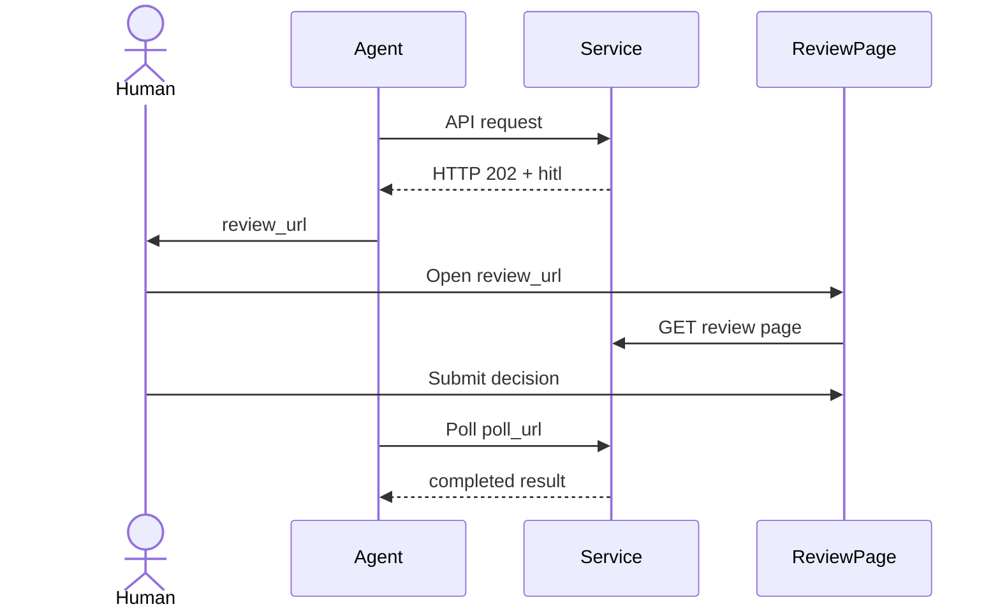
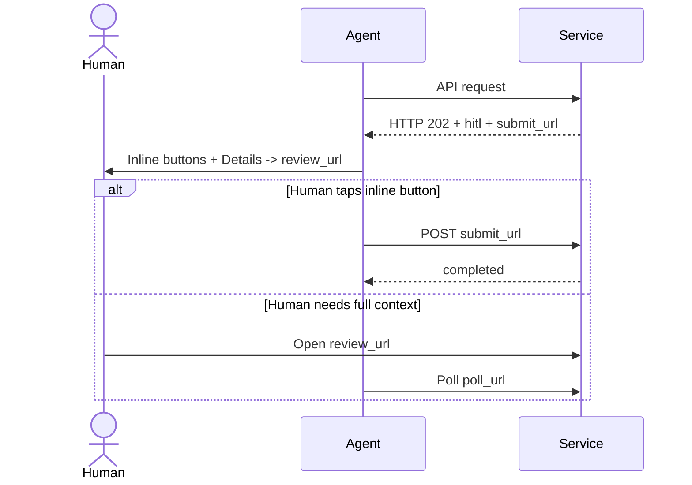
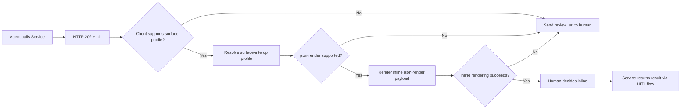
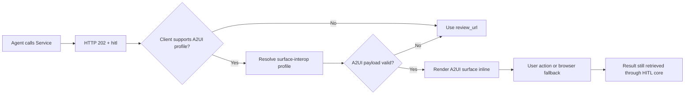
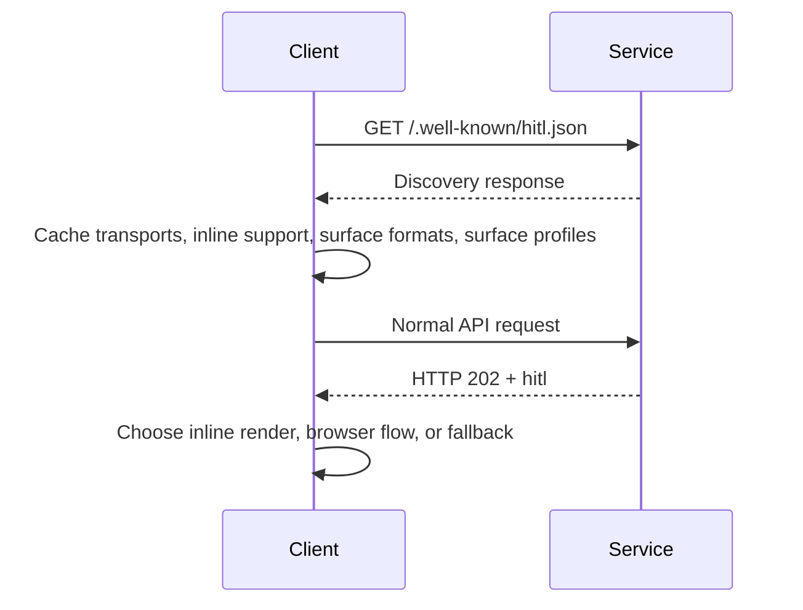
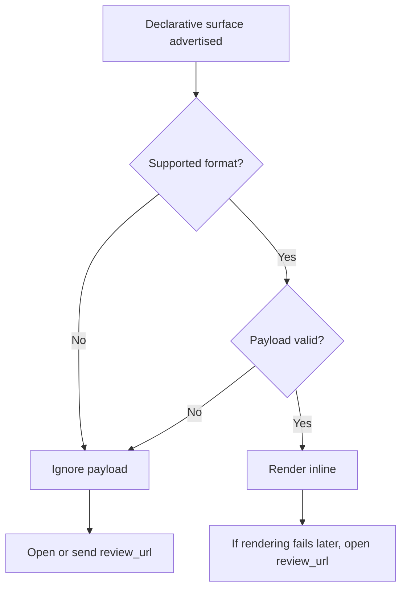

# HITL Flow Verification

This document contains the Mermaid flows used to verify that HITL core and optional surface profiles remain consistent.

## Verification Rules

- Every flow must preserve `review_url` as fallback.
- Every flow must map to real HITL lifecycle states.
- Embedded rendering must be optional and ignorable.
- Unsupported formats or invalid payloads must fall back to the browser review page.

## 1. Standard Browser Review

Verified against:

- `review_url`
- `poll_url`
- `pending/opened/in_progress/completed`

## 2. Inline Submit with URL Fallback

Verified against:

- `submit_url`
- `inline_actions`
- `review_url` fallback
- `403` and browser fallback path

## 3. Embedded `json-render` with URL Fallback

Verified against:

- `supports_surface`
- `surface_formats`
- browser fallback on unsupported or invalid payload

## 4. Embedded A2UI with URL Fallback

Verified against:

- HITL transport remains source of truth
- embedded payload does not replace review page authorization

## 5. Discovery and Capability Negotiation

Verified against:

- discovery schema
- OpenAPI discovery contract
- example `07-well-known-hitl.json`

## 6. Invalid Surface / Fallback

Verified against:

- unknown formats ignored
- malformed payloads fall back
- `review_url` always works
