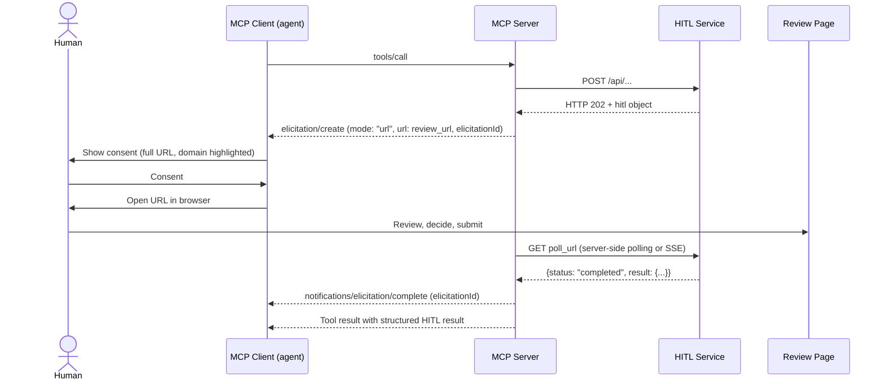

# MCP Elicitation Binding (Informative)

> Status: Informative, non-normative. Applies to HITL Protocol v0.8 and MCP spec revision 2025-11-25 or later (URL mode elicitation).

MCP's [URL mode elicitation](https://modelcontextprotocol.io/specification/draft/client/elicitation) standardizes how an MCP server hands a URL to the user — consent, display rules, and an optional completion notification. It deliberately leaves the page behind that URL undefined.

HITL Protocol defines exactly that layer: review types, service-hosted UI, structured results, case lifecycle. The two compose cleanly:

```
MCP URL mode  = how the URL reaches the human (inside an MCP session)
HITL Protocol = what happens at the URL, and how the structured result returns
```

This document describes how an MCP server that fronts a HITL-compliant service maps HITL cases onto MCP elicitation messages.

## When to use this binding

Use it when the agent talks to your service **through MCP** (e.g. Claude Code, or any MCP client with elicitation support). When the agent calls your HTTP API directly, use the plain HITL flow (HTTP 202 + `poll_url`) — no MCP required.

| Situation | Flow |
|---|---|
| Agent calls your REST API | HTTP 202 + `hitl` object, agent polls (HITL core) |
| Agent calls your MCP server tool | This binding: `elicitation/create` with `mode: "url"` |
| Simple primitive input, no review page needed | MCP form mode elicitation (no HITL case necessary) |

## Mapping

| HITL concept | MCP elicitation concept |
|---|---|
| `hitl.review_url` | `params.url` |
| `hitl.case_id` | correlate with `params.elicitationId` (the MCP server keeps the `case_id ↔ elicitationId` mapping; do not leak service tokens into the ID) |
| `hitl.prompt` / `message` | `params.message` |
| Case reaches terminal state (`completed`, `expired`, `cancelled`) | `notifications/elicitation/complete` with the original `elicitationId` |
| Agent polls `poll_url` | Replaced by the completion notification; the MCP server polls (or subscribes via SSE) on the agent's behalf |
| `poll` result (`status`, `result`) | Returned as the MCP tool result after completion |
| Human declines on review page | Tool result conveys the terminal HITL status; the elicitation `decline`/`cancel` actions only cover the consent step, not the review outcome |

## Flow



Notes:

- The MCP server is the HITL **agent** in protocol terms: it holds the bearer token for `poll_url` and never forwards it to the MCP client.
- `review_url` (including its review token) is shown to the user by design — the token authorizes exactly one case, scoped and time-limited per HITL §security. This matches MCP's rule that elicitation URLs must not be pre-authenticated for anything beyond the interaction itself.
- If the MCP client lacks URL mode support (`elicitation.url` capability absent), fall back to returning the HITL object in the tool result text so the agent can relay `review_url` manually — the standard HITL flow.

## Example

Tool call hits a decision point; the MCP server has received HTTP 202 from the HITL service and sends:

```json
{
  "method": "elicitation/create",
  "params": {
    "mode": "url",
    "elicitationId": "el_9f2c4a",
    "url": "https://service.example.com/review/abc123?token=K7xR2mN4pQ8sT1vW...",
    "message": "5 matching jobs found. Please select which ones to apply for."
  }
}
```

After the human submits on the review page and the case completes:

```json
{
  "jsonrpc": "2.0",
  "method": "notifications/elicitation/complete",
  "params": { "elicitationId": "el_9f2c4a" }
}
```

The MCP server then resolves the pending tool call with the structured HITL result (e.g. selected job IDs).

## Security alignment

MCP URL mode requirements and HITL's token model reinforce each other:

| MCP requirement (client/server) | HITL property |
|---|---|
| Server MUST verify the identity of the user who opens the URL | Review token binds the URL to one case; services SHOULD apply session checks for high-stakes cases (HITL §verification) |
| URL MUST NOT be pre-authenticated for a protected resource | Review token authorizes only viewing/submitting this one review — nothing else |
| Client MUST NOT pre-fetch the URL | HITL services SHOULD treat first GET as human arrival; single-use submit semantics limit damage from crawlers |
| Client MUST show the full URL / highlight domain | Service-hosted review page: the domain *is* the service the user already trusts |
| Sensitive data never transits the MCP client | Identical HITL principle: decisions happen in the browser; the agent only sees the structured result |

For proof-of-human flows (HITL v0.8 `verification_policy`), the browser review path is the verification surface — unchanged under this binding.

## What this binding does not do

- It does not make HITL depend on MCP. HITL core remains plain HTTP.
- It does not tunnel HITL form definitions through MCP form mode. Form mode is limited to flat primitive schemas; HITL review pages stay service-hosted.
- It does not replace `poll_url`. Polling remains the universal fallback whenever the completion notification never arrives (MCP clients are required to offer manual retry/cancel controls for exactly this case).
