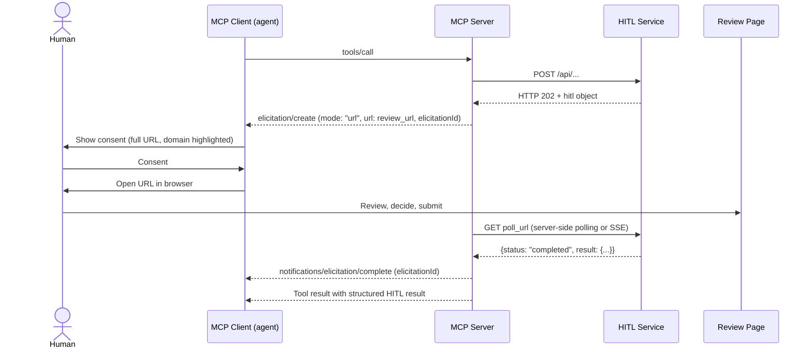

# MCP Elicitation Binding (Informative)

> Status: Informative, non-normative. Core URL/result mapping applies to HITL v0.8 and v0.9. The runnable local MCP demo implements historical v0.8 with MCP **2025-11-25** only. The [published MCP 2026-07-28 revision](https://blog.modelcontextprotocol.io/posts/2026-07-28/) and its optional Tasks extension have separate mappings below. Last reviewed: 2026-10-06.

MCP standardizes how an out-of-band, URL-based human interaction is handed to the user inside an MCP session — consent, display rules, and a completion/continuation mechanism. It deliberately leaves the page behind that URL undefined.

HITL Protocol defines exactly that layer: review types, service-hosted UI, structured results, case lifecycle. The two compose cleanly:

```
MCP           = how the handoff reaches the human (inside an MCP session)
HITL Protocol = what happens at the URL, and how the structured result returns
```

The 2026-07-28 revision uses the [MRTR pattern](https://modelcontextprotocol.io/specification/2026-07-28/basic/patterns/mrtr) for additional client input. The separate [versioned Tasks extension](https://tasks.extensions.modelcontextprotocol.io/specification/2026-07-28/tasks) adds durable task state and polling. They transport the interaction rather than define HITL's decision or business execution. Bindings B/C are informative and are not implemented by the local MCP demo. Direct HTTP services use the HITL core flow independently of MCP.

Across bindings, `completed` records a decision; it does not establish a human identity or execution success. The optional [Agent Access profile](../profiles/agent-access/v0.1/README.md) separately supplies PKCE/OIDC owner enrollment, DPoP-bound grants and explicit authorized commit. A messaging claim such as `submitted_by` is not a verified `responded_by`.

## When to use this binding

Use it when the agent talks to your service **through MCP** (e.g. Claude Code, or any MCP client with elicitation support). When the agent calls your HTTP API directly, use the plain HITL flow (HTTP 202 + `poll_url`) — no MCP required.

| Situation | Flow |
|---|---|
| Agent calls your REST API | HTTP 202 + `hitl` object, agent polls (HITL core) |
| Agent calls your MCP server tool (client on 2025-11-25) | Binding A: `elicitation/create` with `mode: "url"` |
| Agent calls your MCP server tool (client on 2026-07-28) | Binding B (MRTR) for short-lived cases, Binding C (Tasks) for long-lived cases |
| Simple primitive input, no review page needed | MCP form mode elicitation (no HITL case necessary) |

---

## Binding A — MCP 2025-11-25 (local demo binding)

[URL mode elicitation](https://modelcontextprotocol.io/specification/2025-11-25/client/elicitation) in this revision is a server-initiated request with an `elicitationId` and an optional completion notification.

### Mapping

| HITL concept | MCP elicitation concept |
|---|---|
| `hitl.review_url` | `params.url` |
| `hitl.case_id` | correlate with `params.elicitationId` (the MCP server keeps the `case_id ↔ elicitationId` mapping; do not leak service tokens into the ID) |
| `hitl.prompt` / `message` | `params.message` |
| Case reaches terminal state (`completed`, `expired`, `cancelled`) | `notifications/elicitation/complete` with the original `elicitationId` |
| Agent polls `poll_url` | Replaced by the completion notification; the MCP server polls (or subscribes via SSE) on the agent's behalf |
| `poll` result (`status`, `result`) | Returned as the MCP tool result after completion |
| Human declines on review page | Tool result conveys the terminal HITL status; the elicitation `decline`/`cancel` actions only cover the consent step, not the review outcome |

### Flow



Notes:

- The MCP server is the HITL **agent** in protocol terms and retains its own service credentials when authenticated polling is required. The local demo's poll endpoint is unauthenticated; it does not implement production reviewer identity or delegated grants.
- `review_url` (including its review token) is shown to the user by design — the token authorizes exactly one case, scoped and time-limited per HITL §security. This matches MCP's rule that elicitation URLs must not be pre-authenticated for anything beyond the interaction itself.
- If the MCP client lacks URL mode support (`elicitation.url` capability absent), fall back to returning the HITL object in the tool result text so the agent can relay `review_url` manually — the standard HITL flow.

### Example

Tool call hits a decision point; the MCP server has received HTTP 202 from the HITL service and sends:

```json
{
  "method": "elicitation/create",
  "params": {
    "mode": "url",
    "elicitationId": "el_9f2c4a",
    "url": "https://service.example.com/review/abc123?token=K7xR2mN4pQ8sT1vW...",
    "message": "5 matching jobs found. Please select which ones to apply for."
  }
}
```

After the human submits on the review page and the case completes:

```json
{
  "jsonrpc": "2.0",
  "method": "notifications/elicitation/complete",
  "params": { "elicitationId": "el_9f2c4a" }
}
```

The MCP server then resolves the pending tool call with the structured HITL result (e.g. selected job IDs).

---

## Binding B — MCP 2026-07-28: MRTR (informative)

The 2026-07-28 revision removes server-initiated requests. Elicitation payloads now ride in the **result** of the client's own call (Multi Round-Trip Requests, [SEP-2322](https://github.com/modelcontextprotocol/modelcontextprotocol/pull/2322)). Consequences for this binding:

- `elicitation/create` is no longer sent as a standalone request.
- **`elicitationId` and `notifications/elicitation/complete` are removed.**
- A `tools/call` that hits a human decision point returns `resultType: "input_required"` with an `inputRequests` map carrying the elicitation payload (URL mode included) and an opaque, server-minted **`requestState`** blob.
- The client performs the interaction, then **re-issues the original `tools/call`** (new JSON-RPC id) with `inputResponses` plus the unchanged `requestState`. The server correlates via `requestState`.

### Mapping

| HITL concept | MCP 2026-07-28 (MRTR) concept |
|---|---|
| `hitl.review_url` | URL-mode entry in `inputRequests` |
| `hitl.case_id` | carried inside the server's `requestState` (opaque to the client; MUST be integrity-protected, e.g. AEAD/HMAC, and MUST NOT contain the HITL bearer token in recoverable form) |
| `hitl.prompt` / `message` | elicitation `message` in the input request |
| Agent polls `poll_url` | the client's re-issued call replaces the completion notification; the MCP server checks the HITL case state when the re-issue arrives |
| Case still `pending` on re-issue | server returns `input_required` again — or hands the case over to a Task (Binding C) |
| Case terminal (`completed`, `expired`, `cancelled`) | server resolves the re-issued call with the structured HITL result / terminal status |

### Fit

MRTR assumes the client re-issues reasonably soon after the human consents. A HITL browser decision can take minutes to days. Recommendation:

- **Short-lived cases** (confirmation while the user is present): MRTR is sufficient.
- **Long-lived cases** (approval queues, multi-round reviews): use the **Tasks binding** below — it has explicit `input_required` + polling semantics designed for exactly this.

> Field names follow the [published MRTR contract](https://modelcontextprotocol.io/specification/2026-07-28/basic/patterns/mrtr). Supporting this revision requires its complete metadata and client capability contract; the historical demo is not upgraded by this mapping.

---

## Binding C — Tasks extension (`io.modelcontextprotocol/tasks`)

The separate [Tasks extension](https://tasks.extensions.modelcontextprotocol.io/specification/2026-07-28/tasks) provides durable asynchronous state. Its client capability contract is required before using these informative mappings:

| HITL concept | Tasks extension concept |
|---|---|
| HTTP 202 + `hitl` object | `tools/call` returns `resultType: "task"` (durable task handle) |
| `poll_url` + `Retry-After` | `tasks/get` + server-supplied `pollIntervalMs` |
| `status: "pending"` | task status `input_required`, with the URL-mode input request (→ `review_url`) attached |
| Human decides on review page | MCP server observes the terminal HITL state service-side; task moves to `completed` with the structured result |
| `expired` / `cancelled` | task `failed` / `cancelled` |
| Client answers outstanding task input | `tasks/update` with `inputResponses`; service-side HITL validation and authorization still apply |

The task transports lifecycle inside MCP. HITL retains its review and result contract. Task state and `tasks/update` confer no HITL submission or execution rights. Service credentials must not be exposed through task state.

---

## Security alignment

MCP URL mode requirements and HITL's token model reinforce each other (all revisions):

| MCP requirement (client/server) | HITL property |
|---|---|
| Server MUST verify the identity of the user who opens the URL | A case token proves possession only. The service must independently authenticate the user and check case ownership when this binding requires user identity. The local MCP demo does not implement that production identity requirement. |
| URL MUST NOT be pre-authenticated for a protected resource | Review token authorizes only viewing/submitting this one review — nothing else |
| Client MUST NOT pre-fetch the URL | `opened` is an observed URL visit, not proof of human presence or a decision; only a validated submission can complete a case. |
| Client MUST show the full URL / highlight domain | Display the service-controlled review origin; domain display does not establish trust or reviewer identity |
| URL mode keeps secret/credential entry out of the MCP client | HITL context and structured results may still contain personal data. Return only caller-authorized data; do not expose credentials through those payloads |
| `requestState` is opaque and echoed by the client (2026-07-28) | MUST be integrity-protected; MUST NOT embed HITL bearer tokens recoverably — the client round-trips it verbatim |

For proof-of-human flows (HITL v0.8 `verification_policy`), the browser review path is the verification surface — unchanged under all bindings.

## What this binding does not do

- It does not make HITL depend on MCP. HITL core remains plain HTTP.
- It does not tunnel HITL form definitions through MCP form mode. Form mode is limited to flat primitive schemas; HITL review pages stay service-hosted.
- It does not replace `poll_url`. Polling remains the universal fallback: under 2025-11-25 whenever the completion notification never arrives, under 2026-07-28 whenever the re-issue or `tasks/get` path stalls (MCP clients are required to offer manual retry/cancel controls for exactly this case).
