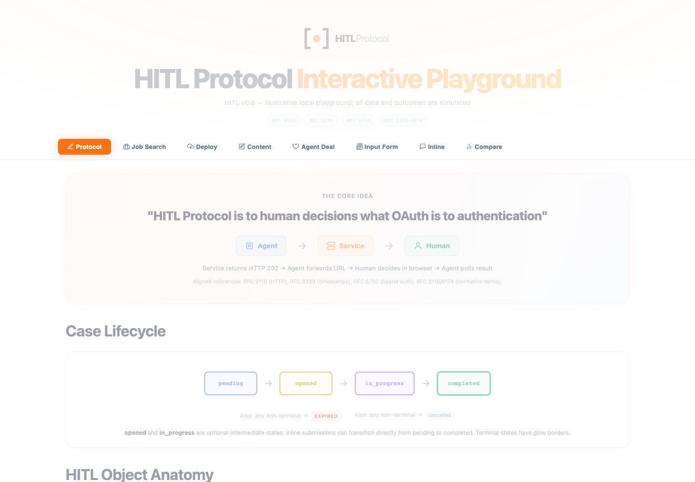
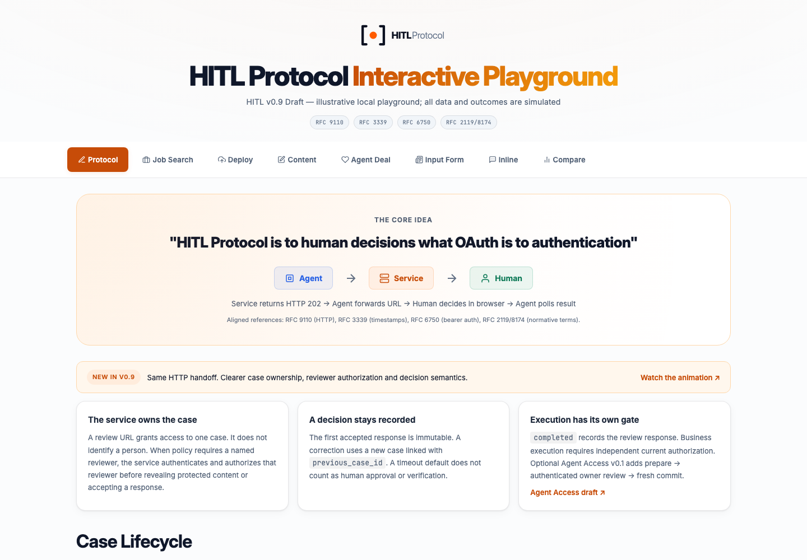

# Playground v0.9 refresh

Scope agreed 2026-10-06: refresh the existing detailed playground, preserve its eight tabs, orange visual identity, controls and use cases. The architecture animation remains the visual explanation and links here for details.

## Plan and acceptance criteria

| Task | Acceptance criteria |
|---|---|
| Update the protocol contract | Every displayed full HITL object, poll response and inline submit body validates against the canonical v0.9 schemas. Content rounds and linked confirmations include the required identifiers, URLs and timestamps. No v0.8 wire version remains. |
| Explain v0.9 semantics | Overview explains service-owned cases, independent reviewer authorization, immutable first decisions, optional intermediate states, timeout defaults and separate business execution. Agent Access is explicitly an optional v0.1 draft and links to its reference. |
| Preserve and improve the existing flows | All eight tabs and existing control choices remain. Native messaging buttons drive the illustrative action control. Optional verification step-up shows 403, the original review URL, and a completed browser response. Cancel as a decision is distinct from a cancelled case. |
| Refresh presentation and accessibility | Keep the orange cards, JSON blocks and sidebar layout. Improve contrast, spacing, focus states, touch targets and mobile reflow. Tabs support arrows/Home/End, correct ARIA and shareable URLs. Reduced motion suppresses animation. |
| Verify and compare | Browser checks cover all outcomes, transports, rounds, deal categories, form combinations and inline platforms. Clipboard fallback produces parseable JSON. Capture actual before/after screenshots at the same width. |

## User, data and state flows

The user chooses an existing tab, then adjusts its scenario controls. Renderers derive the illustrated steps and wire payloads from those choices. These are labeled fictional fixtures, not calls to a live service. The service owns a case and accepts at most one response; later edits use a linked case. A normalized review result records a decision; application execution needs a separate current authorization contract. Optional Agent Access adds prepare → authenticated owner review → fresh commit, described separately from the core.

The URL stores the selected tab and that tab's control values; reload and browser history restore them. Clipboard errors select the actual JSON and announce the fallback. No request is sent by a messenger button or signature demonstration.

## Comparison

Before:

After:

The root README uses a [dedicated current overview crop](../../assets/hitl-playground-v0.9-preview.png) with all eight tabs, v0.9 cards and the complete lifecycle. `pnpm capture:playground` regenerates that crop and these full comparison screenshots. See the [README audit](../readme-review.md).

Sources: [canonical HITL v0.9](../../spec/v0.9/hitl-protocol.md), [schemas](../../schemas/), [verification example](../../examples/15-step-up-verification.json), [Agent Access v0.1](../../profiles/agent-access/v0.1/README.md), [MDN accessible tabs](https://developer.mozilla.org/en-US/docs/Web/Accessibility/ARIA/Reference/Roles/tab_role), [current MCP elicitation](https://modelcontextprotocol.io/specification/2026-07-28/client/elicitation).

## Verification result

All 226 configurations pass in Chromium, Firefox and WebKit, including 552 schema-valid wire messages. Mobile table scroll regions and SSE wrapping are checked in each engine. Reproduce with `pnpm test:playground`, `node scripts/verify-playground.mjs --browser=webkit` or `--browser=firefox`. The refreshed screenshots now use bundled Inter 4.1 and JetBrains Mono 2.304, shared with the animation. The original before screenshots are retained. No font CDN is required.
