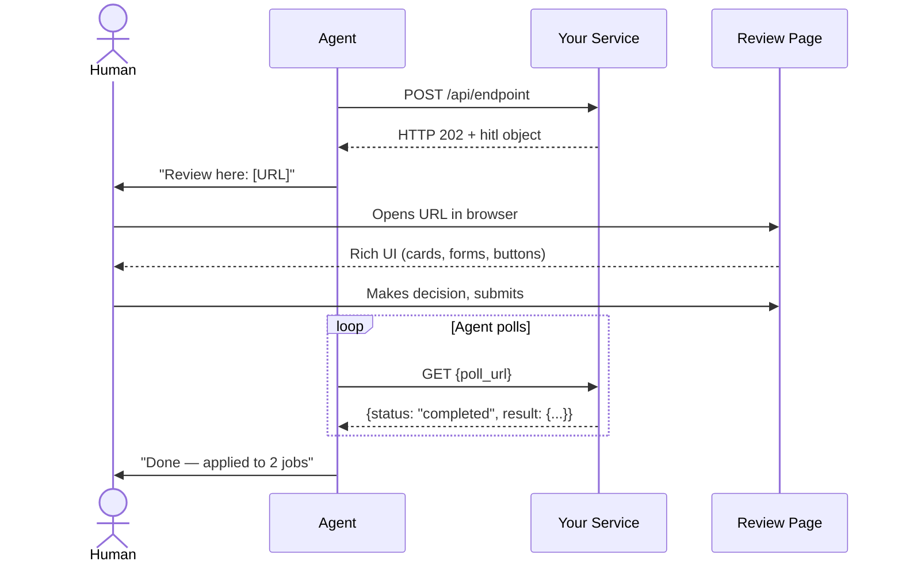
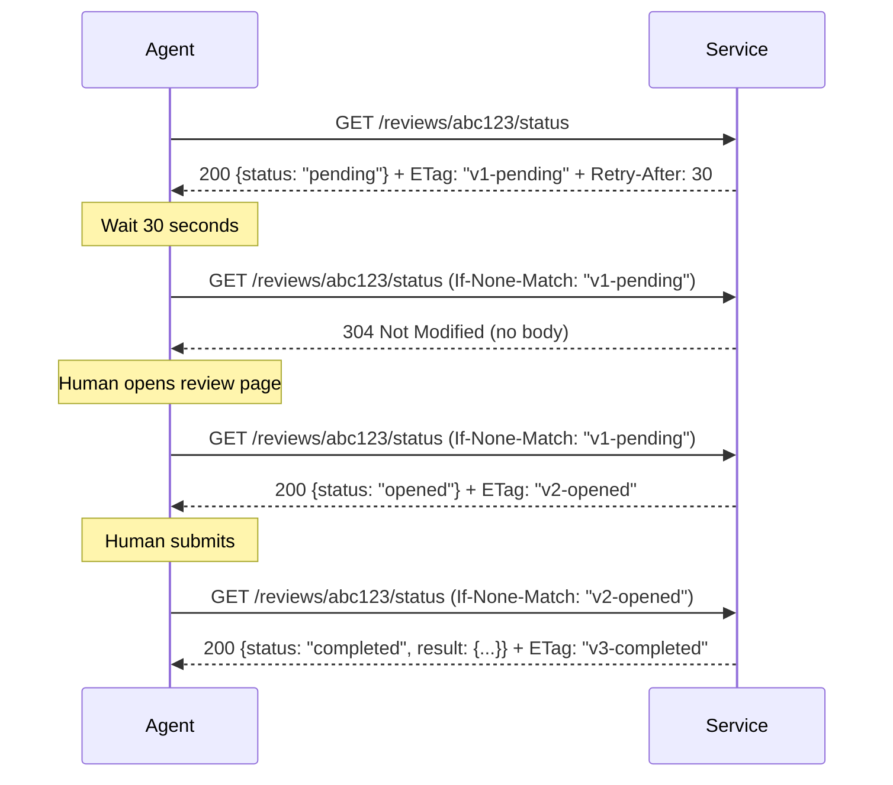
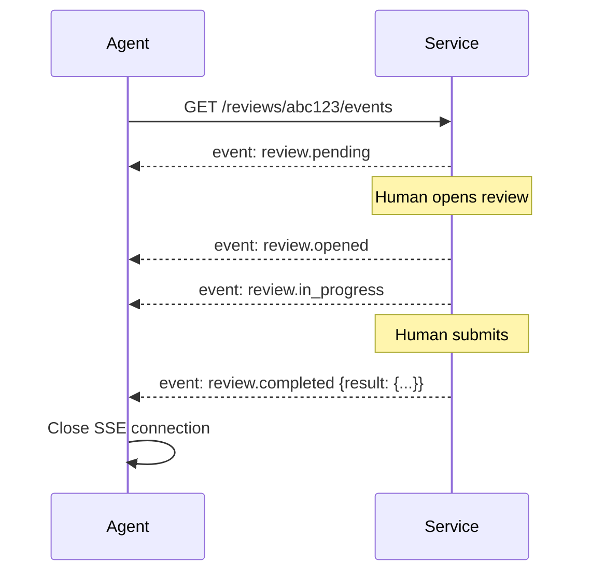
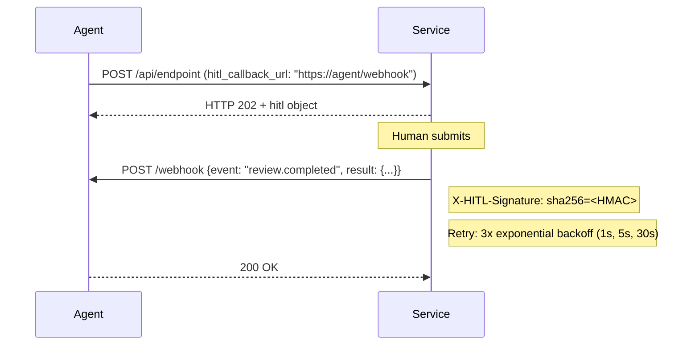
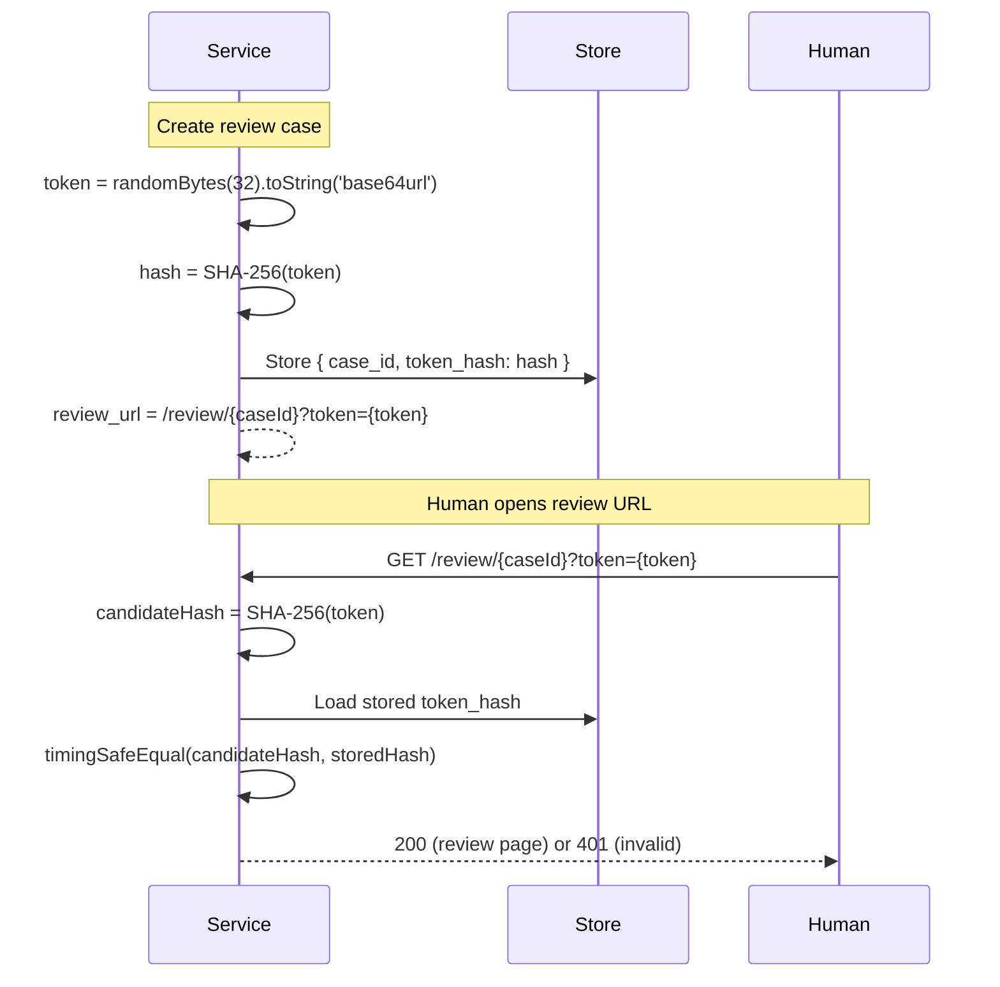
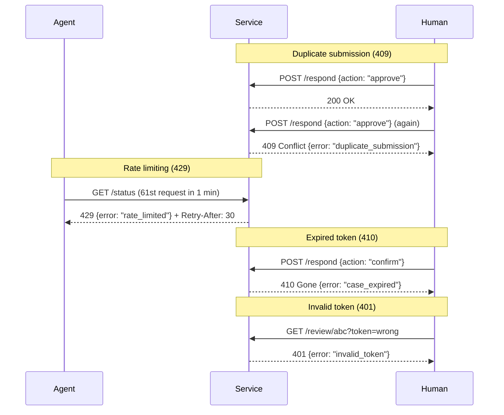
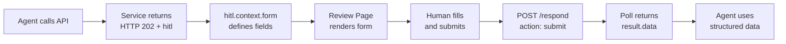
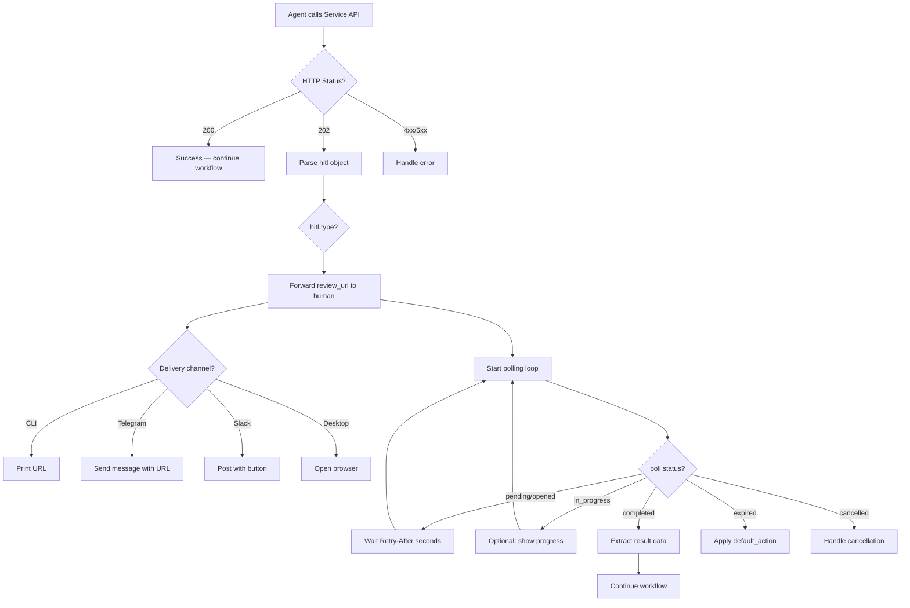

# HITL Protocol — Quick Start Guide

**For service implementors.** You have a web API. Autonomous agents call it. When a human decision is needed, your service returns HTTP 202 with a HITL object.

## Why HITL Protocol?

Autonomous agents (Claude Code, OpenClaw, Goose, Codex) communicate with humans via text channels — CLI, Telegram, Slack. When a human decision is needed, agents dump text and parse freeform responses. This works for yes/no. It fails for:

- Selecting from 5+ options with rich details
- Filling structured forms (salary, dates, preferences)
- Reviewing complex artifacts (code diffs, deployment plans)
- Confirming irreversible actions (sending emails, deploying to production)

**HITL Protocol solves this.** Your service returns a URL. The agent forwards it. The human opens it in a browser, sees your rich UI, and makes a decision. The agent polls for the structured result. No SDK. No UI rendering by the agent. Just HTTP + URL + polling.

### What Your Service Gets

| Benefit | How |
|---------|-----|
| **Agent compatibility** | Any HITL-compliant agent works with your API |
| **Rich UI stays with you** | Your review page, your branding, your UX |
| **Structured data** | Typed, validated responses instead of freeform text |
| **Human stays in the loop** | You control when human decisions are required |
| **Audit trail** | `responded_by` documents who decided |
| **Sensitive data protection** | Human enters PII directly in browser, never through agent |

## Architecture

### Protocol Flow



### Polling Detail (with ETag)



### SSE Transport (Optional)



### Callback Transport (Optional)



### Token Lifecycle



### Error Paths



### Form Data Flow



### Agent Decision Tree



## Choose Your Stack

### Express 5

```bash
cd implementations/reference-service/express
npm install && npm start
```

**5 steps to add HITL to your Express API:**

```javascript
import { randomBytes, createHash, timingSafeEqual } from 'node:crypto';

// 1. Generate a token
const token = randomBytes(32).toString('base64url');
const tokenHash = createHash('sha256').update(token).digest();

// 2. Return HTTP 202 with HITL object
app.post('/api/jobs/search', (req, res) => {
  res.status(202).json({
    status: 'human_input_required',
    message: '5 matching jobs found.',
    hitl: {
      spec_version: '0.5',
      case_id: 'review_abc123',
      review_url: `https://yourservice.com/review/abc123?token=${token}`,
      poll_url: 'https://api.yourservice.com/reviews/abc123/status',
      type: 'selection',
      prompt: 'Select which jobs to apply for',
      timeout: '24h',
      default_action: 'skip',
      created_at: new Date().toISOString(),
      expires_at: new Date(Date.now() + 86400000).toISOString(),
    }
  });
});

// 3. Serve review page (verify token first)
app.get('/review/:caseId', (req, res) => {
  const candidate = createHash('sha256').update(req.query.token).digest();
  if (!timingSafeEqual(candidate, storedHash)) return res.status(401).end();
  // Serve your HTML review page
});

// 4. Accept human response (one-time, 409 on duplicate)
app.post('/reviews/:caseId/respond', (req, res) => {
  if (reviewCase.status === 'completed') return res.status(409).json({error: 'duplicate_submission'});
  reviewCase.result = req.body;
  reviewCase.status = 'completed';
  res.json({ status: 'completed' });
});

// 5. Poll endpoint (ETag + Retry-After)
app.get('/api/reviews/:caseId/status', (req, res) => {
  if (req.get('If-None-Match') === reviewCase.etag) return res.status(304).end();
  res.set('ETag', reviewCase.etag).set('Retry-After', '30').json(reviewCase);
});
```

### Hono

```bash
cd implementations/reference-service/hono
npm install && npm start
```

Same 5 steps, different API:

```javascript
import { Hono } from 'hono';

const app = new Hono();

app.post('/api/jobs/search', (c) => {
  return c.json({ status: 'human_input_required', hitl: {...} }, 202, { 'Retry-After': '30' });
});

app.get('/api/reviews/:caseId/status', (c) => {
  const inm = c.req.header('If-None-Match');
  if (inm === rc.etag) return c.body(null, 304);
  return c.json(rc, 200, { 'ETag': rc.etag, 'Retry-After': '30' });
});
```

### Next.js (App Router)

```bash
cd implementations/reference-service/nextjs
npm install && npm run dev
```

File-based routes:

```
app/
  api/demo/route.ts              → POST /api/demo (returns 202)
  api/reviews/[caseId]/
    status/route.ts              → GET (poll with ETag)
    respond/route.ts             → POST (submit, 409 on duplicate)
    events/route.ts              → GET (SSE via ReadableStream)
  review/[caseId]/page.tsx       → Server Component (review page)
  .well-known/hitl.json/route.ts → Discovery
```

### FastAPI (Python)

```bash
cd implementations/reference-service/python
pip install -r requirements.txt
uvicorn server:app --port 3458
```

```python
import hashlib, hmac, secrets

# 1. Token
token = secrets.token_urlsafe(32)
token_hash = hashlib.sha256(token.encode()).digest()

# 2. HTTP 202
@app.post("/api/jobs/search")
async def search():
    return JSONResponse(status_code=202, content={"hitl": {...}})

# 3. Verify token
def verify(token, stored_hash):
    return hmac.compare_digest(hashlib.sha256(token.encode()).digest(), stored_hash)
```

### curl-only (Framework-agnostic)

Test against any running reference implementation:

```bash
# 1. Create review case
curl -s -X POST http://localhost:3456/api/demo?type=selection | jq .

# 2. Extract URLs from response
POLL_URL="http://localhost:3456/api/reviews/CASE_ID/status"

# 3. Poll
curl -s "$POLL_URL" -H 'If-None-Match: "v1-pending"'

# 4. Submit response
curl -s -X POST "http://localhost:3456/reviews/CASE_ID/respond?token=TOKEN" \
  -H 'Content-Type: application/json' \
  -d '{"action":"select","data":{"selected":["job_001"]}}'

# 5. Poll again (completed)
curl -s "$POLL_URL" | jq '.status'  # "completed"
```

## Minimal Implementation Checklist

Your service needs exactly 3 things:

1. **API endpoint** → Return HTTP 202 + `hitl` object when human input is needed
2. **Review page** → HTML page served at `review_url`, token-protected
3. **Poll endpoint** → Return current status at `poll_url`

That's it. SSE, callbacks, rate limiting, ETag — all optional enhancements.

## Next Steps

- [Full Specification](../spec/v0.5/hitl-protocol.md)
- [JSON Schemas](../schemas/) for validation
- [OpenAPI Spec](../schemas/openapi.yaml) for API documentation
- [Review Page Templates](../templates/) — drop-in HTML templates
- [Reference Implementations](../implementations/reference-service/) — working code in 4 frameworks
- [Examples](../examples/) — 8 complete end-to-end flows
- [Agent Checklist](../agents/checklist.md) — for agent implementors
