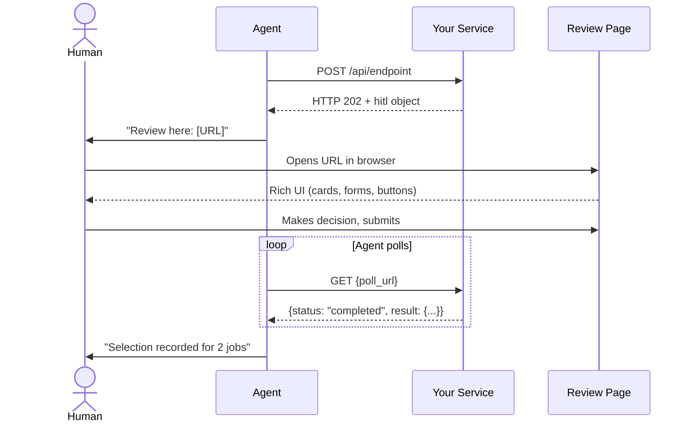
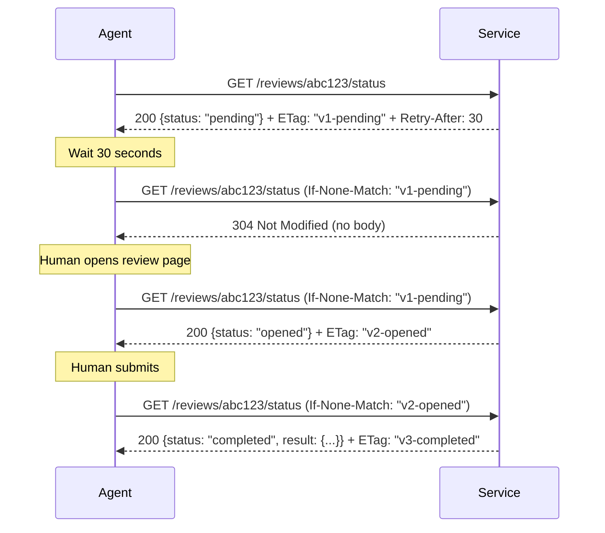
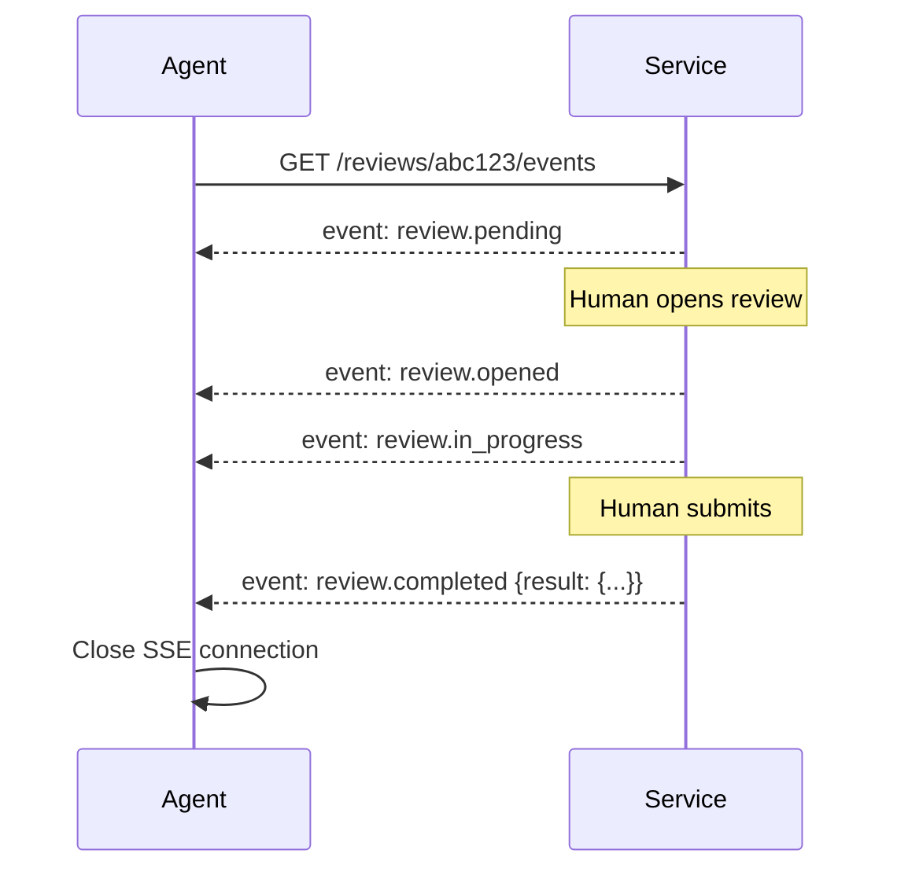
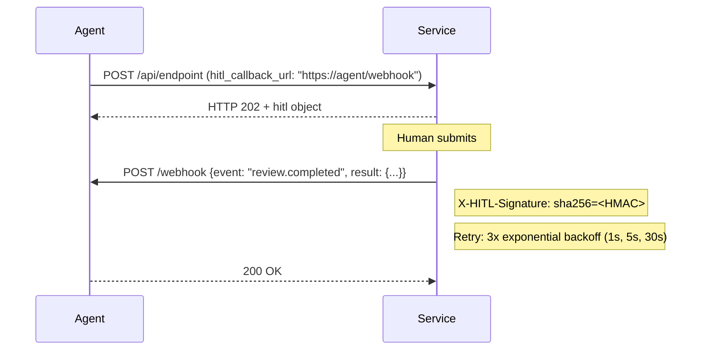
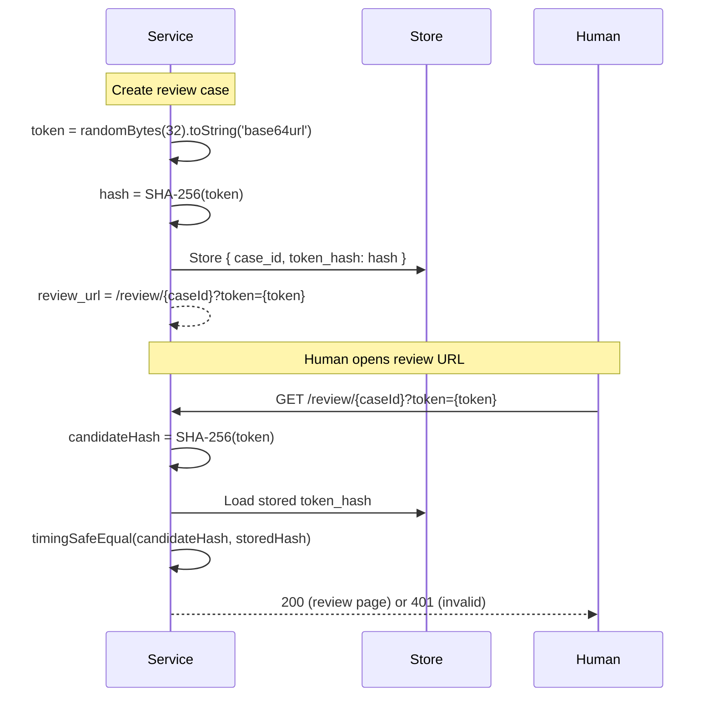
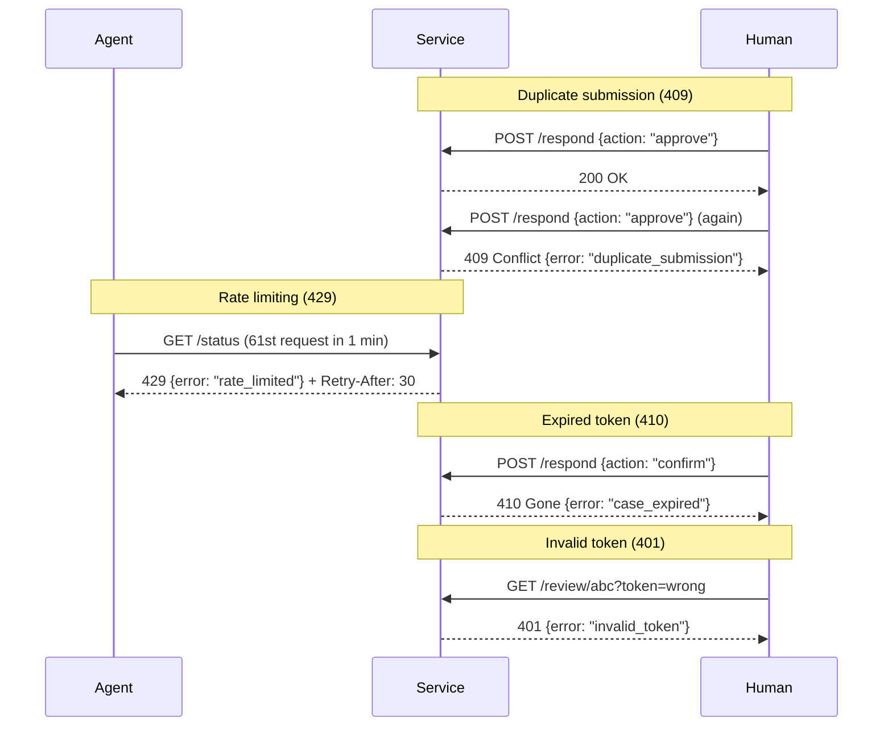
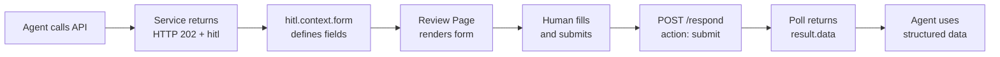
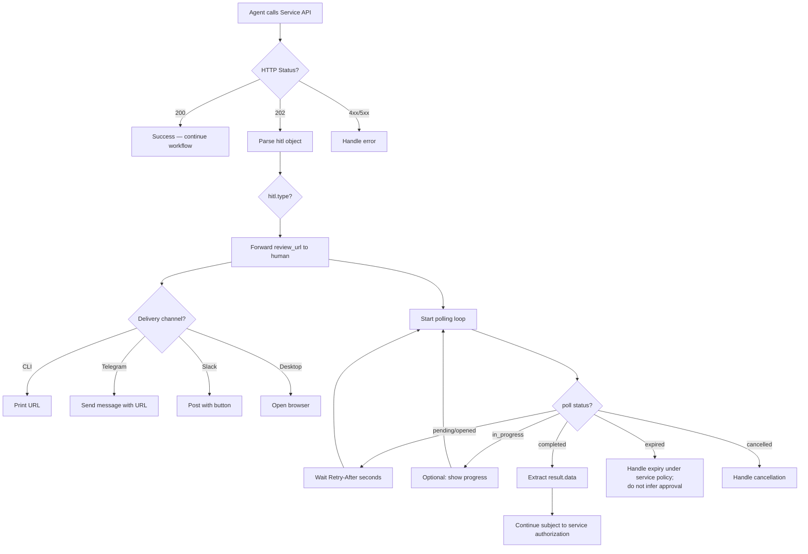

# HITL Protocol — Quick Start Guide

**For service implementors.** You have a web API. Autonomous agents call it. When a human decision is needed, your service returns HTTP 202 with a HITL object.

This guide runs the historical local **v0.8** demos. Use the [archived v0.8 schemas](../schemas/v0.8/) or `@hitl-protocol/schemas/v0.8` for those payloads. The [current v0.9 contract](../spec/v0.9/hitl-protocol.md) is the schema package default. The separate draft [Agent Access reference](../implementations/agent-access/README.md) demonstrates PKCE/OIDC owner enrollment, DPoP grants, immutable operations and explicit authorized execution.

## Why HITL Protocol?

Autonomous agents (Claude Code, OpenClaw, Goose, Codex) communicate with humans via text channels — CLI, Telegram, Slack. When a human decision is needed, agents dump text and parse freeform responses. This works for yes/no. It fails for:

- Selecting from 5+ options with rich details
- Filling structured forms (salary, dates, preferences)
- Reviewing complex artifacts (code diffs, deployment plans)
- Confirming irreversible actions (sending emails, deploying to production)

**HITL Protocol solves this.** Your service returns a URL. The agent forwards it. The human opens it in a browser, sees your rich UI, and makes a decision. The agent polls for the structured result. No SDK. No UI rendering by the agent. Just HTTP + URL + polling.

### What Your Service Gets

| Benefit | How |
|---------|-----|
| **Agent compatibility** | Any HITL-compliant agent works with your API |
| **Rich UI stays with you** | Your review page, your branding, your UX |
| **Structured data** | Typed, validated responses instead of freeform text |
| **Human stays in the loop** | You control when human decisions are required |
| **Audit trail** | Record decision facts; verified `responded_by` requires trusted service-side identity and case authorization |
| **Data minimization** | The service controls what context and result data reach the caller; browser entry alone does not keep PII out of poll results |

## Architecture

### Protocol Flow


```mermaid
sequenceDiagram
    actor H as Human
    participant A as Agent
    participant S as Your Service
    participant P as Review Page

    A->>S: POST /api/endpoint
    S-->>A: HTTP 202 + hitl object
    A->>H: "Review here: [URL]"
    H->>P: Opens URL in browser
    P-->>H: Rich UI (cards, forms, buttons)
    H->>P: Makes decision, submits
    loop Agent polls
        A->>S: GET {poll_url}
        S-->>A: {status: "completed", result: {...}}
    end
    A->>H: "Selection recorded for 2 jobs"
```

### Polling Detail (with ETag)


```mermaid
sequenceDiagram
    participant A as Agent
    participant S as Service

    A->>S: GET /reviews/abc123/status
    S-->>A: 200 {status: "pending"} + ETag: "v1-pending" + Retry-After: 30

    Note over A: Wait 30 seconds

    A->>S: GET /reviews/abc123/status (If-None-Match: "v1-pending")
    S-->>A: 304 Not Modified (no body)

    Note over A: Human opens review page

    A->>S: GET /reviews/abc123/status (If-None-Match: "v1-pending")
    S-->>A: 200 {status: "opened"} + ETag: "v2-opened"

    Note over A: Human submits

    A->>S: GET /reviews/abc123/status (If-None-Match: "v2-opened")
    S-->>A: 200 {status: "completed", result: {...}} + ETag: "v3-completed"
```

### SSE Transport (Optional)


```mermaid
sequenceDiagram
    participant A as Agent
    participant S as Service

    A->>S: GET /reviews/abc123/events
    S-->>A: event: review.pending

    Note over S: Human opens review

    S-->>A: event: review.opened
    S-->>A: event: review.in_progress

    Note over S: Human submits

    S-->>A: event: review.completed {result: {...}}
    A->>A: Close SSE connection
```

### Callback Transport (Optional)


```mermaid
sequenceDiagram
    participant A as Agent
    participant S as Service

    A->>S: POST /api/endpoint (hitl_callback_url: "https://agent/webhook")
    S-->>A: HTTP 202 + hitl object

    Note over S: Human submits

    S->>A: POST /webhook {event: "review.completed", result: {...}}
    Note right of S: X-HITL-Signature: sha256=<HMAC>
    Note right of S: Retry: 3x exponential backoff (1s, 5s, 30s)
    A-->>S: 200 OK
```

### Token Lifecycle


```mermaid
sequenceDiagram
    participant S as Service
    participant DB as Store
    participant H as Human

    Note over S: Create review case

    S->>S: token = randomBytes(32).toString('base64url')
    S->>S: hash = SHA-256(token)
    S->>DB: Store { case_id, token_hash: hash }
    S-->>S: review_url = /review/{caseId}?token={token}

    Note over S,H: Human opens review URL

    H->>S: GET /review/{caseId}?token={token}
    S->>S: candidateHash = SHA-256(token)
    S->>DB: Load stored token_hash
    S->>S: timingSafeEqual(candidateHash, storedHash)
    S-->>H: 200 (review page) or 401 (invalid)
```

### Error Paths


```mermaid
sequenceDiagram
    participant A as Agent
    participant S as Service
    participant H as Human

    Note over H,S: Duplicate submission (409)
    H->>S: POST /respond {action: "approve"}
    S-->>H: 200 OK
    H->>S: POST /respond {action: "approve"} (again)
    S-->>H: 409 Conflict {error: "duplicate_submission"}

    Note over A,S: Rate limiting (429)
    A->>S: GET /status (61st request in 1 min)
    S-->>A: 429 {error: "rate_limited"} + Retry-After: 30

    Note over H,S: Expired token (410)
    H->>S: POST /respond {action: "confirm"}
    S-->>H: 410 Gone {error: "case_expired"}

    Note over H,S: Invalid token (401)
    H->>S: GET /review/abc?token=wrong
    S-->>H: 401 {error: "invalid_token"}
```

### Form Data Flow


```mermaid
flowchart LR
    A[Agent calls API] --> B[Service returns<br/>HTTP 202 + hitl]
    B --> C[hitl.context.form<br/>defines fields]
    C --> D[Review Page<br/>renders form]
    D --> E[Human fills<br/>and submits]
    E --> F[POST /respond<br/>action: submit]
    F --> G[Poll returns<br/>result.data]
    G --> H[Agent uses<br/>structured data]
```

### Agent Decision Tree


```mermaid
flowchart TD
    A[Agent calls Service API] --> B{HTTP Status?}
    B -->|200| C[Success — continue workflow]
    B -->|202| D[Parse hitl object]
    B -->|4xx/5xx| E[Handle error]

    D --> F{hitl.type?}
    F --> G[Forward review_url to human]
    G --> H{Delivery channel?}
    H -->|CLI| I[Print URL]
    H -->|Telegram| J[Send message with URL]
    H -->|Slack| K[Post with button]
    H -->|Desktop| L[Open browser]

    G --> M[Start polling loop]
    M --> N{poll status?}
    N -->|pending/opened| O[Wait Retry-After seconds]
    O --> M
    N -->|in_progress| P[Optional: show progress]
    P --> M
    N -->|completed| Q[Extract result.data]
    Q --> R[Continue subject to service authorization]
    N -->|expired| S[Handle expiry under service policy;<br/>do not infer approval]
    N -->|cancelled| T[Handle cancellation]
```

## Choose Your Stack

### Express 5

```bash
pnpm install
pnpm --filter @hitl-protocol/schemas build
pnpm --filter @hitl-protocol/core build
pnpm --filter hitl-reference-express start
```

The [actual Express demo](../implementations/reference-service/express/server.js) contains the complete local flow. It emits v0.8 and uses the shared `parseSubmission`, `completeCase`, `expireCase` and `pollCase` helpers. Read and adapt that tested implementation rather than copying an abbreviated handler that omits token checks or mutation guards.

The examples bind to loopback and use process-local storage. A production service must add caller and reviewer authentication, case ownership and durable atomic storage. A review token proves possession; `opened` is a URL visit, and `completed` records a decision. Neither implies a human identity check or successful business execution.

### Hono

```bash
pnpm --filter hitl-reference-hono start
```

Use the [actual Hono Node handlers](../implementations/reference-service/hono/server.js). This variant imports Node filesystem and crypto APIs; it is not an Edge/Deno/Worker implementation. Its poll handler resolves expiry before conditional ETag responses and serializes the public poll contract, not the private store record.

### Next.js (App Router)

```bash
pnpm --filter hitl-reference-nextjs dev
```

File-based routes:

```
app/
  api/demo/route.ts              → POST /api/demo (returns 202)
  api/reviews/[caseId]/
    status/route.ts              → GET (poll with ETag)
    respond/route.ts             → POST (submit, 409 on duplicate)
    events/route.ts              → GET (SSE via ReadableStream)
  review/[caseId]/page.tsx       → Server Component (review page)
  .well-known/hitl.json/route.ts → Discovery
```

### FastAPI (Python)

```bash
cd implementations/reference-service/python
pip install -r requirements.txt
uvicorn server:app --host 127.0.0.1 --port 3458
```

```python
import hashlib, hmac, secrets

# 1. Token
token = secrets.token_urlsafe(32)
token_hash = hashlib.sha256(token.encode()).digest()

# 2. HTTP 202
@app.post("/api/jobs/search")
async def search():
    return JSONResponse(status_code=202, content={"hitl": {...}})

# 3. Verify token
def verify(token, stored_hash):
    return hmac.compare_digest(hashlib.sha256(token.encode()).digest(), stored_hash)
```

### curl-only (Framework-agnostic)

Test against any running reference implementation:

```bash
# 1. Create review case
curl -s -X POST http://localhost:3456/api/demo?type=selection | jq .

# 2. Extract URLs from response
POLL_URL="http://localhost:3456/api/reviews/CASE_ID/status"

# 3. Poll
curl -s "$POLL_URL" -H 'If-None-Match: "v1-pending"'

# 4. Submit response
curl -s -X POST "http://localhost:3456/reviews/CASE_ID/respond?token=TOKEN" \
  -H 'Content-Type: application/json' \
  -d '{"action":"select","data":{"selected":["job_001"]}}'

# 5. Poll again (completed)
curl -s "$POLL_URL" | jq '.status'  # "completed"
```

## Minimal Implementation Checklist

The historical handoff needs these pieces:

1. **API endpoint** → Return HTTP 202 + `hitl` object when human input is needed
2. **Review page** → HTML page served at `review_url`, token-protected
3. **Poll endpoint** → Return current status at `poll_url`
4. **Response endpoint** → Validate the decision, recheck expiry and accept exactly one terminal response

Production identity, authorization, persistence and execution controls remain service responsibilities. `completed` is not business success. In the Agent Access profile, a recent authenticated OIDC owner session records the decision and a fresh DPoP-authorized commit performs execution. Agent-provided `responded_by` is never a substitute for reviewer authentication.

## Next Steps

- [Current Specification](../spec/v0.9/hitl-protocol.md)
- [Historical v0.8 JSON Schemas](../schemas/v0.8/) for the examples in this guide
- [Historical v0.8 OpenAPI](../schemas/v0.8/openapi.yaml) for the demo contract
- [Current Schemas](../schemas/) for v0.9 and explicit version selection
- [Review Page Templates](../templates/) — drop-in HTML templates
- [Reference Implementations](../implementations/reference-service/) — working code in 4 frameworks
- [Examples](../examples/) — 12 complete end-to-end flows
- [Agent Checklist](../agents/checklist.md) — for agent implementors
