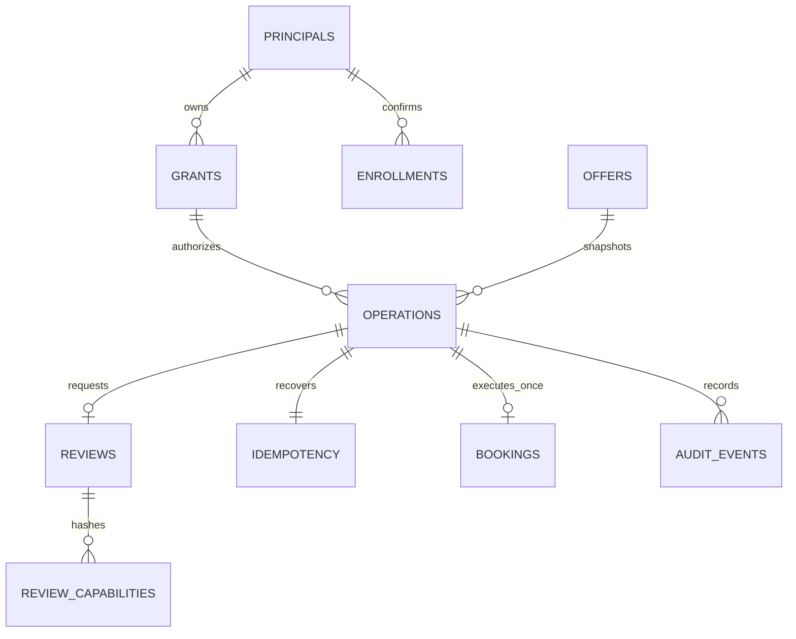

# HITL Agent Access reference — draft

This optional reference composes HITL v0.9 with Public Web identity and delegated API access. It stores demonstration offers and genuine local booking rows in PostgreSQL. It contacts no payment or booking provider. The profile remains a draft pending independent interoperability and threat-model review.

## Run locally

Requirements: Node 24 LTS, pnpm 10, Docker Compose. Dependencies are pinned in the workspace lockfile. The realm/image and credentials below are strictly local fixtures; they are not production credentials.

```sh
pnpm install --frozen-lockfile
pnpm run build
docker compose -f implementations/agent-access/compose.yaml up -d --build
node implementations/agent-access/reference/scripts/wait-for-provider.mjs
node --env-file=implementations/agent-access/reference/.env.example implementations/agent-access/reference/dist/server.js
```

Open <http://127.0.0.1:8789>. The isolated catalogue/database are on port 5459; Keycloak is on `http://localhost:8189/realms/hitl`. Distinct issuer/RP sites deliberately exercise the cross-site OIDC cookie boundary. Local users are `alice` / `alice-local-eval` and `bob` / `bob-local-eval`.

In another terminal, run the agent and follow its browser links:

```sh
ALLOW_INSECURE_LOCALHOST=true pnpm --filter @hitl-protocol/agent-access-reference agent
```

The agent performs code/PKCE/DPoP, confirmed connection, prepare, review, polling and explicit commit. Private signing keys and access/refresh tokens remain in that client process. The browser connection page explains the requested scope and per-booking limit; connected agents can be inspected and revoked.

## Invariants

- The server owns the immutable snapshot, price, grant and policy revisions. Human confirmation never expands a grant or executes a booking.
- Prepare uses a principal-bound idempotency key. Open-review retries return the same operation/case with fresh hash-only capabilities; five links per minute are permitted and previous links remain valid until expiry.
- Prepare, completion and commit first hold the shared namespace policy revision, then use principal → grant → operation/review → offer locks. Local revocation preserves the same business lock order. A monotonic policy promotion waits for active transactions; an older worker fails closed. Completion and commit recheck the database clock after locks and in their guarded writes. An expired reviewer login requires reauthentication and never expires the business proposal.
- Booking, stock, result and audit commit together. One booking per operation is enforced by PostgreSQL.
- Composite foreign keys bind grants, idempotency records and bookings to the same principal/operation/offer. Database triggers make identity and snapshot bindings immutable and advance revisions for material offer/grant changes; stock changes do not revise commercial terms.
- Every protected agent request uses current DPoP-bound credentials and uncached Keycloak introspection. Its two-second execution freshness budget starts on the database clock before introspection; network and lock latency count. External AS revocation is not atomic with the local database.
- Admission quotas run before nonce challenges, authentication and browser-session allocation. Browser login rotates session/CSRF identifiers, invalidates former login attempts and clears case bindings when the owner changes. Proof/replay deadlines and shared key-cache TTLs use database time; cache publication is fenced by the current lease owner.
- Public directory discovery is HTTPS-only, DNS-pinned, bounded and coordinated across processes with a persistent cache and expiring leases. No network request runs under a business DB lock.
- Status authorization and deadline projection precede conditional responses. Private responses are `no-store`. Review capabilities and browser/CSRF tokens are stored only as hashes; raw agent tokens are never persisted or logged. Short-lived OIDC state stores its PKCE verifier and nonce for the pending server-side exchange.

## Persisted flow



The operation snapshot supplies the browser display, policy checks and final booking. `reviews` owns the decision; `bookings` plus the operation result owns execution. There is no second approval field or binding store. Browser capabilities only establish case access and still require the matching owner login; agent credentials do not authenticate a reviewer.

The initial capability GET returns a token-free redirect with `Referrer-Policy: no-referrer`. OIDC state is opaque and bound to the browser session. Clean form pages use `same-origin` so native form submissions retain the exact Origin required by CSRF checks. Session cookies are HttpOnly/Lax for the cross-site OIDC callback; CSRF cookies are HttpOnly/Strict, case-bound server state is preserved across login, and decisions require authentication age at most 300 seconds.

The Keycloak fixture explicitly imports its official `basic` scope mappers for `sub` and `auth_time`; selecting only the custom profile/scopes would omit the required verified claims. All three clients disable the deprecated `fullScopeAllowed` default and use explicit scopes/mappers. The token has both the public resource audience and the confidential introspection-client audience. Global audience checks are enabled, and the agent remains a public client with no service secret.

## Verification

The [initial implementation report](eval-report.md) maps T0–T10 and E1–E12 to the original evals. The subsequent [security review and verification](security-review.md) records the corrective findings, current dependencies and final results.

```sh
pnpm run test
node --test scripts/*.test.mjs
pnpm run audit:dependencies
pnpm --filter hitl-tests-node test
pnpm eval:agent-access
pnpm eval:browser
```

Evals require the isolated PostgreSQL/Keycloak containers and installed Chromium (`pnpm --filter @hitl-protocol/agent-access-reference exec playwright install chromium`). Missing infrastructure is a failed eval, not a skip. Business records and idempotency mappings persist until the operator resets this demonstration database; only ephemeral security state is automatically pruned.

Use TLS and replace all fixture secrets outside loopback development. Configure a single canonical public origin and trusted AS, preserve request targets across proxies and apply normal request protection before expensive verification. Public identity is not brand authenticity, user authentication, authorization or proof of humanity.
