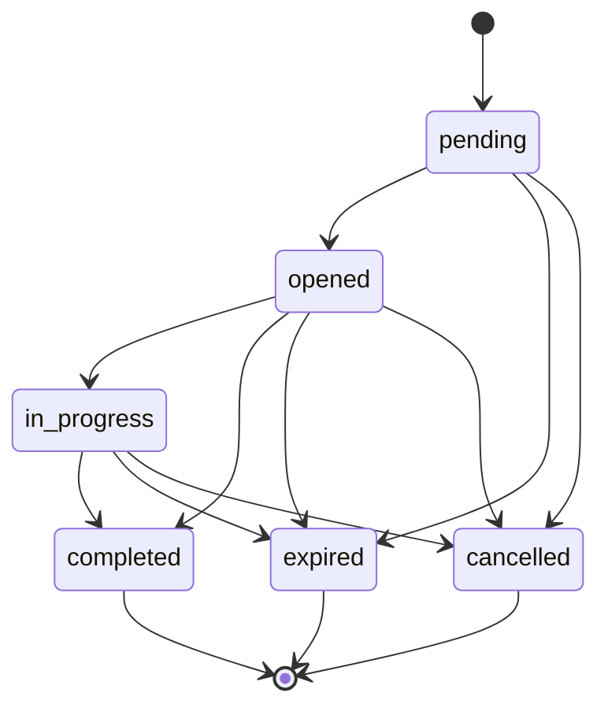

# @hitl-protocol/core

Core runtime utilities for [HITL Protocol](https://github.com/rotorstar/hitl-protocol) implementations — tokens, state machine, rate limiting.

## Install

```bash
npm install @hitl-protocol/core
```

## Usage

### Token Utilities

Dual-token model: `review_token` (browser URL) + `submit_token` (agent inline submit).

```typescript
import { generateToken, hashToken, verifyToken, verifyTokenForPurpose } from '@hitl-protocol/core'

const token = generateToken()           // base64url, 256 bits
const hash = hashToken(token)           // SHA-256 → Buffer
const valid = verifyToken(token, hash)  // timing-safe comparison

// Purpose-scoped verification (v0.6)
const ok = verifyTokenForPurpose(token, reviewCase, 'submit')
```

### State Machine

6 states, 13 valid transitions, 3 terminal states.

```typescript
import { transition, canTransition, VALID_TRANSITIONS, TERMINAL_STATES } from '@hitl-protocol/core'

// Check before transitioning
if (canTransition(rc.status, 'completed')) {
  // Optional callback for side effects (SSE, cleanup)
  transition(rc, 'completed', (rc) => notifySSE(rc))
}
```



### Rate Limiting

```typescript
import { checkRateLimit, clearRateLimit, RATE_LIMIT } from '@hitl-protocol/core'

const { allowed, remaining } = checkRateLimit(caseId)
if (!allowed) return res.status(429)

// Clean up on terminal state
clearRateLimit(caseId)
```

### Constants

```typescript
import { INLINE_ACTIONS, PROMPTS, SAMPLE_CONTEXTS } from '@hitl-protocol/core'

// Actions allowed for inline submit per review type
INLINE_ACTIONS.confirmation  // ['confirm', 'cancel']
INLINE_ACTIONS.selection     // [] (URL-only)
```

### Types

```typescript
import type { ReviewCase, ReviewType, ReviewStatus } from '@hitl-protocol/core'
```

## License

Apache-2.0
