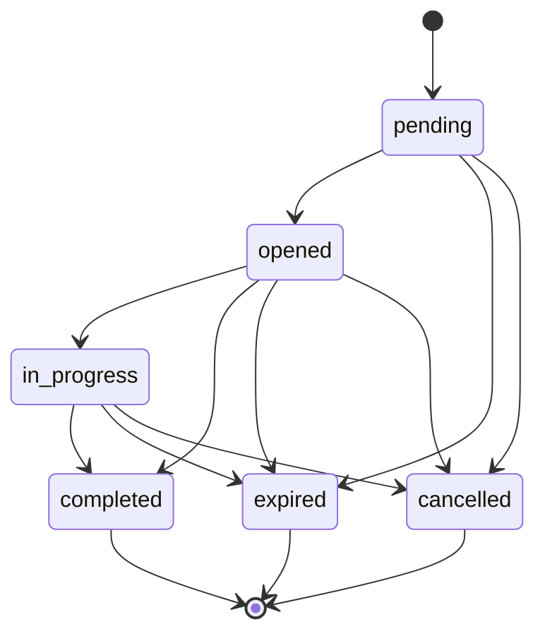

# @hitl-protocol/schemas

JSON Schemas, TypeScript types, and validators for [HITL Protocol](https://github.com/rotorstar/hitl-protocol) v0.7.

## Install

```bash
npm install @hitl-protocol/schemas
```

## Usage

### TypeScript Types

```typescript
import type { HitlObject, PollResponse, SubmitRequest } from '@hitl-protocol/schemas'

function handleResponse(hitl: HitlObject) {
  console.log(hitl.case_id, hitl.review_url)

  // Inline submit support (v0.7)
  if (hitl.submit_url && hitl.submit_token) {
    console.log('Inline actions:', hitl.inline_actions)
  }
}
```

### Validation

```typescript
import { validateHitlObject, validatePollResponse } from '@hitl-protocol/schemas'

const data = JSON.parse(responseBody)

if (validateHitlObject(data)) {
  // data is a valid HitlObject
} else {
  console.error('Validation errors:', validateHitlObject.errors)
}
```

### Raw JSON Schemas

```typescript
import { hitlObjectSchema, pollResponseSchema } from '@hitl-protocol/schemas'

// Use with your own AJV instance or other JSON Schema tooling
console.log(hitlObjectSchema.$id)
```

Or import schema files directly:

```typescript
import schema from '@hitl-protocol/schemas/hitl-object.schema.json' with { type: 'json' }
```

## Schemas

| Schema | Description |
|--------|-------------|
| `hitl-object.schema.json` | HITL object in HTTP 202 response |
| `poll-response.schema.json` | Poll endpoint response |
| `form-field.schema.json` | Form field definitions (Input reviews) |
| `submit-request.schema.json` | Inline submit request body (v0.7) |

## Types

All types are derived from the JSON Schemas and validated against them in the test suite.

### Core Types

- `HitlObject` — The `hitl` object in an HTTP 202 response
- `PollResponse` — Response from the poll endpoint
- `SubmitRequest` — Inline submit request body
- `FormField` — Form field definition
- `ReviewType` — `'approval' | 'selection' | 'input' | 'confirmation' | 'escalation'`
- `ReviewStatus` — `'pending' | 'opened' | 'in_progress' | 'completed' | 'expired' | 'cancelled'`

### State Machine



## License

Apache-2.0
