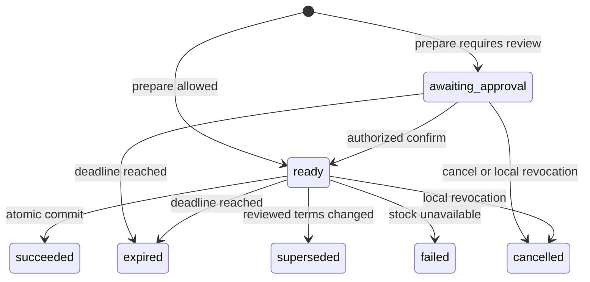

# HITL Agent Access Profile v0.1 (Draft)

This optional profile composes verified agent requests, delegated OAuth rights, an authorized human decision, and explicit execution. HITL remains the decision transport. The service's business operation and grant are the sources of truth for authority and execution.

## Profile identifiers and discovery

- Base: `hitl-agent-access/0.1`
- Public web binding: `hitl-agent-access-public-web/0.1`
- Delegated API binding: `hitl-agent-access-delegated-api/0.1`

A service advertises implemented identifiers in HITL v0.9 discovery `authentication.profiles`. `supports_agent_binding` describes actual enforcement, not a client's ability to attach identifiers. Discovery is public. Operation-specific `x-hitl-agent-access-binding` in [OpenAPI](openapi.json) identifies the required binding; no redundant binding request header is required. A protected operation MUST reject unsupported bindings, missing proofs, and bearer-only substitution.

The generated [context schema](agent-access-context.schema.json) and OpenAPI domain schemas are projections of the canonical runtime Zod contracts in `packages/agent-access/src/contracts.ts`. Schema artifacts are regenerated and checked for drift. Snapshot arithmetic and authorization are runtime constraints, not guarantees of JSON Schema validation alone.

## Public web binding

The binding uses [RFC 9421](https://www.rfc-editor.org/rfc/rfc9421.html) with the pinned [Web Bot Auth working-group draft 00](https://datatracker.ietf.org/doc/html/draft-ietf-webbotauth-httpsig-protocol-00). The draft is not an RFC. Signers MUST use the draft's dictionary-form `Signature-Agent`; the legacy single-string form is not accepted by this profile. Matching dictionary keys correlate each agent assertion and signature. The verified signer is a signing entity; it is not automatically a named user or an enrolled delegated principal.

The service MUST verify signature components, key ownership under the discovered signing entity, method, target URI, creation/expiration, and nonce/replay protection. Relevant request bodies require a verified, signed `Content-Digest`. Unknown valid signing entities may access only public capabilities; discovery is not an enrollment or global reputation system. An anonymous public request may use the anonymous quota. A request presenting an invalid signature MUST fail validation rather than silently downgrade to anonymous access.

Key discovery MUST constrain HTTPS destinations, response sizes, timeouts, redirects, and public-address resolution. DNS rebinding and redirects into private, loopback, link-local, or metadata networks MUST be blocked. Resolved keys may be cached for a bounded time; credential validity and replay are checked for every request. Reverse-proxy reconstruction MUST use a configured trusted public origin and trusted forwarding policy, not arbitrary client forwarding headers.

Proof acceptance and replay retention MUST share an authoritative clock and an exclusive validity deadline. Expiration is rechecked after asynchronous verification; replay records cannot be removed while a proof remains acceptable. The reference uses PostgreSQL time across its processes, a maximum 60-second signature lifetime and 30-second clock-skew allowance.

## Delegated API binding

Enrollment uses OAuth Authorization Code with PKCE and [DPoP](https://www.rfc-editor.org/rfc/rfc9449.html), following [OAuth Security BCP](https://www.rfc-editor.org/rfc/rfc9700.html). Every protected API request uses `Authorization: DPoP <access_token>` plus a fresh `DPoP` proof. The resource server validates issuer, audience, permitted client, expiration, scopes, token-key binding, method/URI, token hash, nonce when required, and replay. DPoP proves possession of a key; it does not independently establish user authority or product identity.

The authorization server MUST restrict issuance of the service's audience and scopes to permitted clients. The Keycloak adapter verifies that the signed `azp` equals the live introspection `client_id`; local authority additionally requires independently confirmed enrollment of that exact client/key. This is not an implicit registry of approved agent vendors.

Protected resource metadata follows [RFC 9728](https://www.rfc-editor.org/rfc/rfc9728.html). The reference exposes these scopes: `hitl:agent:enroll`, `hitl:reviews:read`, `bookings:read`, `bookings:prepare`, `bookings:commit`.

An enrollment proposal stores verified `(issuer, subject, client_id, jkt)` facts, expiry, and a proposed grant. An independently authenticated browser user with matching issuer/subject confirms it. Confirmation creates a service-owned principal and grant. Client-supplied user, principal, tenant, or scope fields confer no authority. The reference is single-tenant; a multi-tenant adopter MUST derive tenant identity from trusted configuration/claims and include it in every ownership check.

Two installations with different DPoP keys receive separate principals and grants. Refresh with the same identity/key preserves ownership. Key rotation requires new confirmed enrollment; the owner explicitly revokes the previous installation to invalidate its open operations. Creating another installation alone does not revoke existing installations. Subdelegation is outside v0.1. Revoked principals/grants cannot prepare, poll protected cases, or commit. Effective rights are the intersection of token scopes, active local grants, and current service policy.

## Prepare, review, and commit

1. `POST /v1/bookings/prepare` validates the offer version, quantity, grant ownership, and current rights. `Idempotency-Key` is mandatory and scoped to the verified principal and request fingerprint. The same key/body returns the same operation; a different body returns `409 idempotency_conflict`.
2. The service records an immutable snapshot with item, price/fees in integer EUR cents, quantity, total, refundability, terms, offer/grant/policy versions. JCS plus SHA-256 yields the lowercase 64-character hexadecimal `snapshot_digest`. Floating-point money is not accepted.
3. If policy permits, the operation is `ready`. If policy requires review, HTTP 202 contains a HITL v0.9 confirmation case. The immutable snapshot is the sole source for the review display and eventual booking.
4. The authenticated owner reviews that snapshot in a service-controlled browser. The initial opaque URL token is exchanged for a short-lived case-scoped session and redirected to `/review/{id}` without a token. Reviewer identity, case authorization, expiry, and CSRF are checked before accepting `confirm` or `cancel`.
5. Confirmation records one immutable HITL decision and moves the operation to `ready`. It does not create a booking. `cancel`, expiry, or revocation never authorizes execution.
6. A fresh DPoP-authenticated `POST /v1/operations/{id}/commit` supplies `expected_version` and `snapshot_digest`. Current token/AS status, scopes, local principal/grant, binding, snapshot, policy, expiry, and stock are rechecked. Local reservation, unique booking, inventory update, and result persistence occur in one PostgreSQL transaction.

Browser authentication MUST rotate the session identifier and CSRF secret and invalidate pending attempts bound to the former session. Anonymous-to-owner login may retain a redeemed case binding; switching the authenticated owner MUST clear it. GET, login and session refresh never record consent. Invalid review links and unauthenticated decision POSTs do not create browser sessions. Browser authentication is at most 300 seconds old when a decision, enrollment or revocation is recorded, including after lock waits.

The context namespace is `hitl.context["x-hitl-agent-access"]`:

```json
{
  "profile": "hitl-agent-access/0.1",
  "binding": "delegated-api",
  "operation_id": "operation_123",
  "operation_version": 1,
  "snapshot_digest": "0000000000000000000000000000000000000000000000000000000000000000",
  "execution_mode": "explicit_commit"
}
```

These values are correlation metadata, not secrets or portable grants. They are compared with the service's persisted operation. An old or foreign binding never grants access. Clients without profile support may relay the browser URL and poll; they cannot bypass the protected commit contract.

The review advertises `verification_policy.mode: "required"`, `required_for: ["browser_submit"]`, and a service-verified `proof_type: "x-hitl-agent-access-reviewer"` with provider `reference-oidc` and presentation format `x-service-session`. Satisfaction requires authenticated owner identity and decision authorization, not merely an existing browser cookie. This proof type makes no proof-of-human, biometric, or legal-authority claim. Agent Access cases expose neither `submit_url` nor `submit_token`, and use `default_action: "abort"`. The poll's normalized verification result is audit information and never an execution authorization.

The reference policy limits each operation to an active grant's `max_total_cents`, capped at 50,000. Refundable operations up to 10,000 cents may become ready directly; higher totals or non-refundable offers require review. A human confirmation cannot exceed that grant. This is a per-operation limit, not a cumulative spending budget.

## States and recovery



The six HITL review statuses and the operation statuses are separate contracts. `completed` means a decision has been recorded; only an operation `succeeded` result establishes local execution. Terminal operation responses remain available to their authorized owner. A repeated commit after a lost success response returns the persisted result without another booking. Simultaneous commits produce exactly one local booking. Changed material terms require a new preparation/review rather than modifying the accepted snapshot.

Local grant revocation and reservation use the same transactional state. Revocation committed before reservation prevents execution. Authorization-server introspection occurs before commit without a status cache; the reference does not claim instantaneous global AS revocation across that network/transaction boundary. AS outages fail closed with `503 temporarily_unavailable`. Existing persisted success is reported consistently after retries. External provider execution, payments, and uncertain remote outcomes require their own idempotency/reconciliation contract and are outside this reference.

The reference samples the shared database clock immediately before introspection, so network and lock latency consume its two-second freshness budget. Future observations and observations older than two seconds are rejected before the booking write. Authorized status projection reads owner/grant, state and its statement timestamp consistently before ETag evaluation; a concurrent successful transition must not be reported as an expiry caused by a later, separately sampled clock.

| Route | Binding / owner | Result |
|---|---|---|
| `GET /v1/catalog` | Anonymous or public-web signing entity | Public available offers, including an empty list |
| `POST /v1/agent-enrollments` | Delegated API, enrollment scope | Pending browser-verification URL |
| `GET /v1/agent-enrollments/{id}` | Original issuer/subject/client/key | Pending, confirmed, or expired enrollment |
| `GET/POST /connect/{id}` | Authenticated enrollment owner; POST CSRF | Explicit enrollment confirmation |
| `POST /v1/bookings/prepare` | Delegated principal, grant, prepare scope | Ready operation or HTTP 202 review |
| `GET /v1/reviews/{id}` | Initiating principal and review-read scope | Versioned HITL PollResponse |
| `GET /v1/operations/{id}` | Initiating principal and read scope | Authoritative operation/result |
| `POST /v1/operations/{id}/commit` | Initiating principal and commit scope | Atomic execution or explicit error |
| `GET /review/{id}` | Case access plus authenticated reviewer owner | Immutable snapshot/recorded decision |
| `POST /review/{id}/respond` | Same reviewer and case; CSRF | Exactly one decision |
| `GET /account/agents` | Authenticated account owner | Connected principals/grants |
| `POST /account/agents/{id}/revoke` | Same owner; CSRF | Idempotent local revocation |

## Security, privacy, and conformance

| Threat | Required boundary and test |
|---|---|
| Spoofing / confused deputy | Verify credentials; store owner facts; reject forged IDs and foreign cases |
| Tampering / TOCTOU | Display persisted snapshot; compare version/digest; recheck rights and stock at commit |
| Replay / double execution | Proof nonces, scoped prepare idempotency, atomic review, unique operation booking |
| SSRF / DNS rebinding | Restrict public key fetches and redirects; inject private destination attacks |
| CSRF / URL leakage | Owner session, case cookie, token-free redirect, no-store, no-referrer, CSRF checks |
| Enumeration / cross-tenant access | Authenticate before disclosure; non-owner objects receive non-disclosing 404 |
| Repudiation / overclaiming | Persist verified reviewer/decision facts; service signatures prove origin only |
| Availability / partial failure | Bounded fetch and bodies, rate limits, fail-closed AS checks, restart/retry tests |

Public responses must not disclose tokens, token hashes, DPoP material, raw identity-provider proofs, or internal session records. Logs redact query tokens, authorization/DPoP headers and CSRF. Audit records use opaque IDs and minimal required identity facts; access and retention follow the service policy. Responses with private data use `Cache-Control: no-store`.

Admission limits MUST run before expensive verification, nonce challenges and anonymous session allocation, including on rejected requests. The reference's delegated/browser paths allow at most 240 requests per actual network peer and 2,400 per service namespace per minute across both processes; authenticated calls additionally allow 60 per agent identity and 120 per account. An exhausted peer/agent bucket is rejected before charging its shared global/account bucket. Public catalogue quotas remain separate. These are bounded reference defaults, not a production capacity claim; upstream connection and bandwidth controls remain deployment responsibilities.

The browser must support WCAG 2.2 AA, keyboard interaction, labelled controls, visible focus, screen-reader status feedback, mobile layouts, and touch targets. Loading, empty account/catalog states, denied identity, expired review, duplicate decisions, errors and retry recovery must be explicit. Refresh, back/forward and deep links reload persisted state; they never silently repeat a mutation. Browser navigation does not require optimistic booking claims.

Conformance requires contract tests against generated schemas, independent signers, real DPoP/AS flows, authorized browser E2E, transaction races, loss/retry/restart, owner isolation, revocation, CSRF and key-discovery attacks. Publish the draft/reference with measured results; do not claim broad adoption or external interoperability until independently demonstrated.
