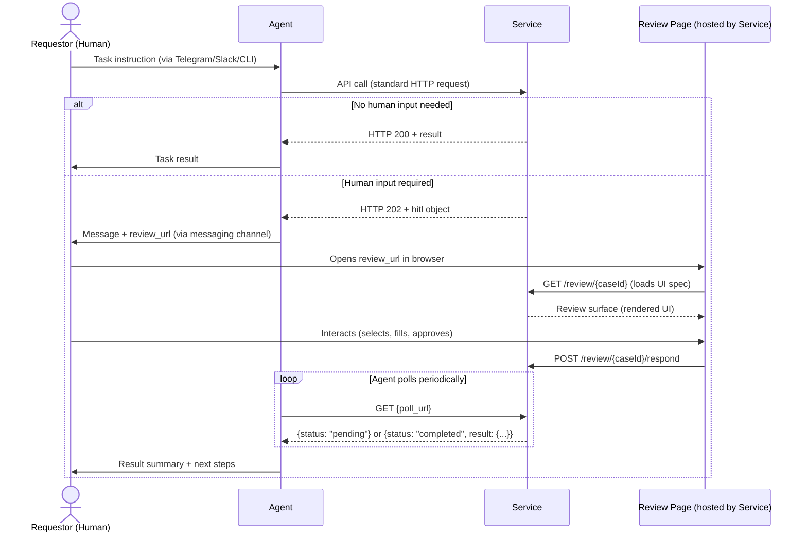
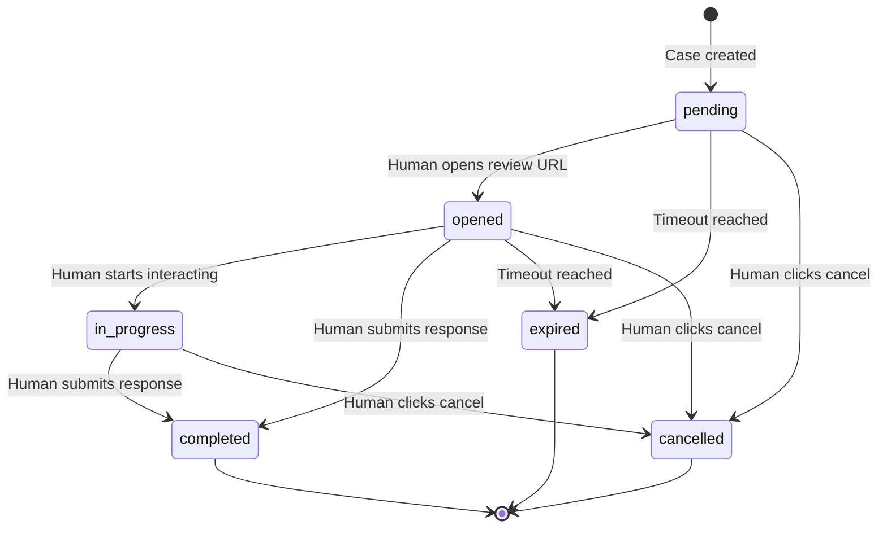
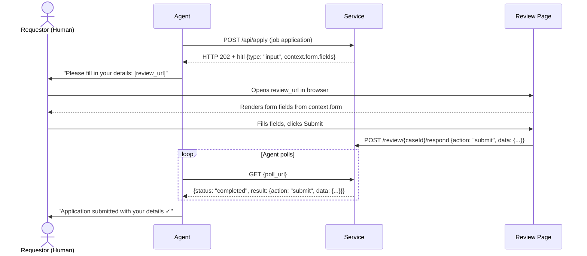
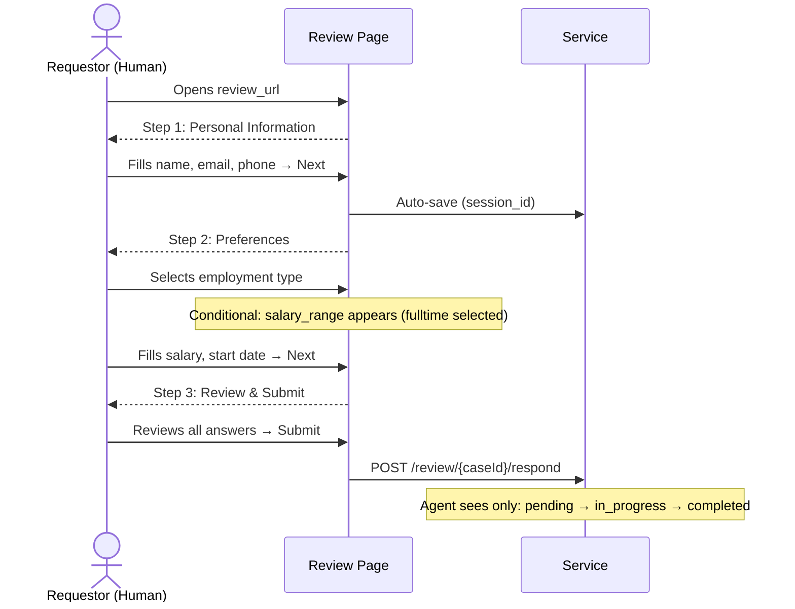
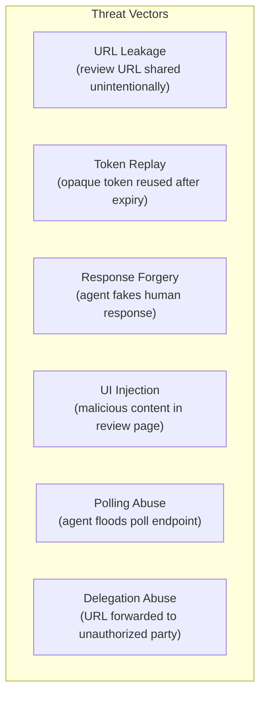

# HITL Protocol Specification v0.5

**Human-in-the-Loop Protocol for Autonomous Agent Services**

---

## 1. Abstract

The HITL Protocol defines a standard mechanism for any service to request structured human input during an autonomous agent's workflow. When a service needs a human decision — approval, selection, data entry, confirmation, or escalation — it returns an HTTP 202 response containing a `hitl` object with a review URL. The agent forwards this URL to the human via their preferred channel (Telegram, Slack, WhatsApp, CLI). The human opens the URL in a browser, interacts with a rich responsive UI, and submits their decision. The agent retrieves the result by polling a status endpoint.

HITL Protocol is to human decisions what OAuth is to authentication: a standardized three-party flow between Agent, Service, and Human.

---

## 2. Status

| Field | Value |
|-------|-------|
| **Version** | 0.5 (Draft) |
| **Date** | 2026-02-22 |
| **Authors** | Torsten Heissler (@rotorstar) |
| **License** | Apache 2.0 |
| **Status** | Draft — open for community feedback |
| **Repository** | https://github.com/rotorstar/hitl-protocol |

### Versioning

This specification follows Semantic Versioning. Breaking changes increment the major version. The `spec_version` field in all HITL objects enables forward compatibility.

---

## 3. Motivation

### The Gap

Four standards define the autonomous agent ecosystem:

| Standard | What it solves |
|----------|---------------|
| **SKILL.md** (Agent Skills Standard) | How an agent discovers a skill |
| **agent.json** (A2A Protocol) | How agents communicate with each other |
| **MCP** (Model Context Protocol) | How an agent accesses tools and resources |
| **AG-UI** (CopilotKit) | How an agent streams to a frontend application |
| **OAuth 2.0** | How a user authenticates with third parties |

AG-UI connects agents to frontend applications they are embedded in — it standardizes real-time event streaming between an agent backend and a React/Angular app. It does not address the case where an autonomous agent (running in a terminal, communicating via Telegram) needs to get a structured human decision from an external service.

None of these standards addresses: **How does a service request a structured human decision during an agent's workflow?**

### The Problem

Autonomous agents (OpenClaw, Claude Code, Codex, Goose) communicate with humans via text channels — Telegram, Slack, WhatsApp, CLI terminals. When a human-in-the-loop moment arises, the current experience is:

1. The agent dumps a wall of text describing options
2. The human types a freeform response ("option 2 please")
3. The agent parses the response (unreliably)
4. No structured data, no forms, no buttons, no visual previews

This works for simple yes/no decisions. It fails catastrophically for:
- Selecting from 5+ options with rich details (job listings, deployment configs)
- Providing structured input (salary range, date preferences, address fields)
- Reviewing complex artifacts (CV drafts, email previews, code diffs)
- Multi-field forms (application details, configuration parameters)

### The Solution

HITL Protocol standardizes a three-party flow:

1. **Service** returns HTTP 202 with a `hitl` object containing a `review_url`
2. **Agent** forwards the URL to the human (via any messaging channel)
3. **Human** opens the URL in a browser, sees a rich responsive UI, submits their decision
4. **Agent** polls a `poll_url` to retrieve the structured result

The service hosts the review page and generates the UI. The agent is only a messenger. The human gets a first-class interactive experience regardless of their messaging platform.

---

## 4. Terminology

| Term | Definition |
|------|------------|
| **Agent** | An autonomous software entity that executes tasks on behalf of a human (e.g., OpenClaw, Claude Code, Codex). The agent calls service APIs and forwards review URLs to the Requestor. |
| **Service** | Any API or web application that an agent interacts with (e.g., job board, CI/CD pipeline, CMS, email provider). The service decides when human input is needed and hosts the review page. |
| **Requestor** | The human who initiated the agent's task and will review/decide. Receives the review URL via a messaging channel. |
| **Review Case** | A single instance of a human-input-required decision. Identified by a unique `case_id`. Has a lifecycle: `pending` → `opened` → `in_progress` → `completed` \| `expired` \| `cancelled`. The intermediate states `opened` and `in_progress` are optional. |
| **Review URL** | A signed URL pointing to the service's review page for a specific case. Contains an opaque bearer token for authentication. The service stores only the SHA-256 hash; the raw token in the URL is the sole proof of access. No login required. |
| **Review Surface** | The interactive UI rendered at the review URL. Can be implemented with any web technology. The spec recommends json-render but does not mandate it. |
| **Poll URL** | An API endpoint the agent calls to check the status of a review case and retrieve the result when complete. |
| **Callback URL** | An optional webhook URL provided by the agent. The service POSTs the result to this URL when the human completes the review, enabling real-time notification without polling. |
| **HITL Object** | The JSON object within an HTTP 202 response that contains all information the agent needs to facilitate the human review. |
| **Review Type** | One of five standardized categories of human input: Approval, Selection, Input, Confirmation, Escalation. |

### Conventions

The key words "MUST", "MUST NOT", "REQUIRED", "SHALL", "SHALL NOT", "SHOULD", "SHOULD NOT", "RECOMMENDED", "MAY", and "OPTIONAL" in this document are to be interpreted as described in [RFC 2119](https://www.rfc-editor.org/rfc/rfc2119).

---

## 5. Protocol Overview

### Sequence Diagram



### Design Principles

1. **Agent-agnostic.** Any agent that speaks HTTP can participate. No SDK required. The agent only needs to recognize HTTP 202 + `hitl` and forward a URL.

2. **Service-hosted UI.** The service generates and hosts the review page. The service has the data context and knows what the human needs to see.

3. **URL-based delivery.** The review URL works in any browser on any device. No app install, no account creation, no login.

4. **Polling as default.** The agent retrieves results by polling a status endpoint. No server-side infrastructure required on the agent side. Callbacks are optional.

5. **Renderer-agnostic.** The spec defines the transport layer (HTTP 202, poll/callback, signed URLs) and review types. The UI rendering technology is a service implementation choice.

---

## 6. HTTP 202 Response

### When to Return HTTP 202

A service MUST return HTTP 202 Accepted (instead of 200 OK) when:
- The request was understood and accepted
- A human decision is required before the service can provide a final result
- The service has created a review case for human interaction

A service MUST NOT return HTTP 202 for:
- Requests that can be fulfilled without human input (use 200)
- Invalid or malformed requests (use 4xx)
- Server errors (use 5xx)
- Long-running async operations that do NOT require human input (use 202 without `hitl`, per standard HTTP semantics)

### Response Schema

```json
{
  "status": "human_input_required",
  "message": "5 matching jobs found. Please select which ones to apply for.",
  "hitl": {
    "spec_version": "0.5",
    "case_id": "review_abc123def456",
    "review_url": "https://service.example.com/review/abc123def456?token=K7xR2mN4pQ8sT1vW3xY5zA9bC...",
    "poll_url": "https://api.service.example.com/v1/reviews/abc123def456/status",
    "callback_url": null,
    "type": "selection",
    "prompt": "Select which jobs to apply for",
    "timeout": "24h",
    "default_action": "skip",
    "created_at": "2026-02-20T10:00:00Z",
    "expires_at": "2026-02-21T10:00:00Z",
    "context": {
      "total_options": 5,
      "query": "Senior Dev Berlin"
    }
  }
}
```

### Field Definitions

| Field | Type | Required | Description |
|-------|------|----------|-------------|
| `status` | string | REQUIRED | MUST be `"human_input_required"` |
| `message` | string | RECOMMENDED | Human-readable summary for the agent to relay to the requestor |
| `hitl` | object | REQUIRED | The HITL object (see below) |

#### HITL Object Fields

| Field | Type | Required | Description |
|-------|------|----------|-------------|
| `spec_version` | string | REQUIRED | Protocol version. MUST be `"0.5"` for this spec. |
| `case_id` | string | REQUIRED | Unique identifier for this review case. MUST be URL-safe. RECOMMENDED format: `review_{random}` |
| `review_url` | string (URL) | REQUIRED | Fully qualified URL to the review page. MUST include a signed token for authentication. |
| `poll_url` | string (URL) | REQUIRED | Fully qualified URL to the status polling endpoint. |
| `callback_url` | string (URL) \| null | OPTIONAL | If the agent provided a callback URL in the original request, it is echoed here. Otherwise `null`. |
| `events_url` | string (URL) | OPTIONAL | SSE endpoint for real-time status events. See Section 8.5. |
| `type` | string (enum) | REQUIRED | One of: `"approval"`, `"selection"`, `"input"`, `"confirmation"`, `"escalation"`. See Section 10. |
| `prompt` | string | REQUIRED | Short description of what the human needs to decide. Max 500 characters. |
| `timeout` | string (duration) | RECOMMENDED | How long the review case stays open. Format: ISO 8601 duration (`PT24H`, `P7D`) or shorthand (`24h`, `7d`). Default: `24h`. |
| `default_action` | string | OPTIONAL | Action to take if the review expires without a response. One of: `"skip"`, `"approve"`, `"reject"`, `"abort"`. Default: `"skip"`. |
| `created_at` | string (ISO 8601) | REQUIRED | Timestamp when the review case was created. |
| `expires_at` | string (ISO 8601) | REQUIRED | Timestamp when the review case expires. |
| `context` | object | OPTIONAL | Arbitrary key-value pairs providing additional context about the review. Not processed by the agent — for human consumption on the review page. |
| `reminder_at` | string (ISO 8601) \| string[] | OPTIONAL | When reminder(s) should be sent to the human. A single timestamp or an array of timestamps. The agent SHOULD re-send the review URL when a reminder timestamp is reached and the case is still `pending` or `opened`. |
| `previous_case_id` | string | OPTIONAL | Links this case to a prior case in a multi-round review chain. Enables agents to reconstruct the full review history. See Section 15.3 for an example. |

### Agent Behavior on HTTP 202

When an agent receives HTTP 202 with a `hitl` object, it MUST:

1. Extract `hitl.review_url`
2. Send `hitl.review_url` to the requestor via their messaging channel, along with `hitl.prompt` or `message` as context
3. Begin polling `hitl.poll_url` (see Section 8) or register `hitl.callback_url` if supported

An agent MUST NOT:
- Attempt to render the review UI itself
- Submit responses on behalf of the human without explicit delegation
- Ignore the HITL signal and proceed without human input

### Requesting a Callback

If the agent has a publicly reachable endpoint and prefers real-time notification over polling, it MAY include a `callback_url` in the original API request:

```json
POST /api/v1/search
{
  "query": "Senior Dev Berlin",
  "hitl_callback_url": "https://agent.example.com/webhooks/hitl"
}
```

The service SHOULD honor the callback URL if provided, in addition to supporting polling.

---

## 7. Review URL

### Structure

```
https://{service_host}/review/{case_id}?token={opaque_token}
```

- `{service_host}` — the service's domain
- `{case_id}` — the unique review case identifier
- `{opaque_token}` — a cryptographically random bearer token (base64url, 43 chars, 256 bits entropy)

### Token Model

The service generates a random token and stores only its SHA-256 hash. Verification uses timing-safe comparison: `timingSafeEqual(SHA-256(url_token), stored_hash)`.

| Aspect | Requirement |
|--------|-------------|
| **Generation** | `randomBytes(32).toString('base64url')` — 43 characters |
| **Storage** | SHA-256 hash only — the raw token is NEVER stored server-side |
| **Verification** | Timing-safe hash comparison on every request |
| **Length** | ~43 chars (vs ~241 for JWT) — minimizes LLM agent corruption risk |
| **DB leak impact** | Attacker gets useless hashes; cannot reconstruct valid URLs |

> **Why not JWT?** Autonomous AI agents forward review URLs via text channels (Telegram, Slack, CLI). LLM tokenizers split long random strings (>100 chars) into subword tokens, causing bit-flips during reproduction. At 241 characters, JWT tokens have a measurable corruption rate when agents relay them. Opaque tokens at 43 characters are below the corruption threshold observed in practice.

### Security Properties

- **No login required.** The opaque token in the URL IS the authentication. Anyone with the URL can view and respond to the review.
- **Time-limited.** The service tracks `expires_at` in the database. After expiry, the review page MUST show an "expired" message.
- **One-response.** After the first response is submitted, subsequent visits SHOULD show a "already responded" message with the submitted response. Services MAY allow editing within a grace period.
- **Delegation by design.** The requestor can forward the URL to a colleague. This is intentional — whoever has the URL can respond.

### HTTPS Requirement

Review URLs MUST use HTTPS. Services MUST NOT generate review URLs over plain HTTP.

### Delivery Modes

Agents operate in diverse environments. The delivery mode for the review URL depends on how the agent communicates with the human:

| Mode | When | How |
|------|------|-----|
| **Messaging channel** (default) | Agent communicates via Telegram, Slack, WhatsApp, Discord | Send URL as a clickable link in the message |
| **Desktop direct** | Agent runs in a terminal on the same machine as the human | Open URL in the default browser via `open` (macOS), `xdg-open` (Linux), or `start` (Windows) |
| **Terminal QR** | Agent runs in a remote terminal (SSH) and human has a phone nearby | Render a QR code in the terminal (e.g., using `qrencode -t ANSI`) for the human to scan |

Agents SHOULD choose the delivery mode based on their runtime context:
- CLI/terminal agents on the user's machine → Desktop direct
- CLI agents on a remote server → Terminal QR or messaging channel
- Messaging-based agents (Telegram bots, Slack apps) → Messaging channel
- Agents with no human communication channel → Log the URL and rely on service-side reminders

---

## 8. Poll Interface

### Endpoint

```
GET {poll_url}
```

The `poll_url` is provided in the HITL object. It returns the current status of the review case.

### Authentication

The poll URL SHOULD accept the same authentication as the original API call (e.g., Bearer token, API key). This ensures only the agent that initiated the request can poll for the result.

### Response Schema

#### Status: Pending

```json
{
  "status": "pending",
  "case_id": "review_abc123def456",
  "created_at": "2026-02-20T10:00:00Z",
  "expires_at": "2026-02-21T10:00:00Z"
}
```

#### Status: Opened

Indicates the human has opened the review URL but has not yet submitted a response.

```json
{
  "status": "opened",
  "case_id": "review_abc123def456",
  "created_at": "2026-02-20T10:00:00Z",
  "opened_at": "2026-02-20T10:03:00Z",
  "expires_at": "2026-02-21T10:00:00Z"
}
```

#### Status: In Progress

Indicates the human is actively interacting with the review page (e.g., filling form fields, toggling selections). Services MAY use this status to signal that the review is being worked on. This status is OPTIONAL — services that do not track interaction granularity MAY skip directly from `opened` to `completed`.

```json
{
  "status": "in_progress",
  "case_id": "review_abc123def456",
  "created_at": "2026-02-20T10:00:00Z",
  "opened_at": "2026-02-20T10:03:00Z",
  "expires_at": "2026-02-21T10:00:00Z"
}
```

#### Status: Completed

```json
{
  "status": "completed",
  "case_id": "review_abc123def456",
  "completed_at": "2026-02-20T10:15:00Z",
  "result": {
    "action": "approve",
    "data": {
      "selected_jobs": ["job-123", "job-456"],
      "note": "Only remote positions"
    }
  },
  "responded_by": {
    "name": "Torsten H.",
    "email": "torsten@example.com"
  }
}
```

#### Status: Expired

```json
{
  "status": "expired",
  "case_id": "review_abc123def456",
  "expired_at": "2026-02-21T10:00:00Z",
  "default_action": "skip"
}
```

#### Status: Cancelled

```json
{
  "status": "cancelled",
  "case_id": "review_abc123def456",
  "cancelled_at": "2026-02-20T10:05:00Z",
  "reason": "User clicked cancel"
}
```

### Status Machine



All terminal states (`completed`, `expired`, `cancelled`) are final. A case MUST NOT transition out of a terminal state. The intermediate states `opened` and `in_progress` are OPTIONAL — services that do not track page-open or interaction events MAY transition directly from `pending` to any terminal state.

### Poll Field Definitions

| Field | Type | Required | Description |
|-------|------|----------|-------------|
| `status` | string (enum) | REQUIRED | One of: `"pending"`, `"opened"`, `"in_progress"`, `"completed"`, `"expired"`, `"cancelled"` |
| `case_id` | string | REQUIRED | The review case identifier |
| `created_at` | string (ISO 8601) | REQUIRED | When the case was created |
| `opened_at` | string (ISO 8601) | When opened/in_progress | When the human first opened the review URL |
| `expires_at` | string (ISO 8601) | When pending/opened/in_progress | When the case will expire |
| `completed_at` | string (ISO 8601) | When completed | When the human submitted their response |
| `expired_at` | string (ISO 8601) | When expired | When the case expired |
| `cancelled_at` | string (ISO 8601) | When cancelled | When the human cancelled |
| `result` | object | When completed | The human's response (see below) |
| `result.action` | string | When completed | The action taken: `"approve"`, `"reject"`, `"submit"`, `"select"`, `"retry"`, `"skip"`, `"abort"` |
| `result.data` | object | When completed | Structured data from the review (type-dependent, see Section 10) |
| `responded_by` | object | When completed | OPTIONAL. Identity of the person who submitted the response. See Section 13.7. |
| `responded_by.name` | string | When completed | Display name of the respondent |
| `responded_by.email` | string | When completed | Verified email of the respondent (if service collected it) |
| `reminder_sent_at` | string (ISO 8601) | When pending/opened | When the last reminder was sent (by service or triggered by `reminder_at`) |
| `next_case_id` | string | When completed | If the service created a follow-up case (e.g., a revision request), this links to the next case in the chain |
| `default_action` | string | When expired | The default action declared when the case was created |
| `reason` | string | When cancelled | Human-readable reason for cancellation |

### Polling Recommendations

- Agents SHOULD poll at a reasonable interval. RECOMMENDED: 30 seconds to 5 minutes, depending on expected response time.
- Agents using heartbeat/cron scheduling (e.g., OpenClaw) SHOULD check poll URLs as part of their regular heartbeat cycle.
- Services MAY include a `Retry-After` header in pending responses to suggest optimal poll intervals.
- Services SHOULD support `If-None-Match` / `ETag` for efficient polling.

---

## 8.5 SSE Event Stream (Optional)

### Overview

As an alternative to polling, services MAY offer a Server-Sent Events (SSE) endpoint for real-time status updates. SSE combines the simplicity of polling (agent initiates the connection, no public endpoint required) with the efficiency of callbacks (server pushes updates instantly).

This transport option is inspired by AG-UI's event-streaming architecture, adapted for HITL Protocol's async review model.

### Endpoint

The `events_url` field in the HITL object points to an SSE endpoint:

```
GET {events_url}
Accept: text/event-stream
Authorization: Bearer <agent_token>
```

### Event Format

Events follow the [SSE specification](https://html.spec.whatwg.org/multipage/server-sent-events.html):

```
event: review.opened
data: {"case_id":"review_abc123","opened_at":"2026-02-20T10:03:00Z"}

event: review.in_progress
data: {"case_id":"review_abc123","opened_at":"2026-02-20T10:03:00Z"}

event: review.completed
data: {"case_id":"review_abc123","completed_at":"2026-02-20T10:15:00Z","result":{"action":"approve","data":{"selected":["job-2","job-4"],"note":"Only remote"}}}

event: review.expired
data: {"case_id":"review_abc123","expired_at":"2026-02-21T10:00:00Z","default_action":"skip"}

event: review.cancelled
data: {"case_id":"review_abc123","cancelled_at":"2026-02-20T10:05:00Z","reason":"User clicked cancel"}

event: review.reminder
data: {"case_id":"review_abc123","reminder_at":"2026-02-20T22:00:00Z","message":"Review expires in 12 hours"}
```

### Event Types

| Event | When | Data |
|-------|------|------|
| `review.opened` | Human opens the review URL | `case_id`, `opened_at` |
| `review.in_progress` | Human starts interacting with the form | `case_id`, `opened_at` |
| `review.reminder` | Reminder timestamp reached (case still pending/opened) | `case_id`, `reminder_at`, `message` |
| `review.completed` | Human submits their response | `case_id`, `completed_at`, `result` |
| `review.expired` | Review case times out | `case_id`, `expired_at`, `default_action` |
| `review.cancelled` | Human cancels the review | `case_id`, `cancelled_at`, `reason` |

### Reconnection

- The SSE endpoint SHOULD include an `id` field per event for reconnection via `Last-Event-ID`.
- If the connection drops, the agent reconnects and receives any events missed since the last `id`.
- After a terminal event (`completed`, `expired`, `cancelled`), the server SHOULD close the connection.

### Relation to Polling

- SSE is an OPTIONAL optimization. The `poll_url` remains the source of truth.
- Agents that support SSE SHOULD still fall back to polling if the SSE connection fails.
- Services that offer SSE MUST also support polling — not all agents can maintain persistent connections.

### When to Use SSE vs Polling vs Callback

| Transport | Agent has public endpoint? | Needs real-time? | Connection model |
|-----------|--------------------------|-------------------|-----------------|
| **Polling** (default) | No | No | Stateless, periodic GET |
| **SSE** | No | Yes | Persistent GET, server pushes |
| **Callback** | Yes | Yes | Server POSTs to agent |

SSE is RECOMMENDED for agents that run as long-lived processes (daemons, background services) and want real-time updates without exposing a public endpoint.

---

## 9. Callback Interface (Optional)

### Overview

As an alternative to polling, agents with a publicly reachable endpoint MAY request real-time notification via a callback (webhook).

### Agent Request

The agent includes a `hitl_callback_url` in its original API request:

```json
{
  "query": "Senior Dev Berlin",
  "hitl_callback_url": "https://agent.example.com/webhooks/hitl"
}
```

### Service Callback

When the human completes the review, the service POSTs the result to the callback URL:

```
POST {hitl_callback_url}
Content-Type: application/json
X-HITL-Signature: sha256=<hmac_hex>

{
  "event": "review.completed",
  "case_id": "review_abc123def456",
  "completed_at": "2026-02-20T10:15:00Z",
  "result": {
    "action": "approve",
    "data": {
      "selected_jobs": ["job-123", "job-456"],
      "note": "Only remote positions"
    }
  }
}
```

### Callback Events

| Event | When |
|-------|------|
| `review.completed` | Human submitted a response |
| `review.expired` | Review case timed out |
| `review.cancelled` | Human cancelled the review |

### Signature Verification

The `X-HITL-Signature` header contains an HMAC-SHA256 signature of the request body, using a shared secret established during initial API authentication. Agents SHOULD verify this signature before processing callbacks.

### Reliability

- The service SHOULD retry failed callback deliveries (HTTP 5xx or timeout) with exponential backoff, up to 3 attempts.
- Callback is a best-effort optimization. Agents SHOULD still support polling as a fallback.
- If the callback fails permanently, the poll endpoint remains the source of truth.

---

## 10. Review Types

The spec defines five standard review types. Each type represents a category of human decision with a predictable UI pattern and result structure.

| Type | Actions | Multi-round | Typical trigger |
|------|---------|-------------|-----------------|
| **Approval** | `approve` · `edit` · `reject` | Yes — `edit` creates follow-up case via `previous_case_id` | Artifact ready for review |
| **Selection** | `select` | No | Multiple options available |
| **Input** | `submit` | No | Missing data the agent cannot infer |
| **Confirmation** | `confirm` · `cancel` | No — one-shot gate | Irreversible action imminent |
| **Escalation** | `retry` · `skip` · `abort` | No | Error or unexpected state |

### 10.1 Approval

**When:** The service has produced an artifact (document, email draft, deployment plan) and needs human go/no-go.

**UI pattern:** Preview of the artifact + action buttons (Approve / Edit / Reject).

**Result structure:**

```json
{
  "action": "approve" | "reject" | "edit",
  "data": {
    "feedback": "Optional text feedback",
    "edits": {}
  }
}
```

**Example:** CV service generates a CV draft. Agent needs human approval before sending it to employers.

> **Multi-round behavior:** When the human responds with `action: "edit"`, the agent revises the artifact and the service creates a new approval case with `previous_case_id` linking to the original. This chain continues until the human responds with `approve` or `reject`. See Section 15.3 for a full multi-round example.

### 10.2 Selection

**When:** The service has multiple options and the human must choose one or more.

**UI pattern:** Cards/list with details for each option + checkboxes or radio buttons.

**Result structure:**

```json
{
  "action": "select",
  "data": {
    "selected": ["option-id-1", "option-id-3"],
    "note": "Optional note"
  }
}
```

**Example:** Job board finds 5 matching positions. Human selects which ones to apply for.

### 10.3 Input

**When:** The service needs information that the agent does not have.

**UI pattern:** Form with typed fields. The service declares form fields in `context.form`, and the review page renders them.

**Result structure:**

```json
{
  "action": "submit",
  "data": {
    "salary_expectation": 108000,
    "earliest_start_date": "2026-05-01",
    "work_authorization": "blue_card",
    "willing_to_relocate": "already_local"
  }
}
```

**Example:** Job application API needs salary expectations, start date, and visa status that the agent cannot infer.

#### 10.3.1 Form Field Definitions

When using the Input review type, services SHOULD declare form fields in `context.form`. This enables review pages to render structured forms without hardcoded layouts.

**Single-step form:**

```json
{
  "context": {
    "form": {
      "fields": [
        {
          "key": "salary_expectation",
          "label": "Salary Expectation (EUR, annual gross)",
          "type": "number",
          "required": true,
          "placeholder": "e.g. 105000",
          "hint": "The listed range is 95,000 - 120,000 EUR",
          "sensitive": true,
          "validation": {
            "min": 0,
            "max": 1000000
          }
        },
        {
          "key": "work_authorization",
          "label": "Work Authorization in Germany",
          "type": "select",
          "required": true,
          "options": [
            { "value": "citizen", "label": "EU/EEA Citizen" },
            { "value": "needs_sponsorship", "label": "Requires Visa Sponsorship" }
          ]
        }
      ]
    }
  }
}
```

**Standard field types:**

| Type | HTML Equivalent | Value Type | Notes |
|------|----------------|------------|-------|
| `text` | `<input type="text">` | string | Single-line text |
| `textarea` | `<textarea>` | string | Multi-line text |
| `number` | `<input type="number">` | number | Integer or decimal |
| `date` | `<input type="date">` | string (ISO 8601) | Date picker |
| `email` | `<input type="email">` | string | Email with validation |
| `url` | `<input type="url">` | string | URL with validation |
| `boolean` | `<input type="checkbox">` | boolean | True/false toggle |
| `select` | `<select>` | string | Single choice from options |
| `multiselect` | `<select multiple>` | string[] | Multiple choices from options |
| `range` | `<input type="range">` | number | Slider within min/max |

Services MAY extend with custom types using an `x-` prefix (e.g., `x-file-upload`, `x-color-picker`). Review pages that do not recognize a custom type SHOULD fall back to `text`.

**Field properties:**

| Property | Type | Required | Description |
|----------|------|----------|-------------|
| `key` | string | REQUIRED | Unique identifier for the field. Used as key in `result.data`. |
| `label` | string | REQUIRED | Human-readable label displayed next to the field. |
| `type` | string | REQUIRED | One of the standard field types above, or a custom `x-` prefixed type. |
| `required` | boolean | OPTIONAL | Whether the field must be filled. Default: `false`. |
| `placeholder` | string | OPTIONAL | Placeholder text shown when the field is empty. |
| `hint` | string | OPTIONAL | Help text displayed below or beside the field. |
| `default` | any | OPTIONAL | Pre-filled value. MUST NOT contain sensitive data (see Security below). |
| `default_ref` | string (URL) | OPTIONAL | URL to securely fetch a pre-fill value. Used instead of `default` for sensitive data. |
| `sensitive` | boolean | OPTIONAL | If `true`, the review page SHOULD mask the input (e.g., password-style dots) and MUST NOT log the value. Default: `false`. |
| `options` | array | When select/multiselect | Array of `{ "value": string, "label": string }` objects. |
| `validation` | object | OPTIONAL | Validation rules (see below). |
| `conditional` | object | OPTIONAL | Conditional visibility (see Section 10.3.3). |

**Validation properties:**

| Property | Type | Applies to | Description |
|----------|------|------------|-------------|
| `minLength` | integer | text, textarea, email, url | Minimum character length |
| `maxLength` | integer | text, textarea, email, url | Maximum character length |
| `pattern` | string (regex) | text, email, url | Regular expression the value must match |
| `min` | number | number, range, date | Minimum value (or earliest date) |
| `max` | number | number, range, date | Maximum value (or latest date) |

> **Security:** Services SHOULD NOT transmit pre-filled sensitive data (PII, credentials) in the `default` field. Instead, use `default_ref` pointing to a secure endpoint that requires the review URL token for access, or mark fields with `sensitive: true` to signal the review page to mask input and suppress logging.

#### 10.3.2 Multi-Step Forms (RECOMMENDED Pattern)

For complex input flows, services MAY organize fields into steps using `context.form.steps`. This enables wizard-style UIs with progressive disclosure.

> **Important:** Multi-step forms are a **service-hosted UI pattern**, not a transport-layer feature. The agent sees only the `review_url` and polls for the result. Whether the review page renders 1 form or 5 wizard steps is entirely a service implementation choice.

```json
{
  "context": {
    "form": {
      "session_id": "form_sess_x7k9m2",
      "steps": [
        {
          "title": "Personal Information",
          "description": "Basic contact details",
          "fields": [
            { "key": "full_name", "label": "Full Name", "type": "text", "required": true },
            { "key": "email", "label": "Email", "type": "email", "required": true },
            { "key": "phone", "label": "Phone", "type": "text", "required": false }
          ]
        },
        {
          "title": "Preferences",
          "description": "Employment and compensation preferences",
          "fields": [
            { "key": "employment_type", "label": "Employment Type", "type": "select", "required": true,
              "options": [
                { "value": "fulltime", "label": "Full-time" },
                { "value": "parttime", "label": "Part-time" },
                { "value": "contract", "label": "Contract" }
              ]
            },
            { "key": "salary_range", "label": "Expected Salary (EUR)", "type": "range", "sensitive": true,
              "validation": { "min": 40000, "max": 200000 },
              "conditional": { "field": "employment_type", "operator": "eq", "value": "fulltime" }
            },
            { "key": "start_date", "label": "Earliest Start Date", "type": "date", "required": true }
          ]
        },
        {
          "title": "Review & Submit",
          "description": "Review your answers before submitting",
          "fields": []
        }
      ]
    }
  }
}
```

**Step properties:**

| Property | Type | Required | Description |
|----------|------|----------|-------------|
| `title` | string | REQUIRED | Step heading displayed in the wizard UI. |
| `description` | string | OPTIONAL | Subtitle or helper text for the step. |
| `fields` | array | REQUIRED | Array of field objects for this step. Empty array for summary/review steps. |

**`session_id`:** Services MAY include a `session_id` in `context.form` to enable form state persistence. This allows humans to partially fill a form, close the browser, and resume later. The session mechanism is an implementation choice:

- **Service-owned (RECOMMENDED):** The service stores form state server-side. The review page auto-saves on field changes. The `session_id` is an opaque server reference.
- **Agent-owned:** The service returns partial form data in poll responses. The agent stores the state.
- **Hybrid:** The `session_id` enables the review page to look up saved state from the service.

When `steps` is present, `fields` at the top level MUST NOT also be present. Use either `fields` (single-step) or `steps` (multi-step), not both.

#### 10.3.3 Conditional Fields

Fields MAY include a `conditional` property to control visibility based on another field's value. This enables dynamic forms where later fields adapt based on earlier answers.

```json
{
  "key": "salary_range",
  "type": "range",
  "conditional": {
    "field": "employment_type",
    "operator": "eq",
    "value": "fulltime"
  }
}
```

**Conditional properties:**

| Property | Type | Description |
|----------|------|-------------|
| `field` | string | The `key` of the field this condition depends on. |
| `operator` | string | One of: `eq`, `neq`, `in`, `gt`, `lt`. |
| `value` | any | The value to compare against. For `in`, an array of values. |

When the condition is not met, the field SHOULD be hidden and its value excluded from the submitted `result.data`. Conditional fields MAY reference fields in previous steps (for multi-step forms) or fields earlier in the same step.

#### 10.3.4 Progress Tracking (Optional)

For multi-step forms, services MAY include a `progress` object in `in_progress` poll responses. This enables agents to provide richer status updates to the human (e.g., "Filling step 2 of 3...").

```json
{
  "status": "in_progress",
  "case_id": "review_input_q1w2e3r4",
  "created_at": "2026-02-22T10:30:00Z",
  "opened_at": "2026-02-22T11:15:03Z",
  "expires_at": "2026-02-25T10:30:00Z",
  "progress": {
    "current_step": 2,
    "total_steps": 3,
    "completed_fields": 4,
    "total_fields": 8
  }
}
```

The `progress` object is OPTIONAL. Services that do not track step-level interaction MAY return `in_progress` without `progress`. Agents MUST function correctly with or without this data. The SSE event `review.in_progress` MAY also include the `progress` object.

#### 10.3.5 Input Flow Diagrams

**Single-step input form:**



**Multi-step wizard (service-internal):**



### 10.4 Confirmation

**When:** An irreversible action is about to be taken. The human must explicitly confirm.

**UI pattern:** Summary of what will happen + Confirm / Cancel buttons.

**Result structure:**

```json
{
  "action": "confirm" | "cancel",
  "data": {
    "confirmed_items": ["item-1", "item-2"],
    "note": "Optional note"
  }
}
```

**Example:** Email service is about to send 3 application emails. Human confirms the recipients and content.

> **One-shot behavior:** Confirmation is always a single round. There is no `edit` action — the human either confirms or cancels. If the action is cancelled, the agent SHOULD NOT retry with a new confirmation case for the same action.

### 10.5 Escalation

**When:** Something went wrong or an unexpected situation arose. The human must decide how to proceed.

**UI pattern:** Problem description + context + action options (Retry / Skip / Abort / Custom).

**Result structure:**

```json
{
  "action": "retry" | "skip" | "abort",
  "data": {
    "reason": "Optional explanation",
    "modified_params": {}
  }
}
```

**Example:** CI/CD pipeline deployment failed. Human decides whether to retry with different parameters, skip this step, or abort the entire workflow.

### Custom Types

Services MAY define custom review types beyond the five standard ones. Custom types MUST use a namespaced identifier (e.g., `"x-myservice-comparison"`). Agents that do not recognize a custom type SHOULD treat it as `"input"` (the most generic type) and still forward the review URL.

---

## 11. UI Spec Format

### Philosophy

The HITL Protocol is **renderer-agnostic**. It defines the transport layer (HTTP 202, poll/callback, signed URLs, review types) but does not mandate a specific UI technology for the review page.

Services MAY implement review pages using:

1. **json-render** (Recommended) — declarative JSON spec, 39 shadcn components, catalog-constrained
2. **A2UI** (Google) — declarative JSON, platform-agnostic component catalog
3. **Adaptive Cards** (Microsoft) — mature JSON card format, 6 input types
4. **Plain HTML** — standard web forms, maximum compatibility
5. **Any web framework** — React, Vue, Svelte, static HTML, etc.

### Recommended: json-render

[json-render](https://github.com/nichochar/json-render) is RECOMMENDED as the default UI format because:

- **39 shadcn/ui components** — covers all HITL UI needs (forms, cards, tables, buttons)
- **Catalog-constrained** — only predefined components allowed (no XSS, no arbitrary HTML)
- **State binding** — two-way binding for form inputs, readable by actions
- **Action system** — buttons trigger typed callbacks with state data
- **AI-generatable** — JSON spec can be generated by templates or LLMs
- **Responsive** — shadcn is responsive by default (works on mobile from Telegram links)
- **Streaming** — supports JSONL patches for progressive UI updates
- **Open source** — Apache 2.0 license, plain JSON spec portable to other renderers

### Spec Declaration

When a service uses a specific UI format, it SHOULD declare it in the HITL object:

```json
{
  "hitl": {
    "...": "...",
    "surface": {
      "format": "json-render",
      "version": "1.0"
    }
  }
}
```

The `surface` field is OPTIONAL. When omitted, the review URL is treated as a standard web page — the agent does not need to know or care about the rendering technology.

### Minimum Requirements for Review Pages

Regardless of the rendering technology, a HITL-compliant review page MUST:

1. **Render responsively.** Review pages MUST work on both mobile browsers (primary path for messaging-delivered URLs) and desktop browsers (primary path for terminal/CLI agents). Use responsive CSS — do not assume a single viewport size.
2. **Work without authentication.** The signed URL token IS the authentication.
3. **Support the result schema.** When the human submits, the response MUST conform to the result structure of the declared review type (Section 10).
4. **Show expiry state.** After `expires_at`, the page MUST show an expiry message (not a broken form).
5. **Be idempotent.** Revisiting an already-responded case SHOULD show the submitted response (not a fresh form).

---

## 12. SKILL.md Extension

### Overview

Skills that interact with HITL-capable services can declare HITL support in their SKILL.md frontmatter. This tells the agent BEFORE invocation: "This skill may return a review URL that needs to be forwarded to the human."

### Frontmatter Extension

```yaml
---
name: job-search-pro
description: "Search and apply for jobs across multiple boards. Use when user needs job hunting assistance."
metadata:
  hitl:
    supported: true
    types:
      - selection
      - confirmation
    review_base_url: "https://jobboard.example.com/review"
    timeout_default: "24h"
    info: "May ask user to select preferred jobs or confirm application submissions."
---
```

### Field Definitions

| Field | Type | Required | Description |
|-------|------|----------|-------------|
| `metadata.hitl.supported` | boolean | REQUIRED | `true` if the skill's service may return HITL responses |
| `metadata.hitl.types` | string[] | RECOMMENDED | Which review types the service may trigger |
| `metadata.hitl.review_base_url` | string (URL) | OPTIONAL | Base URL for review pages (informational) |
| `metadata.hitl.timeout_default` | string (duration) | OPTIONAL | Typical timeout for reviews from this service |
| `metadata.hitl.info` | string | RECOMMENDED | Human-readable description of when/why HITL is triggered. Max 200 characters. |

### SKILL.md Body Section

Skills that support HITL SHOULD include a `## HITL Handling` section in the body:

```markdown
## HITL Handling

When this service returns HTTP 202 with a `hitl` object:

1. Extract `hitl.review_url` from the response
2. Send the URL to the user with `hitl.prompt` as context
3. Poll `hitl.poll_url` until status is `completed` or `expired`
4. Use `result.data` for next steps
```

This section is consumed by the agent's LLM to understand the HITL flow. It follows the Agent Skills Standard pattern of providing step-by-step instructions in the body.

### Backwards Compatibility

The `metadata.hitl` namespace does not conflict with any existing SKILL.md fields. Agents that do not understand HITL will ignore these metadata fields. The skill remains fully functional — the HITL flow is triggered by the HTTP 202 response at runtime, not by the frontmatter declaration.

---

## 13. Security Considerations

### Threat Model



### Mitigations

#### 13.1 Signed URLs

- Review URLs MUST contain a cryptographically random opaque token (Section 7).
- The service MUST store only the SHA-256 hash. The raw token is NEVER persisted.
- Services MUST verify the token via timing-safe hash comparison on every request.
- Services MUST track expiry via `expires_at` in the database (not in the token itself).
- Services SHOULD use short-lived tokens. RECOMMENDED default: 24 hours. Maximum: 7 days.

#### 13.2 One-Time Response

- After the first response is submitted, the review case transitions to `completed`.
- Subsequent submissions to the same case MUST be rejected with HTTP 409 Conflict.
- Services MAY offer a grace period for edits (RECOMMENDED: 5 minutes).

#### 13.3 HTTPS Only

- All URLs (review, poll, callback) MUST use HTTPS.
- Services MUST NOT accept HTTP connections for HITL endpoints.

#### 13.4 Response Integrity (CHEQ-inspired)

For high-stakes decisions, services MAY implement signed responses:

```json
{
  "result": {
    "action": "approve",
    "data": { "...": "..." },
    "signature": {
      "algorithm": "RS256",
      "value": "base64url_encoded_signature",
      "signed_at": "2026-02-20T10:15:00Z",
      "signer": "https://service.example.com/.well-known/jwks.json"
    }
  }
}
```

This allows the agent (or a third party) to cryptographically verify that the human actually made the decision, and the service did not fabricate the response. This is OPTIONAL but RECOMMENDED for financial, legal, or compliance-sensitive workflows.

#### 13.5 Rate Limiting

- Services SHOULD rate-limit the poll endpoint. RECOMMENDED: max 60 requests per minute per case.
- Services SHOULD return HTTP 429 with a `Retry-After` header when rate limits are exceeded.

#### 13.6 Data Minimization

- The review page SHOULD display only data necessary for the decision.
- The HITL object's `context` field SHOULD NOT contain sensitive PII.
- Review case data SHOULD be deleted after a retention period. RECOMMENDED: 30 days after terminal state.

#### 13.7 Delegation Model

URL-based delegation is intentional by design. The security model is "bearer token" — whoever has the URL can respond. This enables:
- Forwarding the review URL to a colleague or team lead
- Opening on a different device

Services that need stricter access control MAY additionally require:
- Email verification before allowing response submission
- IP-based restrictions
- Multi-factor confirmation for high-value decisions

#### Audit Trail

For enterprise and compliance use cases, services SHOULD track WHO responded — not just that a response was submitted. The `responded_by` object in the poll response (Section 8) enables this:

- Services MAY collect respondent identity (e.g., via email verification before submission)
- The `responded_by` fields (`name`, `email`) are OPTIONAL — services SHOULD only collect what is necessary
- When a URL is delegated (forwarded to a colleague), `responded_by` tells the agent who actually made the decision
- This is critical for: financial approvals, compliance sign-offs, deployment authorizations, legal reviews

---

## 14. Compatibility

### 14.1 A2A Protocol (agent.json)

The A2A Protocol defines an `input-required` task state for agent-to-agent communication. HITL Protocol is complementary:

| Aspect | A2A `input-required` | HITL Protocol |
|--------|---------------------|---------------|
| **Scope** | Agent-to-agent communication | Service-to-human via agent |
| **UI** | Not specified | URL-based review page |
| **Transport** | A2A task lifecycle | HTTP 202 + poll/callback |

A service implementing both A2A and HITL can use A2A's `input-required` state to signal the calling agent, while providing the HITL `review_url` for human interaction:

```json
{
  "task_id": "task_123",
  "state": "input-required",
  "hitl": {
    "review_url": "https://service.example.com/review/abc123",
    "...": "..."
  }
}
```

### 14.2 MCP (Model Context Protocol)

MCP's Elicitation feature allows tools to request simple input from the user (text, number, boolean). HITL Protocol handles the cases that MCP Elicitation cannot:

| Aspect | MCP Elicitation | HITL Protocol |
|--------|----------------|---------------|
| **UI complexity** | Primitive types only | Rich forms, cards, previews |
| **Hosting** | Inline in AI client | URL-based, any browser |
| **Rich content** | No | Yes (images, tables, previews) |
| **Async** | Synchronous (blocks tool) | Asynchronous (agent polls) |

Services MAY offer both: MCP Elicitation for simple decisions, HITL Protocol for complex ones.

### 14.3 A2UI (Google)

A2UI defines a declarative component model for rendering UI within AI clients. HITL Protocol and A2UI are complementary:

- **HITL Protocol** = transport + delivery (HTTP 202, poll, signed URLs)
- **A2UI** = embedded rendering within AI clients

A service MAY provide both delivery mechanisms:

```json
{
  "hitl": {
    "review_url": "https://...",
    "poll_url": "https://...",
    "a2ui_surface": {
      "components": ["..."],
      "data": {}
    }
  }
}
```

AI clients that support A2UI can render the surface inline. All other agents fall back to the URL.

### 14.4 Adaptive Cards (Microsoft)

Services already using Adaptive Cards can serve them as the review page format. The HITL Protocol does not conflict — it only standardizes the transport layer around the existing card.

### 14.5 AG-UI (CopilotKit)

AG-UI is an event-based streaming protocol that connects AI agent backends to frontend applications (React, Angular). It standardizes real-time bidirectional communication — token streaming, tool calls, state synchronization — between an agent and the app it is embedded in.

HITL Protocol and AG-UI operate at different layers and are complementary:

| Aspect | AG-UI | HITL Protocol |
|--------|-------|---------------|
| **Scope** | Agent ↔ frontend app (embedded) | Service → human decision (via any agent) |
| **Delivery** | Events streamed into the app | URL sent via Telegram/Slack/CLI |
| **Timing** | Real-time, synchronous session | Asynchronous (minutes to days) |
| **Transport** | SSE / WebSocket streams | HTTP 202 + poll/SSE/callback |
| **User presence** | Must be in the app | Opens URL whenever convenient |
| **HITL feature** | Draft (interrupt-aware lifecycle) | Core (5 review types, signed URLs) |

**Integration path:** Frontend applications built with AG-UI (e.g., CopilotKit apps) can render HITL Protocol `review_url` pages inline when an agent-called service returns HTTP 202. The AG-UI app acts as the delivery channel instead of Telegram/Slack — but the HITL Protocol transport (poll/SSE/callback) remains the same.

**Key distinction:** AG-UI assumes the agent is embedded in a frontend app the developer controls. HITL Protocol assumes the agent has no app — it runs in a terminal, communicates via messaging channels, and needs a universal mechanism to get human decisions from external services.

HITL Protocol's SSE transport (Section 8.5) is inspired by AG-UI's event-streaming architecture, adapted from real-time session streaming to async review status updates.

---

## 15. Examples

### 15.1 Job Search — Selection + Confirmation

**Scenario:** A user asks their agent to find and apply for Senior Developer positions in Berlin.

#### Step 1: Agent calls job board API

```
POST https://api.jobboard.example.com/v1/search
Authorization: Bearer <agent_token>
Content-Type: application/json

{
  "query": "Senior Full-Stack Developer",
  "location": "Berlin",
  "remote": true,
  "max_results": 10
}
```

#### Step 2: Service returns HTTP 202 with HITL

```
HTTP/1.1 202 Accepted
Content-Type: application/json

{
  "status": "human_input_required",
  "message": "Found 5 matching positions. Please select which ones to apply for.",
  "hitl": {
    "spec_version": "0.5",
    "case_id": "review_job_sel_7f3a9b",
    "review_url": "https://jobboard.example.com/review/job_sel_7f3a9b?token=K7xR2mN4pQ8sT1vW3xY5zA9bC...",
    "poll_url": "https://api.jobboard.example.com/v1/reviews/job_sel_7f3a9b/status",
    "type": "selection",
    "prompt": "5 matching Senior Dev positions found. Select which to apply for.",
    "timeout": "24h",
    "default_action": "skip",
    "created_at": "2026-02-20T10:00:00Z",
    "expires_at": "2026-02-21T10:00:00Z",
    "context": {
      "total_results": 5,
      "query": "Senior Full-Stack Developer, Berlin, Remote"
    }
  }
}
```

#### Step 3: Agent forwards URL to user

The agent sends a message via Telegram:

> I found 5 matching Senior Dev positions in Berlin. Please select which ones you'd like to apply for:
> https://jobboard.example.com/review/job_sel_7f3a9b?token=K7xR2mN4pQ8sT1vW3xY5zA9bC...

#### Step 4: User opens URL, selects jobs

The user opens the link on their phone. The review page shows 5 job cards with company name, salary range, requirements, and remote policy. The user checks two jobs and adds a note: "Only fully remote."

#### Step 5: Agent polls and gets result

```
GET https://api.jobboard.example.com/v1/reviews/job_sel_7f3a9b/status
Authorization: Bearer <agent_token>
```

```json
{
  "status": "completed",
  "case_id": "review_job_sel_7f3a9b",
  "completed_at": "2026-02-20T10:12:00Z",
  "result": {
    "action": "select",
    "data": {
      "selected": ["job-tc-senior-fs", "job-dx-platform"],
      "note": "Only fully remote"
    }
  }
}
```

#### Step 6: Agent proceeds with applications

The agent now prepares applications for the two selected positions, potentially triggering another HITL review (Confirmation type) before actually sending the applications.

---

### 15.2 Deployment — Approval

**Scenario:** A CI/CD agent builds and tests a release, then needs human approval before deploying.

#### Service Response

```json
{
  "status": "human_input_required",
  "message": "Build v2.1.0 passed all tests. Approve deployment to production?",
  "hitl": {
    "spec_version": "0.5",
    "case_id": "review_deploy_v210",
    "review_url": "https://ci.company.example.com/review/deploy_v210?token=K7xR2mN4pQ8sT1vW3xY5zA9bC...",
    "poll_url": "https://ci.company.example.com/api/reviews/deploy_v210/status",
    "type": "approval",
    "prompt": "v2.1.0 ready for production. 47 tests passed, 0 failed. Approve?",
    "timeout": "4h",
    "default_action": "abort",
    "created_at": "2026-02-20T14:00:00Z",
    "expires_at": "2026-02-20T18:00:00Z",
    "context": {
      "version": "2.1.0",
      "tests_passed": 47,
      "tests_failed": 0,
      "changes": 12,
      "target": "production"
    }
  }
}
```

#### Review Page

The review page shows:
- Build summary (version, commit hash, changelog)
- Test results (47/47 passed)
- Diff summary (12 files changed)
- Three buttons: **Approve** / **Reject** / **Request Changes**

#### Poll Result

```json
{
  "status": "completed",
  "case_id": "review_deploy_v210",
  "completed_at": "2026-02-20T14:08:00Z",
  "result": {
    "action": "approve",
    "data": {
      "feedback": "Looks good. Deploy during off-peak hours."
    }
  }
}
```

---

### 15.3 Content Review — Approval with Edit Cycle

**Scenario:** A CMS agent drafts a blog post. The human reviews, requests changes, the agent revises, and the human approves the second version.

#### First Review (Approval — rejected with edits)

```json
{
  "hitl": {
    "case_id": "review_post_draft1",
    "type": "approval",
    "prompt": "Blog post draft ready: 'Scaling Microservices in 2026'. Please review.",
    "review_url": "https://cms.example.com/review/post_draft1?token=K7xR2mN4pQ8sT1vW3xY5zA9bC..."
  }
}
```

Poll result:

```json
{
  "status": "completed",
  "result": {
    "action": "edit",
    "data": {
      "feedback": "Good structure but the title is too generic. Add more about Kubernetes. Fix the conclusion.",
      "edits": {
        "title": "Scaling Microservices with Kubernetes: Lessons from 2026",
        "sections_to_revise": ["conclusion"]
      }
    }
  }
}
```

#### Second Review (Approval — approved)

The agent revises the draft and triggers a new review case. Note `previous_case_id` linking to the first review:

```json
{
  "hitl": {
    "case_id": "review_post_draft2",
    "previous_case_id": "review_post_draft1",
    "type": "approval",
    "prompt": "Revised blog post ready. Title updated, conclusion rewritten.",
    "review_url": "https://cms.example.com/review/post_draft2?token=K7xR2mN4pQ8sT1vW3xY5zA9bC..."
  }
}
```

Poll result:

```json
{
  "status": "completed",
  "result": {
    "action": "approve",
    "data": {
      "feedback": "Perfect. Publish it."
    }
  }
}
```

Each review round is a separate case with its own `case_id` and URL. The `previous_case_id` field links the revision to the original review, enabling the agent and the service's review page to reconstruct the full review chain. The first case's poll response MAY include `next_case_id: "review_post_draft2"` once the follow-up case is created.

---

## 16. Appendix A: json-render Component Catalog for HITL

When using json-render as the UI format, these components are RECOMMENDED for each review type:

### Approval Type

| Component | Purpose |
|-----------|---------|
| `Card` | Container for the artifact preview |
| `Text` / `Markdown` | Display the content to review |
| `Image` | Preview images, screenshots, thumbnails |
| `Table` | Structured data (test results, metrics) |
| `Button` | Approve / Reject / Request Changes actions |
| `Textarea` | Optional feedback field |

### Selection Type

| Component | Purpose |
|-----------|---------|
| `Card` | Container for each option |
| `Checkbox` | Multi-select options |
| `RadioGroup` | Single-select options |
| `Badge` | Tags, categories, status indicators |
| `Text` | Option descriptions |
| `Textarea` | Optional notes |
| `Button` | Submit selection |

### Input Type

| Component | Purpose |
|-----------|---------|
| `Input` | Text, number, email, date fields |
| `Textarea` | Long-form text input |
| `Select` | Dropdown choices |
| `Checkbox` | Boolean fields |
| `RadioGroup` | Mutually exclusive choices |
| `Slider` | Range values (salary, budget) |
| `Tabs` / `Stepper` | Multi-step wizard navigation |
| `Progress` | Step progress indicator |
| `Button` | Submit form / Next step / Previous step |

### Confirmation Type

| Component | Purpose |
|-----------|---------|
| `Card` | Summary container |
| `Table` | Action items being confirmed |
| `Text` | Descriptions of consequences |
| `Alert` | Warnings about irreversibility |
| `Button` | Confirm / Cancel |

### Escalation Type

| Component | Purpose |
|-----------|---------|
| `Alert` | Error/problem description |
| `Card` | Context details |
| `Text` | What went wrong, impact |
| `RadioGroup` | Action options (Retry / Skip / Abort) |
| `Input` | Modified parameters for retry |
| `Button` | Submit decision |

### Standard Action Convention

All json-render specs for HITL SHOULD use `submitReview` as the standard action name:

```json
{
  "submit-btn": {
    "type": "Button",
    "props": { "label": "Submit" },
    "on": {
      "press": {
        "action": "submitReview",
        "params": {
          "action": { "$state": "/action" },
          "data": { "$state": "/formData" }
        }
      }
    }
  }
}
```

The `submitReview` action MUST POST to `POST /review/{caseId}/respond` with the result payload.

---

## 17. Appendix B: Comparison with Alternatives

| Feature | HITL Protocol | AG-UI (CopilotKit) | A2UI (Google) | Adaptive Cards | Slack Block Kit | MCP Elicitation | CHEQ (IETF) |
|---------|:---:|:---:|:---:|:---:|:---:|:---:|:---:|
| **URL-based delivery** | Yes (core) | No (embedded) | No (embedded) | Yes (self-host) | No (Slack only) | No (inline) | Yes |
| **Open standard** | Apache 2.0 | MIT | Apache 2.0 | MIT | Proprietary | MIT | IETF Draft |
| **Rich forms** | Via renderer | Via frontend app | 18 components | 6 input types | Blocks | Primitives only | Confirm only |
| **Server callback** | Yes (poll + SSE + webhook) | SSE events (core) | Events | Manual | Yes (response_url) | Synchronous | Opaque token + SHA-256 |
| **AI-generatable** | Yes (JSON) | Yes (events) | Yes (JSON) | Yes (JSON) | Yes (JSON) | N/A | No |
| **Platform lock-in** | None | Frontend app required | None | None | Slack | AI client | None |
| **Mobile support** | Browser (any) | In-app only | Client-dependent | Browser/Teams | Slack app | AI client | Browser |
| **Async (hours/days)** | Yes (poll/SSE) | No (real-time session) | No (session) | No | No | No (blocks) | Yes |
| **Crypto signing** | Optional (CHEQ-inspired) | No | No | No | No | No | Yes (core) |
| **Streaming** | SSE + json-render | SSE (core) | Yes | No | No | No | No |
| **Maturity** | Draft (v0.5) | Stable (v1.0) | Draft (v0.9) | Stable (v1.6) | Stable | Stable | Draft |
| **Agent adoption** | New | CopilotKit ecosystem | New | Low (agent context) | Low (Slack only) | Growing | None |
| **Autonomous CLI agents** | Yes (core use case) | No (needs frontend) | No (needs client) | Possible | No | Yes | Possible |

### What HITL Protocol Borrows from Each

| Source | What we adopt | Why |
|--------|--------------|-----|
| **json-render** | Recommended UI format (flat-tree, catalog-constraint, state-binding) | Best-in-class for AI-generated UIs with guardrails |
| **AG-UI** | SSE event streaming for real-time status updates (Section 8.5), granular status events (`opened`, `in_progress`) | Efficient server-push without requiring public agent endpoint |
| **Adaptive Cards** | Input type patterns (proven over 6 years) | Mature, stable input semantics |
| **Slack Block Kit** | `action_id` + server callback pattern | Most elegant callback architecture |
| **CHEQ** | Signed responses for high-stakes decisions (RS256, CHEQ-inspired) | Agents cannot forge human confirmations |
| **A2UI** | Data/component separation concept | Efficient partial updates, extensibility |
| **A2A Protocol** | `input-required` state compatibility | Seamless integration with A2A workflows |
| **OAuth 2.0** | Three-party flow pattern (Agent-Service-Human) | Proven trust model |
| **HTML Forms** | `action` URL as default callback | Zero-JS fallback path |

---

## Appendix C: JSON Schema

The following JSON Schema defines the HITL object within the HTTP 202 response. Services and agents MAY use this schema for validation.

```json
{
  "$schema": "https://json-schema.org/draft/2020-12/schema",
  "$id": "https://hitl-protocol.org/schemas/v0.5/hitl-object.json",
  "title": "HITL Object",
  "description": "The hitl object within an HTTP 202 response, as defined by HITL Protocol v0.1",
  "type": "object",
  "required": ["spec_version", "case_id", "review_url", "poll_url", "type", "prompt", "created_at", "expires_at"],
  "properties": {
    "spec_version": {
      "type": "string",
      "const": "0.5",
      "description": "Protocol version"
    },
    "case_id": {
      "type": "string",
      "pattern": "^[a-zA-Z0-9_-]+$",
      "description": "Unique, URL-safe identifier for this review case"
    },
    "review_url": {
      "type": "string",
      "format": "uri",
      "description": "Fully qualified HTTPS URL to the review page"
    },
    "poll_url": {
      "type": "string",
      "format": "uri",
      "description": "Fully qualified URL to the status polling endpoint"
    },
    "callback_url": {
      "type": ["string", "null"],
      "format": "uri",
      "description": "Optional callback URL for real-time notification"
    },
    "events_url": {
      "type": "string",
      "format": "uri",
      "description": "Optional SSE endpoint for real-time status events (Section 8.5)"
    },
    "type": {
      "type": "string",
      "enum": ["approval", "selection", "input", "confirmation", "escalation"],
      "description": "Review type category"
    },
    "prompt": {
      "type": "string",
      "maxLength": 500,
      "description": "Short description of what the human needs to decide"
    },
    "timeout": {
      "type": "string",
      "description": "Duration the review stays open (ISO 8601 or shorthand)"
    },
    "default_action": {
      "type": "string",
      "enum": ["skip", "approve", "reject", "abort"],
      "description": "Action taken if review expires without response"
    },
    "created_at": {
      "type": "string",
      "format": "date-time"
    },
    "expires_at": {
      "type": "string",
      "format": "date-time"
    },
    "context": {
      "type": "object",
      "additionalProperties": true,
      "description": "Arbitrary context data for the review page"
    },
    "reminder_at": {
      "oneOf": [
        { "type": "string", "format": "date-time" },
        { "type": "array", "items": { "type": "string", "format": "date-time" } }
      ],
      "description": "When reminder(s) should be sent. Single timestamp or array of timestamps."
    },
    "previous_case_id": {
      "type": "string",
      "pattern": "^[a-zA-Z0-9_-]+$",
      "description": "Links to a prior case in a multi-round review chain"
    },
    "surface": {
      "type": "object",
      "properties": {
        "format": {
          "type": "string",
          "description": "UI format identifier (e.g., json-render, a2ui, adaptive-cards)"
        },
        "version": {
          "type": "string"
        }
      },
      "description": "Optional declaration of the review page UI format"
    }
  },
  "additionalProperties": false
}
```

### Poll Response Schema

```json
{
  "$schema": "https://json-schema.org/draft/2020-12/schema",
  "$id": "https://hitl-protocol.org/schemas/v0.5/poll-response.json",
  "title": "HITL Poll Response",
  "description": "Response from the poll endpoint",
  "type": "object",
  "required": ["status", "case_id"],
  "properties": {
    "status": {
      "type": "string",
      "enum": ["pending", "opened", "in_progress", "completed", "expired", "cancelled"]
    },
    "case_id": {
      "type": "string"
    },
    "created_at": {
      "type": "string",
      "format": "date-time"
    },
    "opened_at": {
      "type": "string",
      "format": "date-time",
      "description": "When the human first opened the review URL"
    },
    "expires_at": {
      "type": "string",
      "format": "date-time"
    },
    "completed_at": {
      "type": "string",
      "format": "date-time"
    },
    "expired_at": {
      "type": "string",
      "format": "date-time"
    },
    "cancelled_at": {
      "type": "string",
      "format": "date-time"
    },
    "result": {
      "type": "object",
      "required": ["action"],
      "properties": {
        "action": {
          "type": "string"
        },
        "data": {
          "type": "object",
          "additionalProperties": true
        },
        "signature": {
          "type": "object",
          "properties": {
            "algorithm": { "type": "string" },
            "value": { "type": "string" },
            "signed_at": { "type": "string", "format": "date-time" },
            "signer": { "type": "string", "format": "uri" }
          }
        }
      }
    },
    "responded_by": {
      "type": "object",
      "properties": {
        "name": {
          "type": "string",
          "description": "Display name of the respondent"
        },
        "email": {
          "type": "string",
          "format": "email",
          "description": "Verified email of the respondent"
        }
      },
      "description": "Optional identity of the person who submitted the response (Section 13.7)"
    },
    "reminder_sent_at": {
      "type": "string",
      "format": "date-time",
      "description": "When the last reminder was sent"
    },
    "next_case_id": {
      "type": "string",
      "pattern": "^[a-zA-Z0-9_-]+$",
      "description": "If a follow-up case was created, links to the next case in the chain"
    },
    "default_action": {
      "type": "string"
    },
    "reason": {
      "type": "string"
    }
  }
}
```

---

## Appendix D: Discovery via .well-known

Services that support HITL Protocol MAY expose a discovery endpoint:

```
GET https://service.example.com/.well-known/hitl.json
```

### Response

```json
{
  "hitl_protocol": "0.5",
  "service": {
    "name": "JobBoard Pro",
    "description": "Job search and application service",
    "homepage": "https://jobboard.example.com"
  },
  "review_types": ["selection", "confirmation"],
  "review_base_url": "https://jobboard.example.com/review",
  "api_base_url": "https://api.jobboard.example.com/v1",
  "surface_formats": ["json-render"],
  "timeout_default": "24h",
  "features": {
    "callback": true,
    "signed_responses": false,
    "edit_grace_period": "5m"
  }
}
```

This endpoint allows agents and tools to discover HITL capabilities before making API calls. It is analogous to `agent.json` for A2A and `openapi.json` for REST APIs.

---

## Appendix E: Agent Implementation Checklist

A minimal agent implementation requires only two capabilities:

### Minimum (Poll-based)

- [ ] Detect HTTP 202 response with `hitl` object in body
- [ ] Extract `hitl.review_url` and `hitl.prompt`
- [ ] Send URL + prompt to the requestor via messaging channel
- [ ] Poll `hitl.poll_url` at regular intervals
- [ ] Handle terminal states: `completed` (use result), `expired` (use default_action), `cancelled` (inform user)

### Enhanced (with SSE)

- [ ] All of the above
- [ ] Connect to `hitl.events_url` as SSE stream
- [ ] Handle SSE events: `review.opened`, `review.in_progress`, `review.reminder`, `review.completed`, `review.expired`, `review.cancelled`
- [ ] Implement reconnection with `Last-Event-ID`
- [ ] Fall back to polling if SSE connection fails

### Enhanced (with Callback)

- [ ] All of the above (Minimum)
- [ ] Expose a public webhook endpoint
- [ ] Include `hitl_callback_url` in API requests
- [ ] Verify `X-HITL-Signature` on incoming callbacks
- [ ] Handle callback events: `review.completed`, `review.expired`, `review.cancelled`

### Enhanced (with Reminders + Case Chains)

- [ ] All of Minimum
- [ ] Handle `hitl.reminder_at` — re-send URL to user when reminder timestamps are reached and case is still pending/opened
- [ ] Handle `review.reminder` SSE event (if using SSE)
- [ ] Track `hitl.previous_case_id` for multi-round reviews — display review chain context to user
- [ ] Read `next_case_id` from completed poll responses to follow case chains

### Agent Decision Tree

```
Receive HTTP response from service
├── Status 200 → Use result directly
├── Status 202 + hitl object → HITL flow
│   ├── Send review_url to user
│   ├── Start polling poll_url (or connect to events_url via SSE)
│   ├── On "opened" → user is viewing the review (optional, informational)
│   ├── On "in_progress" → user is interacting (optional, informational)
│   ├── On "completed" → extract result.data, continue workflow
│   ├── On "expired" → execute default_action or notify user
│   └── On "cancelled" → abort or notify user
├── Status 4xx → Handle client error
└── Status 5xx → Handle server error
```

No SDK, no library, no knowledge of UI rendering. Just HTTP + URL forwarding + polling.

---

## Appendix F: Integration with Agent Negotiation Protocols

HITL Protocol is designed to complement, not replace, negotiation protocols for autonomous agents. When an agent-to-agent deal (ADL) or a job-matching process (WDL) requires structured human input, HITL provides the user-interaction transport layer.

### F.1 ADL Integration Pattern

The Agent Deal Language (ADL v1.0) defines a `human_escalation` bridge type for deals that require human approval. When an ADL deal reaches this bridge, the responding party MAY create a HITL review case to collect the human decision:

```json
{
  "term": {
    "category": "Compensation",
    "key": "comp.infra_cost",
    "value": 500,
    "stance": "REQUIRE",
    "bridge": {
      "bridge_type": "human_escalation",
      "escalation_urgency": "high",
      "hitl_review_url": "https://platform.example.com/review/deal_k8s_123?token=K7xR2mN4pQ8sT1vW3xY5zA9bC...",
      "hitl_poll_url": "https://api.platform.example.com/reviews/deal_k8s_123/status"
    }
  }
}
```

**Role mapping:**
- The ADL **responder** (or platform) acts as the HITL **Service** — it creates the review case and hosts the review page.
- The ADL **initiator** or its human operator becomes the HITL **Requestor** — they open the review URL and submit their decision.
- The **Agent** forwarding the URL may be the initiating agent itself or a separate messaging agent.

**Response mapping:**

| HITL Result Action | ADL Response | When |
|--------------------|-------------|------|
| `approve` | `ACCEPT` | Human approves the deal term |
| `reject` | `DENY` | Human rejects the deal term |
| `edit` / `submit` | `COUNTER` | Human proposes alternative terms |
| (input data) | `CLARIFY` resolved | Human provides requested information |

This pattern preserves ADL's deterministic negotiation engine while leveraging HITL's rich UI and multi-channel delivery for the human interaction step.

### F.2 WDL Integration Pattern

The Work Deal Language (WDL v3.2) can use HITL for cases where the portal needs human input from a candidate who communicates via an agent (e.g., a job-seeking agent on Telegram):

```json
{
  "category": "Aptitude",
  "key": "aptitude.assessment_verification",
  "kind": "MUST",
  "tokens": {
    "bridge_type": "human_escalation",
    "escalation_urgency": "medium",
    "external_review_protocol": "hitl",
    "hitl_config": {
      "review_type": "confirmation",
      "timeout": "PT24H"
    }
  }
}
```

The WDL portal acts as the HITL **Service**, generating the review URL. The candidate's agent (e.g., OpenClaw) forwards the URL via the candidate's messaging channel. The candidate is not limited to the portal's native UI — they can interact via any browser on any device.

### F.3 State Mapping Reference

| HITL State | ADL Deal State | WDL Contextual State |
|------------|----------------|----------------------|
| `pending` | `PROPOSED` | `UNCERTAINTY` |
| `opened` | `NEGOTIATING` | `POTENTIAL` |
| `in_progress` | `NEGOTIATING` | `GAP` |
| `completed` | `AGREED` or next round | `MATCH` |
| `expired` | `EXPIRED` | `CONFLICT` |
| `cancelled` | `DECLINED` | `CONFLICT` |

HITL cases are short-lived (minutes to days) within longer ADL deals (seconds to weeks) or WDL processes (weeks to months).

### F.4 Shared Design Principles

All three protocols share foundational design patterns:

- **HTTP 202** for asynchronous continuation signals
- **Deterministic state machines** with immutable terminal states
- **Immutable audit trails** with structured log codes
- **ISO 8601** for all durations and timestamps
- **JSON Schema** for strict payload validation
- **Timeout / TTL** mechanisms with configurable default actions

These shared principles make the protocols naturally interoperable without requiring a shared SDK or schema dependency.

---

*HITL Protocol is an open standard. Contributions, feedback, and implementations are welcome.*

*Copyright 2026 Torsten Heissler. Licensed under Apache License 2.0.*
