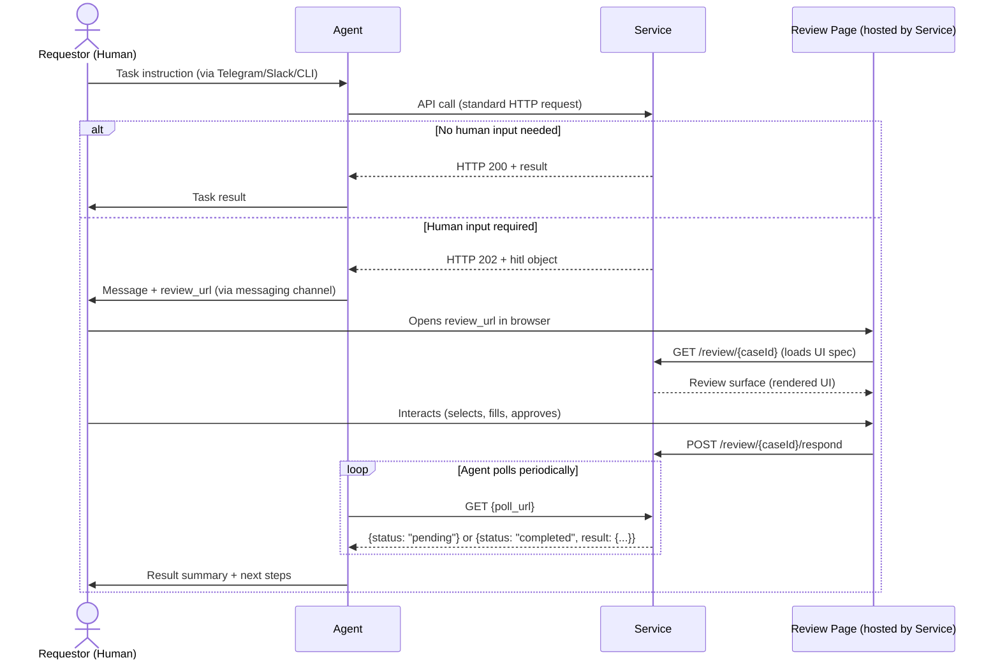
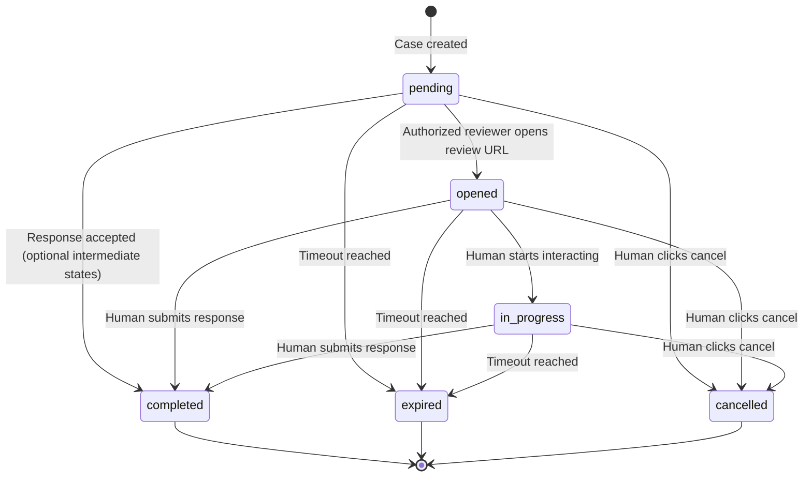
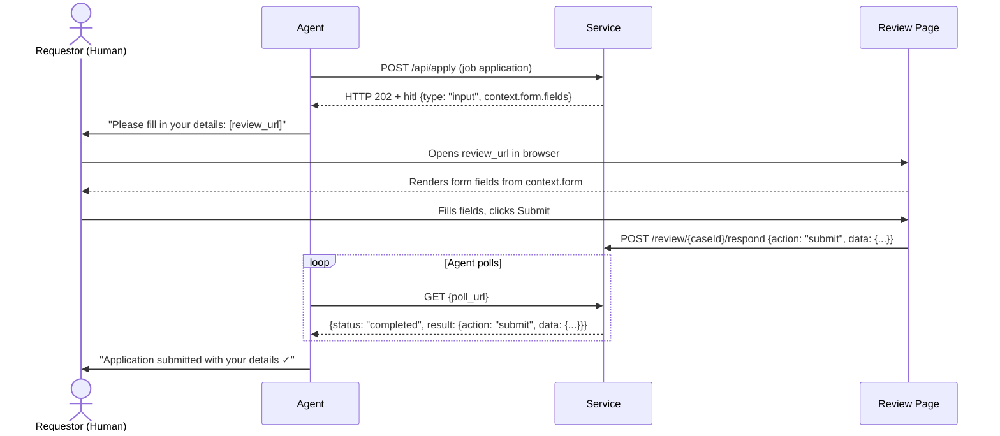
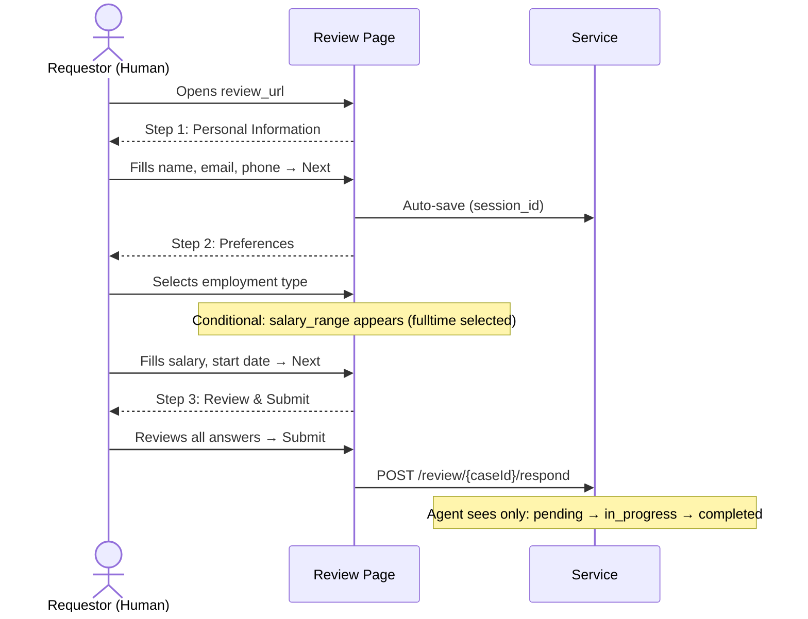
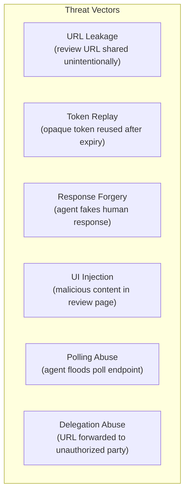

# HITL Protocol Specification v0.9

**The Open Standard for Human Decisions in Agent Workflows**

---

## 1. Abstract

The HITL Protocol defines a standard mechanism for any service to request structured human input during an autonomous agent's workflow. When a service needs a human decision — approval, selection, data entry, confirmation, or escalation — it returns an HTTP 202 response containing a `hitl` object with a review URL. The agent forwards this URL to the human via their preferred channel (Telegram, Slack, WhatsApp, CLI). The human opens the URL in a browser, interacts with a rich responsive UI, and submits their decision. The agent retrieves the result by polling a status endpoint.

HITL Protocol is to human decisions what OAuth is to authentication: a standardized three-party flow between Agent, Service, and Human.

---

## 2. Status

| Field | Value |
|-------|-------|
| **Version** | 0.9 (Draft) |
| **Date** | 2026-10-06 |
| **Authors** | Torsten Heissler (@rotorstar) |
| **License** | Apache 2.0 |
| **Status** | Draft — open for community feedback |
| **Repository** | https://github.com/rotorstar/hitl-protocol |

### Versioning

Before 1.0, each minor draft may change normative semantics. Clients MUST validate the advertised `spec_version`; unknown versions MUST NOT be silently interpreted as a supported version. Poll and submit bodies do not carry a version; their contract is determined by the case and negotiated HITL version.

### Changelog

| Version | Date | Summary |
|---------|------|---------|
| 0.9 | 2026-10-06 | Explicit reviewer authentication, case ownership, immutable decisions, direct completion, schema-derived public types, and optional Agent Access profile. |
| 0.8 | 2026-03-26 | Optional Verification Evidence extension (`verification_policy`, `verification_evidence`, `submission_context`, `verification_result`), PoH-first provider-agnostic core, Agent Auth composition appendix, World ID 4.x appendix. |
| 0.7 | 2026-02-23 | Inline Submit extension (`submit_url`, `submit_token`, `inline_actions`), Channel-Native Rendering guidance, Inline Submit Security considerations. |
| 0.5 | 2026-02-22 | Initial public draft. HTTP 202 flow, 5 review types, poll/SSE/callback, signed URLs, SKILL.md extension, json-render recommendation. |

---

## 3. Motivation

### The Gap

Four standards define the autonomous agent ecosystem:

| Standard | What it solves |
|----------|---------------|
| **SKILL.md** (Agent Skills Standard) | How an agent discovers a skill |
| **agent.json** (A2A Protocol) | How agents communicate with each other |
| **MCP** (Model Context Protocol) | How an agent accesses tools and resources |
| **AG-UI** (CopilotKit) | How an agent streams to a frontend application |
| **OAuth 2.0** | How a user authenticates with third parties |

AG-UI connects agents to frontend applications they are embedded in — it standardizes real-time event streaming between an agent backend and a React/Angular app. It does not address the case where an autonomous agent (running in a terminal, communicating via Telegram) needs to get a structured human decision from an external service.

None of these standards addresses: **How does a service request a structured human decision during an agent's workflow?**

### The Problem

Autonomous agents (OpenClaw, Claude Code, Codex, Goose) communicate with humans via text channels — Telegram, Slack, WhatsApp, CLI terminals. When a human-in-the-loop moment arises, the current experience is:

1. The agent dumps a wall of text describing options
2. The human types a freeform response ("option 2 please")
3. The agent parses the response (unreliably)
4. No structured data, no forms, no buttons, no visual previews

This works for simple yes/no decisions. It fails catastrophically for:
- Selecting from 5+ options with rich details (job listings, deployment configs)
- Providing structured input (salary range, date preferences, address fields)
- Reviewing complex artifacts (CV drafts, email previews, code diffs)
- Multi-field forms (application details, configuration parameters)

### The Solution

HITL Protocol standardizes a three-party flow:

1. **Service** returns HTTP 202 with a `hitl` object containing a `review_url`
2. **Agent** forwards the URL to the human (via any messaging channel)
3. **Human** opens the URL in a browser, sees a rich responsive UI, submits their decision
4. **Agent** polls a `poll_url` to retrieve the structured result

The service hosts the review page and generates the UI. The agent is only a messenger. The human gets a first-class interactive experience regardless of their messaging platform.

---

## 4. Terminology

| Term | Definition |
|------|------------|
| **Agent** | An autonomous software entity that executes tasks on behalf of a human (e.g., OpenClaw, Claude Code, Codex). The agent calls service APIs and forwards review URLs to the Requestor. |
| **Service** | Any API or web application that an agent interacts with (e.g., job board, CI/CD pipeline, CMS, email provider). The service decides when human input is needed and hosts the review page. |
| **Requestor** | The human who initiated the agent's task and will review/decide. Receives the review URL via a messaging channel. |
| **Review Case** | A single instance of a human-input-required decision. Identified by a unique `case_id`. Has a lifecycle: `pending` → `opened` → `in_progress` → `completed` \| `expired` \| `cancelled`. The intermediate states `opened` and `in_progress` are optional. |
| **Review URL** | A service URL pointing to a specific review case. It contains an opaque bearer token granting case access. The service stores only the SHA-256 hash. A profile or verification policy may additionally require an authenticated and authorized reviewer; the URL token alone does not identify a person. |
| **Review Surface** | The interactive UI rendered at the review URL. Can be implemented with any web technology. The spec recommends json-render but does not mandate it. |
| **Poll URL** | An API endpoint the agent calls to check the status of a review case and retrieve the result when complete. |
| **Callback URL** | An optional webhook URL provided by the agent. The service POSTs the result to this URL when the human completes the review, enabling real-time notification without polling. |
| **HITL Object** | The JSON object within an HTTP 202 response that contains all information the agent needs to facilitate the human review. |
| **Review Type** | One of five standardized categories of human input: Approval, Selection, Input, Confirmation, Escalation. |

### Conventions

The key words "MUST", "MUST NOT", "REQUIRED", "SHALL", "SHALL NOT", "SHOULD", "SHOULD NOT", "RECOMMENDED", "MAY", and "OPTIONAL" in this document are to be interpreted as described in [RFC 2119](https://www.rfc-editor.org/rfc/rfc2119) and [RFC 8174](https://www.rfc-editor.org/rfc/rfc8174).

---

## 5. Protocol Overview

### Sequence Diagram



### Design Principles

1. **Agent-agnostic.** Any agent that speaks HTTP can participate. No SDK required. The agent only needs to recognize HTTP 202 + `hitl` and forward a URL.

2. **Service-hosted UI.** The service generates and hosts the review page. The service has the data context and knows what the human needs to see.

3. **URL-based delivery.** The review URL opens a service-hosted page in a browser without a dedicated app. Cases that require a named reviewer MAY require independent authentication; possessing the URL alone does not establish that identity.

4. **Polling as default.** The agent retrieves results by polling a status endpoint. No server-side infrastructure required on the agent side. Callbacks are optional.

5. **Renderer-agnostic.** The spec defines the transport layer (HTTP 202, poll/callback, signed URLs) and review types. The UI rendering technology is a service implementation choice.

---

## 6. HTTP 202 Response

### When to Return HTTP 202

A service MUST return HTTP 202 Accepted (instead of 200 OK) when:
- The request was understood and accepted
- A human decision is required before the service can provide a final result
- The service has created a review case for human interaction

A service MUST NOT return HTTP 202 for:
- Requests that can be fulfilled without human input (use 200)
- Invalid or malformed requests (use 4xx)
- Server errors (use 5xx)
- Long-running async operations that do NOT require human input (use 202 without `hitl`, per standard HTTP semantics)

### Response Schema

```json
{
  "status": "human_input_required",
  "message": "5 matching jobs found. Please select which ones to apply for.",
  "hitl": {
    "spec_version": "0.9",
    "case_id": "review_abc123def456",
    "review_url": "https://service.example.com/review/abc123def456?token=K7xR2mN4pQ8sT1vW3xY5zA9bC...",
    "poll_url": "https://api.service.example.com/v1/reviews/abc123def456/status",
    "callback_url": null,
    "type": "selection",
    "prompt": "Select which jobs to apply for",
    "timeout": "24h",
    "default_action": "skip",
    "created_at": "2026-02-20T10:00:00Z",
    "expires_at": "2026-02-21T10:00:00Z",
    "context": {
      "total_options": 5,
      "query": "Senior Dev Berlin"
    }
  }
}
```

### Field Definitions

| Field | Type | Required | Description |
|-------|------|----------|-------------|
| `status` | string | REQUIRED | MUST be `"human_input_required"` |
| `message` | string | RECOMMENDED | Human-readable summary for the agent to relay to the requestor |
| `hitl` | object | REQUIRED | The HITL object (see below) |

#### HITL Object Fields

| Field | Type | Required | Description |
|-------|------|----------|-------------|
| `spec_version` | string | REQUIRED | Protocol version. MUST be `"0.9"` for this spec. |
| `case_id` | string | REQUIRED | Unique identifier for this review case. MUST be URL-safe. RECOMMENDED format: `review_{random}` |
| `review_url` | string (URL) | REQUIRED | Fully qualified URL to the review page. MUST include an opaque case-access token; additional reviewer authentication may be required. |
| `poll_url` | string (URL) | REQUIRED | Fully qualified URL to the status polling endpoint. |
| `callback_url` | string (URL) \| null | OPTIONAL | If the agent provided a callback URL in the original request, it is echoed here. Otherwise `null`. |
| `events_url` | string (URL) | OPTIONAL | SSE endpoint for real-time status events. See Section 8.5. |
| `type` | string (enum) | REQUIRED | One of: `"approval"`, `"selection"`, `"input"`, `"confirmation"`, `"escalation"`. See Section 10. |
| `prompt` | string | REQUIRED | Short description of what the human needs to decide. Max 500 characters. |
| `timeout` | string (duration) | RECOMMENDED | How long the review case stays open. Format: ISO 8601 duration (`PT24H`, `P7D`) or shorthand (`24h`, `7d`). Default: `24h`. |
| `default_action` | string | OPTIONAL | Action to take if the review expires without a response. One of: `"skip"`, `"approve"`, `"reject"`, `"abort"`. Default: `"skip"`. |
| `created_at` | string (ISO 8601) | REQUIRED | Timestamp when the review case was created. |
| `expires_at` | string (ISO 8601) | REQUIRED | Timestamp when the review case expires. |
| `context` | object | OPTIONAL | Arbitrary key-value pairs providing additional context about the review. Not processed by the agent — for human consumption on the review page. |
| `reminder_at` | string (ISO 8601) \| string[] | OPTIONAL | When reminder(s) should be sent to the human. A single timestamp or an array of timestamps. The agent SHOULD re-send the review URL when a reminder timestamp is reached and the case is still `pending` or `opened`. |
| `previous_case_id` | string | OPTIONAL | Links this case to a prior case in a multi-round review chain. Enables agents to reconstruct the full review history. See Section 15.3 for an example. |
| `submit_url` | string (URL) | OPTIONAL | API endpoint where the agent MAY submit simple responses on behalf of the human, without requiring them to visit the `review_url`. See Section 7.5. MUST be HTTPS. |
| `submit_token` | string | OPTIONAL | Opaque bearer token for authenticating agent submissions via `submit_url`. MUST be present when `submit_url` is present. Service stores only the SHA-256 hash. Separate from the review URL token. |
| `inline_actions` | string[] | OPTIONAL | Actions that may be submitted via `submit_url` without the human visiting the `review_url`. When omitted and `submit_url` is present, ALL actions for the review type are permitted. When present, only listed actions are accepted; others return HTTP 403. |
| `verification_policy` | object | OPTIONAL | Service-declared verification requirements for proof_of_human evidence. See Section 7.6. |

### Agent Behavior on HTTP 202

When an agent receives HTTP 202 with a `hitl` object, it MUST:

1. Extract `hitl.review_url`
2. Send `hitl.review_url` to the requestor via their messaging channel, along with `hitl.prompt` or `message` as context
3. Begin polling `hitl.poll_url` (see Section 8) or register `hitl.callback_url` if supported

If `hitl.verification_policy` is present and `inline_submit` is listed in `required_for`, the agent SHOULD determine whether it can satisfy any declared requirement branch before attempting inline submit. If it cannot, it SHOULD direct the human to `review_url`.

An agent MUST NOT:
- Attempt to render the review UI itself
- Submit responses on behalf of the human without explicit delegation — EXCEPT via `submit_url` when the human explicitly triggers an action through a native messaging button (see Section 7.5)
- Ignore the HITL signal and proceed without human input

### Requesting a Callback

If the agent has a publicly reachable endpoint and prefers real-time notification over polling, it MAY include a `callback_url` in the original API request:

```json
POST /api/v1/search
{
  "query": "Senior Dev Berlin",
  "hitl_callback_url": "https://agent.example.com/webhooks/hitl"
}
```

The service SHOULD honor the callback URL if provided, in addition to supporting polling.

---

## 7. Review URL

### Structure

```
https://{service_host}/review/{case_id}?token={opaque_token}
```

- `{service_host}` — the service's domain
- `{case_id}` — the unique review case identifier
- `{opaque_token}` — a cryptographically random bearer token (base64url, 43 chars, 256 bits entropy)

### Token Model

The service generates a random token and stores only its SHA-256 hash. Verification uses timing-safe comparison: `timingSafeEqual(SHA-256(url_token), stored_hash)`.

| Aspect | Requirement |
|--------|-------------|
| **Generation** | `randomBytes(32).toString('base64url')` — 43 characters |
| **Storage** | SHA-256 hash only — the raw token is NEVER stored server-side |
| **Verification** | Timing-safe hash comparison on every request |
| **Length** | ~43 chars (vs ~241 for JWT) — minimizes LLM agent corruption risk |
| **DB leak impact** | Attacker gets useless hashes; cannot reconstruct valid URLs |

> **Why opaque tokens?** A 32-byte random token gives a compact case capability whose expiry and revocation stay under service control. Shorter URLs are easier to relay, but length does not guarantee faithful reproduction by an agent. Clients SHOULD preserve the exact URL as structured data rather than regenerate it from model output. Invalid tokens MUST fail verification regardless of how the URL was delivered.

### Security Properties

- **Case access.** For a basic review, a valid opaque URL token grants access to that case. Services MAY require additional reviewer authentication. When a profile or verification policy requires it, the service MUST verify reviewer identity and authorization before exposing protected case content or accepting a response. URL possession is not proof of identity or authority.
- **Time-limited.** The service tracks `expires_at` in the database. After expiry, the review page MUST show an "expired" message.
- **One-response.** The first accepted response is immutable. Subsequent authorized visits SHOULD show the recorded response. Any correction or negotiation requires a new case linked with `previous_case_id`; a completed case MUST NOT be edited.
- **Explicit delegation policy.** A basic bearer review URL may be forwarded. Services requiring a named reviewer MUST NOT infer delegation from URL possession; the forwarded user must independently satisfy the service authorization policy.

### HTTPS Requirement

Review URLs MUST use HTTPS in production. For local development only, `http://localhost` and `http://127.0.0.1` MAY be used.

### Delivery Modes

Agents operate in diverse environments. The delivery mode for the review URL depends on how the agent communicates with the human:

| Mode | When | How |
|------|------|-----|
| **Messaging channel** (default) | Agent communicates via Telegram, Slack, WhatsApp, Discord | Send URL as a clickable link in the message |
| **Desktop direct** | Agent runs in a terminal on the same machine as the human | Open URL in the default browser (e.g., `webbrowser.open()` in Python, or equivalent stdlib call) |
| **Terminal QR** | Agent runs in a remote terminal (SSH) and human has a phone nearby | Render a QR code in the terminal (e.g., using `qrencode -t ANSI`) for the human to scan |

Agents SHOULD choose the delivery mode based on their runtime context:
- CLI/terminal agents on the user's machine → Desktop direct
- CLI agents on a remote server → Terminal QR or messaging channel
- Messaging-based agents (Telegram bots, Slack apps) → Messaging channel
- Agents with no human communication channel → Log the URL and rely on service-side reminders

---

## 7.5 Inline Submit (Optional)

### Motivation

When agents communicate via messaging platforms (Telegram, Slack, Discord, WhatsApp, Microsoft Teams), every HITL decision currently requires a browser switch — even for simple "Confirm / Cancel" choices. All major messaging platforms offer native interactive elements (inline buttons, action components, adaptive cards) that can handle simple decisions directly in the chat.

Inline Submit extends the protocol with an optional `submit_url` endpoint that allows agents to submit responses on behalf of the human when the human explicitly triggers a native messaging button.

### Prerequisites

Inline Submit is OPTIONAL. Services opt-in by including `submit_url` and `submit_token` in the HITL object. Services that omit these fields require the human to visit the `review_url` for all responses (the default v0.5 behavior).

### HITL Object Fields

When a service supports inline submit, it includes three additional fields in the HITL object:

```json
{
  "hitl": {
    "spec_version": "0.9",
    "case_id": "review_confirm_s5t6u7v8",
    "review_url": "https://mailcraft.example/review/confirm_s5t6u7v8?token=S6tU8v...",
    "poll_url": "https://api.mailcraft.example/v1/reviews/confirm_s5t6u7v8/status",
    "submit_url": "https://api.mailcraft.example/v1/reviews/confirm_s5t6u7v8/respond",
    "submit_token": "agt_X2yZ4aB6cD8eF0gH2iJ4kL6mN8oP0qR2sT4uV6wX",
    "inline_actions": ["confirm", "cancel"],
    "type": "confirmation",
    "prompt": "Confirm sending 3 job application emails",
    "...": "..."
  }
}
```

**Field constraints:**

- `submit_url` MUST be HTTPS.
- `submit_token` MUST be present whenever `submit_url` is present.
- `submit_token` MUST be different from the review URL token. The review token grants case access to a browser; it does not authenticate a named human. The submit token authenticates the agent's programmatic submission. Additional reviewer identity and authorization checks apply when required by the case policy.
- `submit_token` follows the same generation and storage pattern as the review URL token: `randomBytes(32).toString('base64url')` → 43 characters, SHA-256 hash stored server-side.

> **Implementation note:** Services MUST NOT accept `submit_token` where the review URL token is expected, or vice versa. Each token MUST be validated only against its corresponding hash for its intended purpose. A common mistake is implementing a single `verifyToken()` function that checks both hashes — this defeats the security separation entirely, because a leaked `review_url` would then also grant inline submit access.
- `inline_actions` is OPTIONAL even when `submit_url` is present. When omitted, all actions for the review type are permitted via `submit_url`.

### Submit Endpoint

The `submit_url` accepts POST requests authenticated via the `submit_token`:

```
POST {submit_url}
Authorization: Bearer {submit_token}
Content-Type: application/json

{
  "action": "confirm",
  "data": {},
  "submitted_via": "telegram_inline_button",
  "submitted_by": {
    "platform": "telegram",
    "platform_user_id": "123456789",
    "display_name": "Alex Mueller"
  }
}
```

**Request fields:**

| Field | Type | Required | Description |
|-------|------|----------|-------------|
| `action` | string | REQUIRED | The action taken. MUST be a valid action for the review type AND listed in `inline_actions` (if specified). |
| `data` | object | OPTIONAL | Structured data accompanying the action. For simple inline actions (confirm, cancel, approve, reject), this is typically empty `{}`. |
| `submitted_via` | string | REQUIRED | Identifies the submission channel for audit purposes. Standardized values: `telegram_inline_button`, `slack_block_action`, `discord_component`, `whatsapp_reply_button`, `teams_adaptive_card`. Custom values use `x-` prefix. |
| `submitted_by` | object | REQUIRED | Caller-reported origin metadata for the messaging-platform action. This is not verified reviewer identity without independent service verification. |
| `submitted_by.platform` | string | REQUIRED | Platform identifier: `telegram`, `slack`, `discord`, `whatsapp`, `teams`, or custom with `x-` prefix. |
| `submitted_by.platform_user_id` | string | REQUIRED | Platform-specific user identifier (e.g., Telegram user ID, Slack member ID). |
| `submitted_by.display_name` | string | OPTIONAL | Human-readable display name. |
| `verification_evidence` | array | OPTIONAL | Opaque verification evidence relayed from a human-controlled proof flow. See Section 7.6. Agents MUST NOT generate or mutate it. |

**Responses:**

| Status | Condition | Body |
|--------|-----------|------|
| `200 OK` | Response accepted. | `{"status": "completed", "case_id": "...", "completed_at": "..."}` |
| `401 Unauthorized` | Invalid or expired `submit_token`. | `{"error": "invalid_token", "message": "..."}` |
| `403 Forbidden` | Action not in `inline_actions`, evidence missing, or evidence invalid. | `{"error": "action_not_inline"\|"verification_required"\|"verification_failed", "message": "...", "case_id": "...", "review_url": "https://..."}` |
| `409 Conflict` | Already responded (one-time guarantee). | `{"error": "duplicate_submission", "message": "..."}` |
| `410 Gone` | Review case expired. | `{"error": "case_expired", "message": "..."}` |
| `429 Too Many Requests` | Rate limited. | `{"error": "rate_limited", "message": "..."}` |

The 403 response SHOULD include `case_id`. It MAY include `review_url` as a convenience hint, but agents SHOULD use the original `hitl.review_url` from the initial HTTP 202 response as the canonical full-review link.

### Relationship to Existing Response Endpoint

The `submit_url` MAY point to the same endpoint path as the browser-based respond endpoint (`/reviews/{caseId}/respond`). The service distinguishes case-scoped browser access from agent submissions authenticated through `Authorization: Bearer`. Each path MUST enforce its own token/session purpose, verification policy, and reviewer authorization requirements; cookie-authenticated mutations additionally require CSRF protection.

Services implementing dual-auth on the respond endpoint:

| Authentication | Caller | Notes |
|---------------|--------|-------|
| Case-scoped browser session (or initial `?token={review_token}`) | Browser | Case access; independently authenticated reviewer when required |
| `Authorization: Bearer {submit_token}` | Agent relaying a response | Inline submit introduced in v0.7; reported origin alone does not prove human intent |

### Agent Behavior with Inline Submit

When an agent receives an HTTP 202 with `submit_url` present, it SHOULD:

1. Evaluate whether the review type and available `inline_actions` can be handled with native messaging buttons.
2. If inline submit is allowed by review type, evaluate whether any declared `verification_policy` for `inline_submit` can be satisfied.
3. If yes: render native buttons for the inline actions AND include a URL button to `review_url` for the full review page.
4. If no (e.g., `selection` type requiring rich content, required proof unavailable, or `input` type requiring form fields): render only a URL button to `review_url`.

When the human taps a native messaging button, the agent:

1. Determines the `action` from the button's callback data.
2. If required by policy and available from a human-controlled proof flow, attaches `verification_evidence`.
3. Sends `POST submit_url` with the action, `submitted_via`, `submitted_by`, and optional `verification_evidence`.
4. On `200 OK`: updates the message to show the result and removes the buttons.
5. On `403 Forbidden`: directs the human to the original `hitl.review_url` from the 202 response (optionally using `review_url` from the error as a hint).
6. On `409 Conflict` or `410 Gone`: updates the message to show the case is closed.

An agent MUST NOT submit via `submit_url` without the human explicitly triggering a button. Automated or pre-filled submissions defeat the purpose of human-in-the-loop.

---

## 7.6 Verification Evidence Extension (Optional)

### Scope

This extension allows a service to declare that a completed review response MAY or MUST be accompanied by verification evidence. In v0.9, the normative core standardizes only `proof_of_human`.

The HITL core protocol MUST NOT require a specific verification provider. Services MAY integrate third-party or first-party proof systems, but provider verification MUST be performed by the service.

### Verification Policy

A service MAY include `verification_policy` in the HITL object:

```json
{
  "verification_policy": {
    "mode": "required",
    "required_for": ["inline_submit"],
    "requirements": {
      "any_of": [
        {
          "all_of": [
            {
              "proof_type": "proof_of_human",
              "provider": "world_id",
              "min_assurance": "high"
            }
          ]
        }
      ]
    },
    "binding": {
      "case_id": true,
      "action": true,
      "challenge": "base64url-opaque-nonce",
      "freshness_seconds": 300,
      "expires_at": "2026-03-26T12:00:00Z",
      "single_use": true
    },
    "fallback": {
      "on_missing": "browser_review",
      "on_invalid": "browser_review"
    }
  }
}
```

Normative rules:

- `mode` values:
  - `optional`: evidence MAY be presented and MAY affect downstream policy.
  - `required`: evidence MUST be present and valid for every path listed in `required_for`.
  - `step_up`: evidence is not initially required, but the service MAY require a stronger path before accepting the response.
- `requirements.any_of[]` expresses OR-of-AND policy logic. Each `any_of` branch MAY satisfy the policy if all `all_of` entries in that branch are satisfied.
- If `required_for` contains `browser_submit`, the service MUST perform verification on the service-hosted review surface and MUST NOT expect the agent to transport raw browser-path evidence.
- If `binding.case_id` is true, the service MUST verify that accepted evidence is bound to the HITL `case_id`.
- If `binding.action` is true, the service MUST verify that accepted evidence is bound to the submitted action.
- If `binding.single_use` is true, the service MUST reject re-use of equivalent evidence for the same case/action binding.

### Verification Evidence On Inline Submit

When using inline submit, the agent MAY include a `verification_evidence` array:

```json
{
  "action": "confirm",
  "data": {},
  "submitted_via": "telegram_inline_button",
  "submitted_by": {
    "platform": "telegram",
    "platform_user_id": "123456789",
    "display_name": "Alex Mueller"
  },
  "verification_evidence": [
    {
      "proof_type": "proof_of_human",
      "provider": "world_id",
      "format": "provider_opaque",
      "presentation": {
        "proof": "<opaque-provider-payload>"
      },
      "binding": {
        "case_id": "review_confirm_s5t6u7v8",
        "action": "confirm",
        "challenge": "base64url-opaque-nonce"
      }
    }
  ]
}
```

Normative rules:

- Agents MUST treat verification evidence as opaque unless they explicitly implement the provider-specific flow.
- Agents MUST NOT generate, alter, or synthesize verification evidence.
- Agents MAY only relay evidence obtained from a human-controlled verification flow or authenticator.
- The service MUST perform provider-specific verification server-side before accepting the evidence as valid.

### Submission Context And Verification Result

When verification was required or presented, the completed poll response SHOULD include `submission_context.verification_result`:

```json
{
  "submission_context": {
    "mode": "inline_submit",
    "submitted_via": "telegram_inline_button",
    "submitted_by": {
      "platform": "telegram",
      "platform_user_id": "123456789",
      "display_name": "Alex Mueller"
    },
    "verification_result": {
      "satisfied": true,
      "verified_evidence": [
        {
          "proof_type": "proof_of_human",
          "provider": "world_id",
          "assurance_level": "high",
          "bound_to_case": true,
          "bound_to_action": true,
          "fresh": true,
          "single_use_enforced": true
        }
      ],
      "missing_requirements": []
    }
  }
}
```

Normative rules:

- `verification_result` MUST be normalized and provider-agnostic.
- Poll responses MUST NOT expose raw provider proof payloads, secrets, biometric material, or opaque proof blobs by default.
- If verification was required by policy or evidence was presented on inline submit, the completed poll result MUST include `submission_context.verification_result`.

### Step-Up Errors

If an inline submission path does not satisfy the declared verification policy, the service SHOULD return HTTP 403 with one of these error codes:

- `verification_required`
- `verification_failed`
- `action_not_inline`

The error body SHOULD include `case_id` and MAY include `review_url`. Agents receiving `verification_required` or `verification_failed` SHOULD fall back to `review_url` rather than retrying the same inline path.

---

## 7.7 Channel-Native Rendering

### Overview

Different messaging platforms have different capabilities for native interactive elements. This section provides guidance for agents implementing inline submit across platforms.

### Messenger Capability Matrix

| Capability | Telegram | Slack | Discord | WhatsApp | MS Teams |
|-----------|----------|-------|---------|----------|----------|
| **Interactive Elements** | Inline Keyboard | Block Kit Buttons | Message Components | Reply Buttons | Adaptive Cards |
| **Action Data Limit** | 64 bytes | 2000 chars | 100 chars | 256 chars | Unbounded JSON |
| **Button Text Limit** | ~64 chars | 75 chars | 80 chars | 20 chars | Unbounded |
| **Max Buttons** | Unbounded | ~25 | 40 (5/row) | **3** | Unbounded |
| **Select/List** | No | Multi-select | Select menu (25 options) | List (10 items) | Input.ChoiceSet |
| **URL Button** | Yes | Yes | Yes (Link style) | CTA URL | Action.OpenUrl |
| **Embedded WebView** | Mini Apps | No | No | No | Task Modules |
| **Message Update** | Yes | Yes | Yes | No | Yes |

### Recommended Rendering by Review Type

| Review Type | Inline Possible? | Recommended Rendering |
|------------|------------------|----------------------|
| **confirmation** (confirm, cancel) | Yes — 2 buttons | Native inline buttons + URL "Details" button |
| **escalation** (retry, skip, abort) | Yes — 3 buttons | Native inline buttons + URL "Details" button |
| **approval** without edit (approve, reject) | Yes — 2 buttons | Native inline buttons + URL "Review" button |
| **approval** with edit | Partially — edit needs browser | Inline approve/reject + URL "Review & Edit" button |
| **selection** | No — requires content display | URL button or embedded WebView (Telegram Mini App, Teams Task Module) |
| **input** | No — requires form fields | URL button or embedded WebView |

### Platform-Specific Constraints

**WhatsApp:** Maximum 3 reply buttons per message and 20-character button text limit. This restricts inline actions to confirmation (2 buttons) and escalation (3 buttons, at the limit). Button titles must be concise: "Confirm", "Cancel", "Retry", "Skip", "Abort". Agents SHOULD include the `review_url` in the message body text (not as a button) since WhatsApp reply buttons do not support URL types.

**Telegram:** The `callback_data` field is limited to 64 bytes. Agents SHOULD use a compact encoding scheme (e.g., `hitl:{short_id}:{action}`) with an agent-side mapping table to resolve the full `case_id`, `submit_url`, and `submit_token`. Short IDs can be generated by truncating a SHA-256 hash of the `case_id`. Telegram's Mini App feature allows opening the `review_url` in an embedded WebView for complex review types.

**Discord:** The `custom_id` field allows up to 100 characters, sufficient for most `case_id` values. Agents MAY encode the full `case_id` and `action` directly in the `custom_id` (e.g., `hitl:review_abc123:confirm`).

**Slack:** The button `value` field allows up to 2000 characters. Agents MAY include the full `case_id`, `submit_url`, and `submit_token` directly in the value as JSON, eliminating the need for a mapping table.

**Microsoft Teams:** Adaptive Cards support unbounded JSON in `Action.Submit` data payloads. Agents MAY include all HITL metadata directly in the card action data.

---

## 8. Poll Interface

### Endpoint

```
GET {poll_url}
```

The `poll_url` is provided in the HITL object. It returns the current status of the review case.

### Authentication

Protected poll URLs MUST authenticate the caller and authorize it against the stored case owner. They SHOULD accept the original API authentication where compatible with the service's binding. Merely accepting a credential or knowing the case ID does not establish ownership.

### Response Schema

#### Status: Pending

```json
{
  "status": "pending",
  "case_id": "review_abc123def456",
  "created_at": "2026-02-20T10:00:00Z",
  "expires_at": "2026-02-21T10:00:00Z"
}
```

#### Status: Opened

Indicates the human has opened the review URL but has not yet submitted a response.

```json
{
  "status": "opened",
  "case_id": "review_abc123def456",
  "created_at": "2026-02-20T10:00:00Z",
  "opened_at": "2026-02-20T10:03:00Z",
  "expires_at": "2026-02-21T10:00:00Z"
}
```

#### Status: In Progress

Indicates the human is actively interacting with the review page (e.g., filling form fields, toggling selections). Services MAY use this status to signal that the review is being worked on. This status is OPTIONAL — services that do not track interaction granularity MAY skip directly from `opened` to `completed`.

```json
{
  "status": "in_progress",
  "case_id": "review_abc123def456",
  "created_at": "2026-02-20T10:00:00Z",
  "opened_at": "2026-02-20T10:03:00Z",
  "expires_at": "2026-02-21T10:00:00Z"
}
```

#### Status: Completed

```json
{
  "status": "completed",
  "case_id": "review_abc123def456",
  "completed_at": "2026-02-20T10:15:00Z",
  "result": {
    "action": "approve",
    "data": {
      "selected_jobs": ["job-123", "job-456"],
      "note": "Only remote positions"
    }
  },
  "responded_by": {
    "name": "Torsten H.",
    "email": "torsten@example.com"
  },
  "submission_context": {
    "mode": "inline_submit",
    "submitted_via": "telegram_inline_button",
    "submitted_by": {
      "platform": "telegram",
      "platform_user_id": "123456789",
      "display_name": "Torsten H."
    },
    "verification_result": {
      "satisfied": true,
      "verified_evidence": [
        {
          "proof_type": "proof_of_human",
          "provider": "world_id",
          "assurance_level": "high",
          "bound_to_case": true,
          "bound_to_action": true,
          "fresh": true,
          "single_use_enforced": true
        }
      ],
      "missing_requirements": []
    }
  }
}
```

#### Status: Expired

```json
{
  "status": "expired",
  "case_id": "review_abc123def456",
  "expired_at": "2026-02-21T10:00:00Z",
  "default_action": "skip"
}
```

#### Status: Cancelled

```json
{
  "status": "cancelled",
  "case_id": "review_abc123def456",
  "cancelled_at": "2026-02-20T10:05:00Z",
  "reason": "User clicked cancel"
}
```

### Status Machine



All terminal states (`completed`, `expired`, `cancelled`) are final. A case MUST NOT transition out of a terminal state. The intermediate states `opened` and `in_progress` are OPTIONAL — services that do not track page-open or interaction events MAY transition directly from `pending` to any terminal state.

An expired case and its `default_action` record a timeout policy, not a human decision. A timeout default MUST NOT satisfy a requirement for affirmative human approval or reviewer verification. Any business action following expiry remains subject to independent current authorization; profiles MAY further restrict permitted defaults.

### Poll Field Definitions

| Field | Type | Required | Description |
|-------|------|----------|-------------|
| `status` | string (enum) | REQUIRED | One of: `"pending"`, `"opened"`, `"in_progress"`, `"completed"`, `"expired"`, `"cancelled"` |
| `case_id` | string | REQUIRED | The review case identifier |
| `created_at` | string (ISO 8601) | OPTIONAL | When the case was created |
| `opened_at` | string (ISO 8601) | OPTIONAL | When the authorized reviewer first opened the review URL |
| `expires_at` | string (ISO 8601) | OPTIONAL | When the case will expire; SHOULD be supplied for nonterminal cases |
| `completed_at` | string (ISO 8601) | When completed | When the human submitted their response |
| `expired_at` | string (ISO 8601) | When expired | When the case expired |
| `cancelled_at` | string (ISO 8601) | When cancelled | When the human cancelled |
| `result` | object | When completed | The human's response (see below) |
| `result.action` | string | When completed | The accepted review-type action, including `approve`, `reject`, `edit`, `submit`, `select`, `confirm`, `cancel`, `retry`, `skip`, `abort`, or a defined custom action |
| `result.data` | object | OPTIONAL | Structured data from the review (type-dependent, see Section 10) |
| `responded_by` | object | When completed | OPTIONAL. Identity of the person who submitted the response. See Section 13.7. |
| `responded_by.name` | string | When completed | Display name of the respondent |
| `responded_by.email` | string | When completed | Verified email of the respondent (if service collected it) |
| `submission_context` | object | When completed | OPTIONAL. How the response was submitted and whether verification policy was satisfied. |
| `submission_context.mode` | string | When completed | `browser_submit` or `inline_submit` |
| `submission_context.submitted_via` | string | When inline_submit | REQUIRED for inline context; optional for browser context. Submission surface or messaging channel |
| `submission_context.submitted_by` | object | When inline_submit | REQUIRED for inline context; optional for browser context. Caller-reported platform-origin metadata, independently verified only when the service establishes it |
| `submission_context.verification_result` | object | When completed | OPTIONAL. Normalized provider-agnostic verification outcome |
| `reminder_sent_at` | string (ISO 8601) | When pending/opened | When the last reminder was sent (by service or triggered by `reminder_at`) |
| `next_case_id` | string | When completed | If the service created a follow-up case (e.g., a revision request), this links to the next case in the chain |
| `default_action` | string | When expired | The default action declared when the case was created |
| `reason` | string | When cancelled | Human-readable reason for cancellation |

### Polling Recommendations

- Agents SHOULD poll at a reasonable interval. RECOMMENDED: 30 seconds to 5 minutes, depending on expected response time.
- Agents using heartbeat/cron scheduling (e.g., OpenClaw) SHOULD check poll URLs as part of their regular heartbeat cycle.
- Services MAY include a `Retry-After` header in pending responses to suggest optimal poll intervals.
- Services SHOULD support `If-None-Match` / `ETag` for efficient polling.

---

## 8.5 SSE Event Stream (Optional)

### Overview

As an alternative to polling, services MAY offer a Server-Sent Events (SSE) endpoint for real-time status updates. SSE combines the simplicity of polling (agent initiates the connection, no public endpoint required) with the efficiency of callbacks (server pushes updates instantly).

This transport option is inspired by AG-UI's event-streaming architecture, adapted for HITL Protocol's async review model.

### Endpoint

The `events_url` field in the HITL object points to an SSE endpoint:

```
GET {events_url}
Accept: text/event-stream
Authorization: Bearer <agent_token>
```

### Event Format

Events follow the [SSE specification](https://html.spec.whatwg.org/multipage/server-sent-events.html):

```
event: review.opened
data: {"case_id":"review_abc123","opened_at":"2026-02-20T10:03:00Z"}

event: review.in_progress
data: {"case_id":"review_abc123","opened_at":"2026-02-20T10:03:00Z"}

event: review.completed
data: {"case_id":"review_abc123","completed_at":"2026-02-20T10:15:00Z","result":{"action":"approve","data":{"selected":["job-2","job-4"],"note":"Only remote"}}}

event: review.expired
data: {"case_id":"review_abc123","expired_at":"2026-02-21T10:00:00Z","default_action":"skip"}

event: review.cancelled
data: {"case_id":"review_abc123","cancelled_at":"2026-02-20T10:05:00Z","reason":"User clicked cancel"}

event: review.reminder
data: {"case_id":"review_abc123","reminder_at":"2026-02-20T22:00:00Z","message":"Review expires in 12 hours"}
```

### Event Types

| Event | When | Data |
|-------|------|------|
| `review.opened` | Human opens the review URL | `case_id`, `opened_at` |
| `review.in_progress` | Human starts interacting with the form | `case_id`, `opened_at` |
| `review.reminder` | Reminder timestamp reached (case still pending/opened) | `case_id`, `reminder_at`, `message` |
| `review.completed` | Human submits their response | `case_id`, `completed_at`, `result` |
| `review.expired` | Review case times out | `case_id`, `expired_at`, `default_action` |
| `review.cancelled` | Human cancels the review | `case_id`, `cancelled_at`, `reason` |

### Reconnection

- The SSE endpoint SHOULD include an `id` field per event for reconnection via `Last-Event-ID`.
- If the connection drops, the agent reconnects and receives any events missed since the last `id`.
- After a terminal event (`completed`, `expired`, `cancelled`), the server SHOULD close the connection.

### Relation to Polling

- SSE is an OPTIONAL optimization. The `poll_url` remains the source of truth.
- Agents that support SSE SHOULD still fall back to polling if the SSE connection fails.
- Services that offer SSE MUST also support polling — not all agents can maintain persistent connections.

### When to Use SSE vs Polling vs Callback

| Transport | Agent has public endpoint? | Needs real-time? | Connection model |
|-----------|--------------------------|-------------------|-----------------|
| **Polling** (default) | No | No | Stateless, periodic GET |
| **SSE** | No | Yes | Persistent GET, server pushes |
| **Callback** | Yes | Yes | Server POSTs to agent |

SSE is RECOMMENDED for agents that run as long-lived processes (daemons, background services) and want real-time updates without exposing a public endpoint.

---

## 9. Callback Interface (Optional)

### Overview

As an alternative to polling, agents with a publicly reachable endpoint MAY request real-time notification via a callback (webhook).

### Agent Request

The agent includes a `hitl_callback_url` in its original API request:

```json
{
  "query": "Senior Dev Berlin",
  "hitl_callback_url": "https://agent.example.com/webhooks/hitl"
}
```

### Service Callback

When the human completes the review, the service POSTs the result to the callback URL:

```
POST {hitl_callback_url}
Content-Type: application/json
X-HITL-Signature: sha256=<hmac_hex>

{
  "event": "review.completed",
  "case_id": "review_abc123def456",
  "completed_at": "2026-02-20T10:15:00Z",
  "result": {
    "action": "approve",
    "data": {
      "selected_jobs": ["job-123", "job-456"],
      "note": "Only remote positions"
    }
  }
}
```

### Callback Events

| Event | When |
|-------|------|
| `review.completed` | Human submitted a response |
| `review.expired` | Review case timed out |
| `review.cancelled` | Human cancelled the review |

### Signature Verification

The `X-HITL-Signature` header contains an HMAC-SHA256 signature of the exact request-body bytes, using a shared secret established through an authenticated service integration. A receiver using this mechanism MUST verify the signature with a timing-safe comparison before trusting callback data. A deployment MAY use another mutually agreed authenticated delivery mechanism, such as mutual TLS.

Receivers MUST correlate a trusted callback with the expected service, case, owner and negotiated protocol version, and handle duplicate or replayed deliveries without repeating business execution. An unauthenticated callback MAY only trigger a bounded poll of the already stored, authenticated `poll_url`; its payload MUST NOT establish the decision, reviewer identity, execution authority, or a new polling destination. When delivery authentication, correlation or freshness cannot be established, the authenticated poll response remains the source of truth.

### Callback Destination Security

Services that implement callback delivery MUST validate destinations before connecting. HTTPS alone does not prevent server-side request forgery. Use a configured destination policy, reject URL credentials, block loopback, private, link-local, metadata and other non-public destinations for public callbacks, and enforce that policy on the actual connection address after DNS resolution. Explicitly configured local development destinations are the only exception. Redirects MUST be disabled or fully revalidated at every hop, including the resolved address; credentials MUST NOT be forwarded to an unapproved origin. Apply bounded connection/response timeouts, body limits and retry counts. The [OWASP SSRF prevention guidance](https://cheatsheetseries.owasp.org/cheatsheets/Server_Side_Request_Forgery_Prevention_Cheat_Sheet.html) describes destination and DNS-rebinding controls.

### Reliability

- The service SHOULD retry failed callback deliveries (HTTP 5xx or timeout) with exponential backoff, up to 3 attempts.
- Callback is a best-effort optimization. Agents SHOULD still support polling as a fallback.
- If the callback fails permanently, the poll endpoint remains the source of truth.

---

## 10. Review Types

The spec defines five standard review types. Each type represents a category of human decision with a predictable UI pattern and result structure.

| Type | Actions | Multi-round | Typical trigger |
|------|---------|-------------|-----------------|
| **Approval** | `approve` · `edit` · `reject` | Yes — `edit` creates follow-up case via `previous_case_id` | Artifact ready for review |
| **Selection** | `select` | No | Multiple options available |
| **Input** | `submit` | No | Missing data the agent cannot infer |
| **Confirmation** | `confirm` · `cancel` | No — one-shot gate | Irreversible action imminent |
| **Escalation** | `retry` · `skip` · `abort` | No | Error or unexpected state |

### 10.1 Approval

**When:** The service has produced an artifact (document, email draft, deployment plan) and needs human go/no-go.

**UI pattern:** Preview of the artifact + action buttons (Approve / Edit / Reject).

**Result structure:**

```json
{
  "action": "approve" | "reject" | "edit",
  "data": {
    "feedback": "Optional text feedback",
    "edits": {}
  }
}
```

**Example:** CV service generates a CV draft. Agent needs human approval before sending it to employers.

> **Multi-round behavior:** When the human responds with `action: "edit"`, the agent revises the artifact and the service creates a new approval case with `previous_case_id` linking to the original. This chain continues until the human responds with `approve` or `reject`. See Section 15.3 for a full multi-round example.

### 10.2 Selection

**When:** The service has multiple options and the human must choose one or more.

**UI pattern:** Cards/list with details for each option + checkboxes or radio buttons.

**Result structure:**

```json
{
  "action": "select",
  "data": {
    "selected": ["option-id-1", "option-id-3"],
    "note": "Optional note"
  }
}
```

**Example:** Job board finds 5 matching positions. Human selects which ones to apply for.

### 10.3 Input

**When:** The service needs information that the agent does not have.

**UI pattern:** Form with typed fields. The service declares form fields in `context.form`, and the review page renders them.

**Result structure:**

```json
{
  "action": "submit",
  "data": {
    "salary_expectation": 108000,
    "earliest_start_date": "2026-05-01",
    "work_authorization": "blue_card",
    "willing_to_relocate": "already_local"
  }
}
```

**Example:** Job application API needs salary expectations, start date, and visa status that the agent cannot infer.

#### 10.3.1 Form Field Definitions

When using the Input review type, services SHOULD declare form fields in `context.form`. This enables review pages to render structured forms without hardcoded layouts.

**Single-step form:**

```json
{
  "context": {
    "form": {
      "fields": [
        {
          "key": "salary_expectation",
          "label": "Salary Expectation (EUR, annual gross)",
          "type": "number",
          "required": true,
          "placeholder": "e.g. 105000",
          "hint": "The listed range is 95,000 - 120,000 EUR",
          "sensitive": true,
          "validation": {
            "min": 0,
            "max": 1000000
          }
        },
        {
          "key": "work_authorization",
          "label": "Work Authorization in Germany",
          "type": "select",
          "required": true,
          "options": [
            { "value": "citizen", "label": "EU/EEA Citizen" },
            { "value": "needs_sponsorship", "label": "Requires Visa Sponsorship" }
          ]
        }
      ]
    }
  }
}
```

**Standard field types:**

| Type | HTML Equivalent | Value Type | Notes |
|------|----------------|------------|-------|
| `text` | `<input type="text">` | string | Single-line text |
| `textarea` | `<textarea>` | string | Multi-line text |
| `number` | `<input type="number">` | number | Integer or decimal |
| `date` | `<input type="date">` | string (ISO 8601) | Date picker |
| `email` | `<input type="email">` | string | Email with validation |
| `url` | `<input type="url">` | string | URL with validation |
| `boolean` | `<input type="checkbox">` | boolean | True/false toggle |
| `select` | `<select>` | string | Single choice from options |
| `multiselect` | `<select multiple>` | string[] | Multiple choices from options |
| `range` | `<input type="range">` | number | Slider within min/max |

Services MAY extend with custom types using an `x-` prefix (e.g., `x-file-upload`, `x-color-picker`). Review pages that do not recognize a custom type SHOULD fall back to `text`.

**Field properties:**

| Property | Type | Required | Description |
|----------|------|----------|-------------|
| `key` | string | REQUIRED | Unique identifier for the field. Used as key in `result.data`. |
| `label` | string | REQUIRED | Human-readable label displayed next to the field. |
| `type` | string | REQUIRED | One of the standard field types above, or a custom `x-` prefixed type. |
| `required` | boolean | OPTIONAL | Whether the field must be filled. Default: `false`. |
| `placeholder` | string | OPTIONAL | Placeholder text shown when the field is empty. |
| `hint` | string | OPTIONAL | Help text displayed below or beside the field. |
| `default` | any | OPTIONAL | Pre-filled value. MUST NOT contain sensitive data (see Security below). |
| `default_ref` | string (URL) | OPTIONAL | URL to securely fetch a pre-fill value. Used instead of `default` for sensitive data. |
| `sensitive` | boolean | OPTIONAL | If `true`, the review page SHOULD mask the input (e.g., password-style dots) and MUST NOT log the value. Default: `false`. |
| `options` | array | When select/multiselect | Array of `{ "value": string, "label": string }` objects. |
| `validation` | object | OPTIONAL | Validation rules (see below). |
| `conditional` | object | OPTIONAL | Conditional visibility (see Section 10.3.3). |

**Validation properties:**

| Property | Type | Applies to | Description |
|----------|------|------------|-------------|
| `minLength` | integer | text, textarea, email, url | Minimum character length |
| `maxLength` | integer | text, textarea, email, url | Maximum character length |
| `pattern` | string (regex) | text, email, url | Regular expression the value must match |
| `min` | number | number, range, date | Minimum value (or earliest date) |
| `max` | number | number, range, date | Maximum value (or latest date) |

> **Security:** Services SHOULD NOT transmit pre-filled sensitive data (PII, credentials) in the `default` field. Instead, use `default_ref` pointing to a secure endpoint that requires the review URL token for access, or mark fields with `sensitive: true` to signal the review page to mask input and suppress logging.

#### 10.3.2 Multi-Step Forms (RECOMMENDED Pattern)

For complex input flows, services MAY organize fields into steps using `context.form.steps`. This enables wizard-style UIs with progressive disclosure.

> **Important:** Multi-step forms are a **service-hosted UI pattern**, not a transport-layer feature. The agent sees only the `review_url` and polls for the result. Whether the review page renders 1 form or 5 wizard steps is entirely a service implementation choice.

```json
{
  "context": {
    "form": {
      "session_id": "form_sess_x7k9m2",
      "steps": [
        {
          "title": "Personal Information",
          "description": "Basic contact details",
          "fields": [
            { "key": "full_name", "label": "Full Name", "type": "text", "required": true },
            { "key": "email", "label": "Email", "type": "email", "required": true },
            { "key": "phone", "label": "Phone", "type": "text", "required": false }
          ]
        },
        {
          "title": "Preferences",
          "description": "Employment and compensation preferences",
          "fields": [
            { "key": "employment_type", "label": "Employment Type", "type": "select", "required": true,
              "options": [
                { "value": "fulltime", "label": "Full-time" },
                { "value": "parttime", "label": "Part-time" },
                { "value": "contract", "label": "Contract" }
              ]
            },
            { "key": "salary_range", "label": "Expected Salary (EUR)", "type": "range", "sensitive": true,
              "validation": { "min": 40000, "max": 200000 },
              "conditional": { "field": "employment_type", "operator": "eq", "value": "fulltime" }
            },
            { "key": "start_date", "label": "Earliest Start Date", "type": "date", "required": true }
          ]
        },
        {
          "title": "Review & Submit",
          "description": "Review your answers before submitting",
          "fields": []
        }
      ]
    }
  }
}
```

**Step properties:**

| Property | Type | Required | Description |
|----------|------|----------|-------------|
| `title` | string | REQUIRED | Step heading displayed in the wizard UI. |
| `description` | string | OPTIONAL | Subtitle or helper text for the step. |
| `fields` | array | REQUIRED | Array of field objects for this step. Empty array for summary/review steps. |

**`session_id`:** Services MAY include a `session_id` in `context.form` to enable form state persistence. This allows humans to partially fill a form, close the browser, and resume later. The session mechanism is an implementation choice:

- **Service-owned (RECOMMENDED):** The service stores form state server-side. The review page auto-saves on field changes. The `session_id` is an opaque server reference.
- **Agent-owned:** The service returns partial form data in poll responses. The agent stores the state.
- **Hybrid:** The `session_id` enables the review page to look up saved state from the service.

When `steps` is present, `fields` at the top level MUST NOT also be present. Use either `fields` (single-step) or `steps` (multi-step), not both.

#### 10.3.3 Conditional Fields

Fields MAY include a `conditional` property to control visibility based on another field's value. This enables dynamic forms where later fields adapt based on earlier answers.

```json
{
  "key": "salary_range",
  "type": "range",
  "conditional": {
    "field": "employment_type",
    "operator": "eq",
    "value": "fulltime"
  }
}
```

**Conditional properties:**

| Property | Type | Description |
|----------|------|-------------|
| `field` | string | The `key` of the field this condition depends on. |
| `operator` | string | One of: `eq`, `neq`, `in`, `gt`, `lt`. |
| `value` | any | The value to compare against. For `in`, an array of values. |

When the condition is not met, the field SHOULD be hidden and its value excluded from the submitted `result.data`. Conditional fields MAY reference fields in previous steps (for multi-step forms) or fields earlier in the same step.

#### 10.3.4 Progress Tracking (Optional)

For multi-step forms, services MAY include a `progress` object in `in_progress` poll responses. This enables agents to provide richer status updates to the human (e.g., "Filling step 2 of 3...").

```json
{
  "status": "in_progress",
  "case_id": "review_input_q1w2e3r4",
  "created_at": "2026-02-22T10:30:00Z",
  "opened_at": "2026-02-22T11:15:03Z",
  "expires_at": "2026-02-25T10:30:00Z",
  "progress": {
    "current_step": 2,
    "total_steps": 3,
    "completed_fields": 4,
    "total_fields": 8
  }
}
```

The `progress` object is OPTIONAL. Services that do not track step-level interaction MAY return `in_progress` without `progress`. Agents MUST function correctly with or without this data. The SSE event `review.in_progress` MAY also include the `progress` object.

#### 10.3.5 Input Flow Diagrams

**Single-step input form:**



**Multi-step wizard (service-internal):**



### 10.4 Confirmation

**When:** An irreversible action is about to be taken. The human must explicitly confirm.

**UI pattern:** Summary of what will happen + Confirm / Cancel buttons.

**Result structure:**

```json
{
  "action": "confirm" | "cancel",
  "data": {
    "confirmed_items": ["item-1", "item-2"],
    "note": "Optional note"
  }
}
```

**Example:** Email service is about to send 3 application emails. Human confirms the recipients and content.

> **One-shot behavior:** Confirmation is always a single round. There is no `edit` action — the human either confirms or cancels. If the action is cancelled, the agent SHOULD NOT retry with a new confirmation case for the same action.

### 10.5 Escalation

**When:** Something went wrong or an unexpected situation arose. The human must decide how to proceed.

**UI pattern:** Problem description + context + action options (Retry / Skip / Abort / Custom).

**Result structure:**

```json
{
  "action": "retry" | "skip" | "abort",
  "data": {
    "reason": "Optional explanation",
    "modified_params": {}
  }
}
```

**Example:** CI/CD pipeline deployment failed. Human decides whether to retry with different parameters, skip this step, or abort the entire workflow.

### Custom Types

Services MAY define custom review types beyond the five standard ones. Custom types MUST use a namespaced identifier (e.g., `"x-myservice-comparison"`). Agents that do not recognize a custom type SHOULD treat it as `"input"` (the most generic type) and still forward the review URL.

---

## 11. UI Spec Format

### Philosophy

The HITL Protocol is **renderer-agnostic**. It defines the transport layer (HTTP 202, poll/callback, signed URLs, review types) but does not mandate a specific UI technology for the review page.

Services MAY implement review pages using:

1. **json-render** (Recommended) — declarative JSON UI via an optional interop profile, catalog-constrained
2. **A2UI** (Google) — declarative embedded UI via an optional interop profile
3. **Adaptive Cards** (Microsoft) — mature JSON card format, 6 input types
4. **Plain HTML** — standard web forms, maximum compatibility
5. **Any web framework** — React, Vue, Svelte, static HTML, etc.

### Recommended: json-render

[json-render](https://github.com/vercel-labs/json-render) is RECOMMENDED as the default declarative UI companion because:

- **Catalog-constrained** — only predefined components allowed (no XSS, no arbitrary HTML)
- **Portable JSON** — flat-tree specs work well for service-generated or model-generated review UI
- **State binding** — two-way binding for form inputs, readable by actions
- **Action system** — buttons trigger typed callbacks with state data
- **AI-generatable** — JSON spec can be generated by templates or LLMs
- **Responsive** — shadcn is responsive by default (works on mobile from Telegram links)
- **Streaming** — supports JSONL patches for progressive UI updates
- **Open source** — Apache 2.0 license, plain JSON spec portable to other renderers

### Spec Declaration

When a service uses a specific UI format, it SHOULD declare it in the HITL object:

```json
{
  "hitl": {
    "...": "...",
    "surface": {
      "format": "json-render",
      "version": "1.0"
    }
  }
}
```

The `surface` field is OPTIONAL. When omitted, the review URL is treated as a standard web page — the agent does not need to know or care about the rendering technology.

The `surface` field is declarative only. The HITL core does **not** standardize embedded renderer payloads inside the `hitl` object. Services that want inline declarative rendering SHOULD use an optional interoperability profile layered above the core and MUST keep `review_url` as the required fallback.

### Minimum Requirements for Review Pages

Regardless of the rendering technology, a HITL-compliant review page MUST:

1. **Render responsively.** Review pages MUST work on both mobile browsers (primary path for messaging-delivered URLs) and desktop browsers (primary path for terminal/CLI agents). Use responsive CSS — do not assume a single viewport size.
2. **Enforce declared access requirements.** Basic reviews may use only the URL token. Profiles and verification policies may additionally require authenticated, authorized reviewers. Missing additional credentials MUST NOT downgrade the review to bearer-only access.
3. **Support the result schema.** When the human submits, the response MUST conform to the result structure of the declared review type (Section 10).
4. **Show expiry state.** After `expires_at`, the page MUST show an expiry message (not a broken form).
5. **Be idempotent.** Revisiting an already-responded case SHOULD show the submitted response (not a fresh form).

---

## 12. SKILL.md Extension

### Overview

Skills that interact with HITL-capable services can declare HITL support in their SKILL.md frontmatter. This tells the agent BEFORE invocation: "This skill may return a review URL that needs to be forwarded to the human."

### Frontmatter Extension

```yaml
---
name: job-search-pro
description: "Search and apply for jobs across multiple boards. Use when user needs job hunting assistance."
metadata:
  hitl:
    supported: true
    types:
      - selection
      - confirmation
    review_base_url: "https://jobboard.example.com/review"
    timeout_default: "24h"
    info: "May ask user to select preferred jobs or confirm application submissions."
---
```

### Field Definitions

| Field | Type | Required | Description |
|-------|------|----------|-------------|
| `metadata.hitl.supported` | boolean | REQUIRED | `true` if the skill's service may return HITL responses |
| `metadata.hitl.types` | string[] | RECOMMENDED | Which review types the service may trigger |
| `metadata.hitl.review_base_url` | string (URL) | OPTIONAL | Base URL for review pages (informational) |
| `metadata.hitl.timeout_default` | string (duration) | OPTIONAL | Typical timeout for reviews from this service |
| `metadata.hitl.info` | string | RECOMMENDED | Human-readable description of when/why HITL is triggered. Max 200 characters. |

### SKILL.md Body Section

Skills that support HITL SHOULD include a `## HITL Handling` section in the body:

```markdown
## HITL Handling

When this service returns HTTP 202 with a `hitl` object:

1. Extract `hitl.review_url` from the response
2. Send the URL to the user with `hitl.prompt` as context
3. Poll `hitl.poll_url` until status is `completed` or `expired`
4. Use `result.data` for next steps
```

This section is consumed by the agent's LLM to understand the HITL flow. It follows the Agent Skills Standard pattern of providing step-by-step instructions in the body.

### Backwards Compatibility

The `metadata.hitl` namespace does not conflict with any existing SKILL.md fields. Agents that do not understand HITL will ignore these metadata fields. The skill remains fully functional — the HITL flow is triggered by the HTTP 202 response at runtime, not by the frontmatter declaration.

---

## 13. Security Considerations

### Threat Model



### Mitigations

#### 13.1 Signed URLs

- Review URLs MUST contain a cryptographically random opaque token (Section 7).
- The service MUST store only the SHA-256 hash. The raw token is NEVER persisted.
- Services MUST verify the token via timing-safe hash comparison on every request.
- Services MUST track expiry via `expires_at` in the database (not in the token itself).
- Services SHOULD use short-lived tokens. RECOMMENDED default: 24 hours. Maximum: 7 days.

#### 13.2 One-Time Response

- After the first response is submitted, the review case transitions to `completed`.
- Subsequent submissions to the same case MUST be rejected with HTTP 409 Conflict.
- Terminal state and recorded response MUST be changed atomically and remain immutable. Exactly one competing response may succeed; losing submissions MUST receive HTTP 409. Corrections require a new linked case.
- Services MUST check `expires_at` at response time, independently of cleanup timers or background jobs. An expired case MUST NOT accept a response.
- `completed` records a decision only. It does not establish that a business action has executed or that current authorization still permits execution.

#### 13.3 HTTPS Only

- All URLs (review, poll, callback) MUST use HTTPS in production.
- For local development only, `http://localhost` and `http://127.0.0.1` MAY be used.
- Services MUST NOT accept plain HTTP for non-local HITL endpoints.
- Clients MUST validate service-provided endpoint URLs against their trusted service configuration before sending credentials. A response, redirect, `default_ref`, or signature-key URL MUST NOT by itself authorize credential disclosure or access to a different origin or internal network.

#### 13.4 Response Integrity (CHEQ-inspired)

For high-stakes decisions, services MAY implement signed responses:

```json
{
  "result": {
    "action": "approve",
    "data": { "...": "..." },
    "signature": {
      "algorithm": "RS256",
      "value": "base64url_encoded_signature",
      "signed_at": "2026-02-20T10:15:00Z",
      "signer": "https://service.example.com/.well-known/jwks.json"
    }
  }
}
```

A service signature establishes response origin and integrity under the trusted service key. It does NOT prove human presence, named reviewer identity, intent, or legal authority, and it cannot prove that the signing service did not fabricate the response. Independent human-held signing keys require a separately specified verification profile. The optional `signature` object MUST NOT be treated as a portable execution authorization.

The core signature fields are metadata, not a complete signing profile. A deployment claiming verified signatures MUST define the exact signed bytes or canonicalization, allowed algorithms, trusted key distribution, case/service binding and replay handling. Clients MUST use an independently trusted service key and reject unsupported algorithms; the response's `signer` URL alone cannot establish trust. Schema validity or the presence of `signature` MUST NOT be reported as successful cryptographic verification. [RFC 9421](https://www.rfc-editor.org/rfc/rfc9421.html) is one available HTTP signing mechanism with explicit covered components and replay controls.

#### 13.5 Rate Limiting

- Services SHOULD rate-limit the poll endpoint. RECOMMENDED: max 60 requests per minute per case.
- Services SHOULD return HTTP 429 with a `Retry-After` header when rate limits are exceeded.

#### 13.6 Data Minimization

- The review page SHOULD display only data necessary for the decision.
- The HITL object's `context` field SHOULD NOT contain sensitive PII.
- Review case data SHOULD be deleted after a retention period. RECOMMENDED: 30 days after terminal state.

#### 13.7 Delegation Model

Basic bearer reviews allow URL-based delegation. An authenticated reviewer profile instead requires an explicitly authorized reviewer; forwarding the URL does not transfer those rights. A basic review may support:
- Forwarding the review URL to a colleague or team lead
- Opening on a different device

Services that need stricter access control MAY additionally require:
- Email verification before allowing response submission
- IP-based restrictions
- Multi-factor confirmation for high-value decisions

#### Audit Trail

For enterprise and compliance use cases, services SHOULD track WHO responded — not just that a response was submitted. The `responded_by` object in the poll response (Section 8) enables this:

- Services MAY collect respondent identity (e.g., via email verification before submission)
- The `responded_by` fields (`name`, `email`) are OPTIONAL — services SHOULD only collect what is necessary
- When a URL is delegated (forwarded to a colleague), `responded_by` tells the agent who actually made the decision
- This is critical for: financial approvals, compliance sign-offs, deployment authorizations, legal reviews

#### Case Ownership and Authorization

- Every protected agent operation, status poll, and event stream MUST authenticate its caller and authorize access to the stored case owner. An unguessable `case_id` is not an authorization mechanism.
- The service MUST store the initiating agent principal and, where applicable, the user and tenant with the case. These identities MUST come from verified credentials or a trusted enrollment; client-supplied identity fields are not authoritative.
- Basic bearer browser access and authenticated agent polling are different capabilities. Review tokens MUST NOT grant access to unrelated operations or agent credentials.
- Responses containing tokens, private results, or reviewer data MUST use `Cache-Control: no-store`. Logs MUST redact bearer/DPoP credentials, query tokens, CSRF values, and raw proof material.
- A profile requiring an authenticated reviewer MUST check the permitted user and tenant before rendering protected content and again before accepting a decision.
- Services SHOULD exchange the initial URL token for a short-lived, case-scoped browser session and redirect to a token-free URL. Cookie authentication MUST be protected against CSRF.

#### 13.8 Inline Submit Security

Inline submit introduces a new submission path with a different security profile than browser-based submissions:

**Different verification context.** A service-controlled browser page can combine independent reviewer authentication, case authorization and CSRF protection. CSP, CORS and same-origin rules do not themselves verify a human or authorize a decision. For inline submissions, the agent relays a messaging-platform interaction, and the service must enforce any required verification independently.

**Threat: Fabricated submissions.** A compromised or malicious agent could submit responses via `submit_url` without the human actually triggering a button. Mitigations:

1. **Service opt-in.** Services that handle high-stakes decisions (financial transactions, legal agreements, compliance reviews) SHOULD NOT include `submit_url` in the HITL object. The browser-based review page provides stronger verification.
2. **Action scoping.** Services SHOULD use `inline_actions` to restrict which actions are available via `submit_url`. For example, an approval review could allow `approve` and `reject` inline but require the browser for `edit` (which needs a textarea and content preview).
3. **Audit trail.** Every inline submission MUST include `submitted_via` and `submitted_by`. Services MAY retain the minimum necessary fields as caller-reported audit metadata under their privacy policy; these fields do not establish identity or human interaction.
4. **Identity verification.** A claimed `submitted_by.platform_user_id`, even when it matches a registered identity, MUST NOT be treated as proof that this person responded. Services claiming verified identity or interaction MUST verify independent authenticated evidence and its binding to the permitted reviewer, case and action. Missing required verification MUST fail closed or use the authenticated browser flow.
5. **Token isolation.** The `submit_token` is separate from the review URL token. Compromise of one does not compromise the other. Both follow the SHA-256 hash storage pattern.

**Threat: Token leakage via callback data.** Agents MUST NOT include the `submit_token` in messaging platform callback data (e.g., Telegram's `callback_data`, Discord's `custom_id`). These values transit through the messaging platform's servers and could be logged. The `submit_token` MUST be stored only on the agent side and never transmitted through third-party infrastructure.

**Recommendation for high-stakes services:** Omit `submit_url` entirely and require the full browser-based review experience. For medium-stakes services, include `submit_url` with a restrictive `inline_actions` list. For low-stakes services (e.g., simple confirmations, non-destructive actions), allow all actions inline.

#### 13.9 Verification Evidence Security

Verification evidence strengthens HITL but does not replace authorization policy.

A valid `proof_of_human` proves, at most, that a real and possibly unique human was involved according to the provider's semantics. It does NOT by itself prove:

- named identity
- organizational role
- business authorization
- legal authority
- correctness of human intent

Services MUST NOT treat `proof_of_human` alone as sufficient authorization for high-stakes enterprise actions unless that is explicitly the service's policy.

Services SHOULD bind accepted evidence to:

- `case_id`
- `action`
- a freshness window
- single-use semantics where supported

Agents MUST NOT be trusted to self-attest human verification. Provider-backed or service-verified evidence is REQUIRED whenever verification is claimed as satisfied.

For high-stakes decisions, services SHOULD prefer browser review or another service-controlled verification surface over chat-native inline submit.

---

## 14. Compatibility

### 14.1 A2A Protocol (agent.json)

The A2A Protocol defines an `input-required` task state for agent-to-agent communication. HITL Protocol is complementary:

| Aspect | A2A `input-required` | HITL Protocol |
|--------|---------------------|---------------|
| **Scope** | Agent-to-agent communication | Service-to-human via agent |
| **UI** | Not specified | URL-based review page |
| **Transport** | A2A task lifecycle | HTTP 202 + poll/callback |

A service implementing both A2A and HITL can use A2A's `input-required` state to signal the calling agent, while providing the HITL `review_url` for human interaction:

```json
{
  "task_id": "task_123",
  "state": "input-required",
  "hitl": {
    "review_url": "https://service.example.com/review/abc123",
    "...": "..."
  }
}
```

### 14.2 MCP (Model Context Protocol)

MCP's Elicitation feature exists in two modes (since spec revision 2025-11-25):

- **Form mode** lets a server request flat, primitive-typed input (string, number, boolean, enum) rendered inline by the MCP client.
- **URL mode** lets a server direct the user to an external URL for an out-of-band interaction.

The delivery mechanism differs by MCP revision. In **2025-11-25** (current stable), elicitation is a server-initiated request (`elicitation/create`) with an `elicitationId` and an optional `notifications/elicitation/complete` notification. The **2026-07-28** revision (release candidate at the time of writing) removes server-initiated requests: elicitation payloads ride in the *result* of the client's own call (`resultType: "input_required"`, Multi Round-Trip Requests / SEP-2322), the client re-issues the original call with an opaque `requestState`, and long-running work — explicitly including human approval gates — moves to the official **Tasks extension** (`io.modelcontextprotocol/tasks`, SEP-2663) with a native `input_required` status and `tasks/get` polling.

HITL Protocol is complementary to all of these — and URL mode remains the natural delivery channel for HITL cases inside MCP:

| Aspect | MCP Form Mode | MCP URL Mode | MCP Tasks (2026-07-28 ext.) | HITL Protocol |
|--------|---------------|--------------|------------------------------|---------------|
| **What is standardized** | Inline schema + client-rendered form | Transport of a URL + consent + completion/continuation | Async lifecycle: task handle, `input_required`, polling | What happens *at* the URL: review types, forms, structured results, lifecycle |
| **UI complexity** | Primitive types, flat objects only | Unspecified (page is opaque to MCP) | None (carries elicitation payloads) | Rich forms, cards, previews, multi-step wizards |
| **Result data** | Returned inline to the client | Not exposed to the client | Task result after completion | Structured result via `poll_url` (service → agent) |
| **Scope** | MCP server ↔ MCP client | MCP server ↔ MCP client | MCP server ↔ MCP client | Any HTTP service ↔ any agent ↔ human |
| **Async** | Synchronous (blocks request) | Out-of-band | `tasks/get` + `pollIntervalMs` | Asynchronous (minutes to days, agent polls) |

**Key relationship:** MCP standardizes *how the handoff reaches the user* within an MCP session — since 2026-07-28 including async plumbing (`input_required`, task polling) that mirrors HITL's `poll_url` semantics inside the MCP triangle. It deliberately does not define what the page at that URL looks like, which decision types exist, or how a structured result is shaped. HITL Protocol defines exactly that layer — and does so on the open HTTP layer, for any agent, MCP or not. An MCP server that wraps a HITL-compliant service maps HITL cases onto the mechanism of the client's revision — see the informative [MCP Elicitation Binding](../../docs/mcp-elicitation-binding.md) for per-revision mappings (2025-11-25 elicitation, 2026-07-28 MRTR, Tasks extension).

MCP URL mode security requirements (no pre-fetching, explicit user consent, full URL display, server-side verification of the user who opens the URL) are compatible with HITL when the service actually authenticates the user and checks authorization. A review token grants access to one case; it does not verify the identity of the person opening the URL.

Services MAY offer both: MCP form mode elicitation for simple primitive input, HITL Protocol for structured human decisions — delivered via plain HTTP 202 outside MCP, or via URL mode elicitation / Tasks inside MCP.

### 14.3 A2UI (Google)

A2UI defines a declarative component model for rendering UI within AI clients. HITL Protocol and A2UI are complementary:

- **HITL Protocol** = transport + delivery (HTTP 202, poll, signed URLs, browser fallback)
- **A2UI** = embedded rendering within AI clients

The v0.9 core does **not** define an `a2ui_surface` field inside the `hitl` object. Services that want to offer A2UI alongside HITL SHOULD publish it through an optional surface interoperability profile and MUST preserve `review_url` as the canonical full-review link and authorization boundary.

AI clients that support A2UI can render an optional profile payload inline. All other agents fall back to the URL-based HITL flow.

### 14.4 Adaptive Cards (Microsoft)

Services already using Adaptive Cards can serve them as the review page format. The HITL Protocol does not conflict — it only standardizes the transport layer around the existing card.

### 14.5 AG-UI (CopilotKit)

AG-UI is an event-based streaming protocol that connects AI agent backends to frontend applications (React, Angular). It standardizes real-time bidirectional communication — token streaming, tool calls, state synchronization — between an agent and the app it is embedded in.

HITL Protocol and AG-UI operate at different layers and are complementary:

| Aspect | AG-UI | HITL Protocol |
|--------|-------|---------------|
| **Scope** | Agent ↔ frontend app (embedded) | Service → human decision (via any agent) |
| **Delivery** | Events streamed into the app | URL sent via Telegram/Slack/CLI |
| **Timing** | Real-time, synchronous session | Asynchronous (minutes to days) |
| **Transport** | SSE / WebSocket streams | HTTP 202 + poll/SSE/callback |
| **User presence** | Must be in the app | Opens URL whenever convenient |
| **HITL feature** | Draft (interrupt-aware lifecycle) | Core (5 review types, signed URLs) |

**Integration path:** Frontend applications built with AG-UI (e.g., CopilotKit apps) can render HITL Protocol `review_url` pages inline when an agent-called service returns HTTP 202. The AG-UI app acts as the delivery channel instead of Telegram/Slack — but the HITL Protocol transport (poll/SSE/callback) remains the same.

**Key distinction:** AG-UI assumes the agent is embedded in a frontend app the developer controls. HITL Protocol assumes the agent has no app — it runs in a terminal, communicates via messaging channels, and needs a universal mechanism to get human decisions from external services.

HITL Protocol's SSE transport (Section 8.5) is inspired by AG-UI's event-streaming architecture, adapted from real-time session streaming to async review status updates.

---

## 15. Examples

### 15.1 Job Search — Selection + Confirmation

**Scenario:** A user asks their agent to find and apply for Senior Developer positions in Berlin.

#### Step 1: Agent calls job board API

```
POST https://api.jobboard.example.com/v1/search
Authorization: Bearer <agent_token>
Content-Type: application/json

{
  "query": "Senior Full-Stack Developer",
  "location": "Berlin",
  "remote": true,
  "max_results": 10
}
```

#### Step 2: Service returns HTTP 202 with HITL

```
HTTP/1.1 202 Accepted
Content-Type: application/json

{
  "status": "human_input_required",
  "message": "Found 5 matching positions. Please select which ones to apply for.",
  "hitl": {
    "spec_version": "0.9",
    "case_id": "review_job_sel_7f3a9b",
    "review_url": "https://jobboard.example.com/review/job_sel_7f3a9b?token=K7xR2mN4pQ8sT1vW3xY5zA9bC...",
    "poll_url": "https://api.jobboard.example.com/v1/reviews/job_sel_7f3a9b/status",
    "type": "selection",
    "prompt": "5 matching Senior Dev positions found. Select which to apply for.",
    "timeout": "24h",
    "default_action": "skip",
    "created_at": "2026-02-20T10:00:00Z",
    "expires_at": "2026-02-21T10:00:00Z",
    "context": {
      "total_results": 5,
      "query": "Senior Full-Stack Developer, Berlin, Remote"
    }
  }
}
```

#### Step 3: Agent forwards URL to user

The agent sends a message via Telegram:

> I found 5 matching Senior Dev positions in Berlin. Please select which ones you'd like to apply for:
> https://jobboard.example.com/review/job_sel_7f3a9b?token=K7xR2mN4pQ8sT1vW3xY5zA9bC...

#### Step 4: User opens URL, selects jobs

The user opens the link on their phone. The review page shows 5 job cards with company name, salary range, requirements, and remote policy. The user checks two jobs and adds a note: "Only fully remote."

#### Step 5: Agent polls and gets result

```
GET https://api.jobboard.example.com/v1/reviews/job_sel_7f3a9b/status
Authorization: Bearer <agent_token>
```

```json
{
  "status": "completed",
  "case_id": "review_job_sel_7f3a9b",
  "completed_at": "2026-02-20T10:12:00Z",
  "result": {
    "action": "select",
    "data": {
      "selected": ["job-tc-senior-fs", "job-dx-platform"],
      "note": "Only fully remote"
    }
  }
}
```

#### Step 6: Agent proceeds with applications

The agent now prepares applications for the two selected positions, potentially triggering another HITL review (Confirmation type) before actually sending the applications.

---

### 15.2 Deployment — Approval

**Scenario:** A CI/CD agent builds and tests a release, then needs human approval before deploying.

#### Service Response

```json
{
  "status": "human_input_required",
  "message": "Build v2.1.0 passed all tests. Approve deployment to production?",
  "hitl": {
    "spec_version": "0.9",
    "case_id": "review_deploy_v210",
    "review_url": "https://ci.company.example.com/review/deploy_v210?token=K7xR2mN4pQ8sT1vW3xY5zA9bC...",
    "poll_url": "https://ci.company.example.com/api/reviews/deploy_v210/status",
    "type": "approval",
    "prompt": "v2.1.0 ready for production. 47 tests passed, 0 failed. Approve?",
    "timeout": "4h",
    "default_action": "abort",
    "created_at": "2026-02-20T14:00:00Z",
    "expires_at": "2026-02-20T18:00:00Z",
    "context": {
      "version": "2.1.0",
      "tests_passed": 47,
      "tests_failed": 0,
      "changes": 12,
      "target": "production"
    }
  }
}
```

#### Review Page

The review page shows:
- Build summary (version, commit hash, changelog)
- Test results (47/47 passed)
- Diff summary (12 files changed)
- Three buttons: **Approve** / **Reject** / **Request Changes**

#### Poll Result

```json
{
  "status": "completed",
  "case_id": "review_deploy_v210",
  "completed_at": "2026-02-20T14:08:00Z",
  "result": {
    "action": "approve",
    "data": {
      "feedback": "Looks good. Deploy during off-peak hours."
    }
  }
}
```

---

### 15.3 Content Review — Approval with Edit Cycle

**Scenario:** A CMS agent drafts a blog post. The human reviews, requests changes, the agent revises, and the human approves the second version.

#### First Review (Approval — rejected with edits)

```json
{
  "hitl": {
    "case_id": "review_post_draft1",
    "type": "approval",
    "prompt": "Blog post draft ready: 'Scaling Microservices in 2026'. Please review.",
    "review_url": "https://cms.example.com/review/post_draft1?token=K7xR2mN4pQ8sT1vW3xY5zA9bC..."
  }
}
```

Poll result:

```json
{
  "status": "completed",
  "result": {
    "action": "edit",
    "data": {
      "feedback": "Good structure but the title is too generic. Add more about Kubernetes. Fix the conclusion.",
      "edits": {
        "title": "Scaling Microservices with Kubernetes: Lessons from 2026",
        "sections_to_revise": ["conclusion"]
      }
    }
  }
}
```

#### Second Review (Approval — approved)

The agent revises the draft and triggers a new review case. Note `previous_case_id` linking to the first review:

```json
{
  "hitl": {
    "case_id": "review_post_draft2",
    "previous_case_id": "review_post_draft1",
    "type": "approval",
    "prompt": "Revised blog post ready. Title updated, conclusion rewritten.",
    "review_url": "https://cms.example.com/review/post_draft2?token=K7xR2mN4pQ8sT1vW3xY5zA9bC..."
  }
}
```

Poll result:

```json
{
  "status": "completed",
  "result": {
    "action": "approve",
    "data": {
      "feedback": "Perfect. Publish it."
    }
  }
}
```

Each review round is a separate case with its own `case_id` and URL. The `previous_case_id` field links the revision to the original review, enabling the agent and the service's review page to reconstruct the full review chain. The first case's poll response MAY include `next_case_id: "review_post_draft2"` once the follow-up case is created.

---

## 16. Appendix A: json-render Component Catalog for HITL

When using json-render as the UI format, these components are RECOMMENDED for each review type:

### Approval Type

| Component | Purpose |
|-----------|---------|
| `Card` | Container for the artifact preview |
| `Text` / `Markdown` | Display the content to review |
| `Image` | Preview images, screenshots, thumbnails |
| `Table` | Structured data (test results, metrics) |
| `Button` | Approve / Reject / Request Changes actions |
| `Textarea` | Optional feedback field |

### Selection Type

| Component | Purpose |
|-----------|---------|
| `Card` | Container for each option |
| `Checkbox` | Multi-select options |
| `RadioGroup` | Single-select options |
| `Badge` | Tags, categories, status indicators |
| `Text` | Option descriptions |
| `Textarea` | Optional notes |
| `Button` | Submit selection |

### Input Type

| Component | Purpose |
|-----------|---------|
| `Input` | Text, number, email, date fields |
| `Textarea` | Long-form text input |
| `Select` | Dropdown choices |
| `Checkbox` | Boolean fields |
| `RadioGroup` | Mutually exclusive choices |
| `Slider` | Range values (salary, budget) |
| `Tabs` / `Stepper` | Multi-step wizard navigation |
| `Progress` | Step progress indicator |
| `Button` | Submit form / Next step / Previous step |

### Confirmation Type

| Component | Purpose |
|-----------|---------|
| `Card` | Summary container |
| `Table` | Action items being confirmed |
| `Text` | Descriptions of consequences |
| `Alert` | Warnings about irreversibility |
| `Button` | Confirm / Cancel |

### Escalation Type

| Component | Purpose |
|-----------|---------|
| `Alert` | Error/problem description |
| `Card` | Context details |
| `Text` | What went wrong, impact |
| `RadioGroup` | Action options (Retry / Skip / Abort) |
| `Input` | Modified parameters for retry |
| `Button` | Submit decision |

### Standard Action Convention

All json-render specs for HITL SHOULD use `submitReview` as the standard action name:

```json
{
  "submit-btn": {
    "type": "Button",
    "props": { "label": "Submit" },
    "on": {
      "press": {
        "action": "submitReview",
        "params": {
          "action": { "$state": "/action" },
          "data": { "$state": "/formData" }
        }
      }
    }
  }
}
```

The `submitReview` action MUST POST to `POST /review/{caseId}/respond` with the result payload.

---

## 17. Appendix B: Comparison with Alternatives

| Feature | HITL Protocol | AG-UI (CopilotKit) | A2UI (Google) | Adaptive Cards | Slack Block Kit | MCP Elicitation | CHEQ (IETF) |
|---------|:---:|:---:|:---:|:---:|:---:|:---:|:---:|
| **URL-based delivery** | Yes (core) | No (embedded) | No (embedded) | Yes (self-host) | No (Slack only) | No (inline) | Yes |
| **Open standard** | Apache 2.0 | MIT | Apache 2.0 | MIT | Proprietary | MIT | IETF Draft |
| **Rich forms** | Via renderer | Via frontend app | 18 components | 6 input types | Blocks | Primitives only | Confirm only |
| **Server callback** | Yes (poll + SSE + webhook) | SSE events (core) | Events | Manual | Yes (response_url) | Synchronous | Opaque token + SHA-256 |
| **AI-generatable** | Yes (JSON) | Yes (events) | Yes (JSON) | Yes (JSON) | Yes (JSON) | N/A | No |
| **Platform lock-in** | None | Frontend app required | None | None | Slack | AI client | None |
| **Mobile support** | Browser (any) | In-app only | Client-dependent | Browser/Teams | Slack app | AI client | Browser |
| **Async (hours/days)** | Yes (poll/SSE) | No (real-time session) | No (session) | No | No | No (blocks) | Yes |
| **Crypto signing** | Optional (CHEQ-inspired) | No | No | No | No | No | Yes (core) |
| **Streaming** | SSE + json-render | SSE (core) | Yes | No | No | No | No |
| **Maturity** | Draft (v0.9) | Stable (v1.0) | Draft (v0.9) | Stable (v1.6) | Stable | Stable | Draft |
| **Agent adoption** | New | CopilotKit ecosystem | New | Low (agent context) | Low (Slack only) | Growing | None |
| **Autonomous CLI agents** | Yes (core use case) | No (needs frontend) | No (needs client) | Possible | No | Yes | Possible |

### What HITL Protocol Borrows from Each

| Source | What we adopt | Why |
|--------|--------------|-----|
| **json-render** | Recommended UI format (flat-tree, catalog-constraint, state-binding) | Best-in-class for AI-generated UIs with guardrails |
| **AG-UI** | SSE event streaming for real-time status updates (Section 8.5), granular status events (`opened`, `in_progress`) | Efficient server-push without requiring public agent endpoint |
| **Adaptive Cards** | Input type patterns (proven over 6 years) | Mature, stable input semantics |
| **Slack Block Kit** | `action_id` + server callback pattern | Most elegant callback architecture |
| **Service signing** | Optional signed responses for provenance and integrity | A trusted service signature does not prove human identity or intent |
| **A2UI** | Data/component separation concept | Efficient partial updates, extensibility |
| **A2A Protocol** | `input-required` state compatibility | Seamless integration with A2A workflows |
| **OAuth 2.0** | Three-party flow pattern (Agent-Service-Human) | Proven trust model |
| **HTML Forms** | `action` URL as default callback | Zero-JS fallback path |

---

## Appendix C: Canonical JSON Schemas

The machine-consumable JSON Schema files in [`/schemas`](../../schemas/) are the canonical v0.9 wire contracts. Historical v0.8 schemas are preserved unchanged in [`/schemas/v0.8`](../../schemas/v0.8/). The published package exposes v0.9 by default and explicit `/v0.8` and `/v0.9` entrypoints. Raw schemas, types, and validators are version-specific; the supported-version validators apply only to HITL objects and discovery.

Poll terminal states are disjoint variants: `completed` requires `result` and `completed_at`; `expired` requires `expired_at` and `default_action`; `cancelled` requires `cancelled_at`. An inline submission context requires its channel and submitter metadata. A form contains either single-step `fields` or multi-step `steps`, never both. TypeScript declarations are generated from these schemas; formats, length, freshness, and authorization still require runtime validation.

---

## Appendix D: Discovery via .well-known

Services that support HITL Protocol MAY expose a discovery endpoint:

```
GET https://service.example.com/.well-known/hitl.json
```

### Response

```json
{
  "hitl_protocol": {
    "spec_version": "0.9",
    "service": {
      "name": "JobBoard Pro",
      "description": "Job search and application service",
      "url": "https://jobboard.example.com"
    },
    "capabilities": {
      "review_types": ["selection", "confirmation"],
      "transports": ["polling", "sse"],
      "default_timeout": "PT24H",
      "supports_inline_submit": true,
      "supports_agent_binding": true,
      "supports_surface": true,
      "surface_formats": ["json-render"],
      "surface_profiles": ["hitl-surface-interop/v0.1"]
    },
    "endpoints": {
      "reviews_base": "https://api.jobboard.example.com/v1/reviews",
      "review_page_base": "https://jobboard.example.com/review"
    },
    "authentication": {
      "type": "oauth2",
      "documentation": "https://jobboard.example.com/docs/agent-auth",
      "well_known": "https://jobboard.example.com/.well-known/agent-auth"
    },
    "rate_limits": {
      "poll_recommended_interval_seconds": 30,
      "max_requests_per_minute": 60
    }
  }
}
```

This endpoint allows agents and tools to discover HITL capabilities before making API calls. It is analogous to `agent.json` for A2A and `openapi.json` for REST APIs.

Declarative surface support is advertised here at the capability level only. The HITL core still requires `review_url`, and embedded payloads remain profile-defined rather than part of the core `hitl` object.

---

## Appendix E: Agent Implementation Checklist

A minimal agent implementation requires only two capabilities:

### Minimum (Poll-based)

- [ ] Detect HTTP 202 response with `hitl` object in body
- [ ] Extract `hitl.review_url` and `hitl.prompt`
- [ ] Send URL + prompt to the requestor via messaging channel
- [ ] Poll `hitl.poll_url` at regular intervals
- [ ] Handle terminal states: `completed` (use result), `expired` (use default_action), `cancelled` (inform user)

### Enhanced (with SSE)

- [ ] All of the above
- [ ] Connect to `hitl.events_url` as SSE stream
- [ ] Handle SSE events: `review.opened`, `review.in_progress`, `review.reminder`, `review.completed`, `review.expired`, `review.cancelled`
- [ ] Implement reconnection with `Last-Event-ID`
- [ ] Fall back to polling if SSE connection fails

### Enhanced (with Callback)

- [ ] All of the above (Minimum)
- [ ] Expose a public webhook endpoint
- [ ] Include `hitl_callback_url` in API requests
- [ ] If `verification_policy.required_for` includes `inline_submit`, preflight whether any requirement branch can be satisfied before rendering inline actions
- [ ] On `verification_required` or `verification_failed`, fall back to `review_url`
- [ ] Verify `X-HITL-Signature` on incoming callbacks
- [ ] Handle callback events: `review.completed`, `review.expired`, `review.cancelled`

### Enhanced (with Reminders + Case Chains)

- [ ] All of Minimum
- [ ] Handle `hitl.reminder_at` — re-send URL to user when reminder timestamps are reached and case is still pending/opened
- [ ] Handle `review.reminder` SSE event (if using SSE)
- [ ] Track `hitl.previous_case_id` for multi-round reviews — display review chain context to user
- [ ] Read `next_case_id` from completed poll responses to follow case chains

### Agent Decision Tree

```
Receive HTTP response from service
├── Status 200 → Use result directly
├── Status 202 + hitl object → HITL flow
│   ├── Send review_url to user
│   ├── Start polling poll_url (or connect to events_url via SSE)
│   ├── On "opened" → user is viewing the review (optional, informational)
│   ├── On "in_progress" → user is interacting (optional, informational)
│   ├── On "completed" → extract result.data, continue workflow
│   ├── On "expired" → execute default_action or notify user
│   └── On "cancelled" → abort or notify user
├── Status 4xx → Handle client error
└── Status 5xx → Handle server error
```

No SDK, no library, no knowledge of UI rendering. Just HTTP + URL forwarding + polling.

---

## Appendix F: Integration with Agent Negotiation Protocols

HITL Protocol is designed to complement, not replace, negotiation protocols for autonomous agents. When an agent-to-agent deal (ADL) or a job-matching process (WDL) requires structured human input, HITL provides the user-interaction transport layer.

### F.1 ADL Integration Pattern

The Agent Deal Language (ADL v1.0) defines a `human_escalation` bridge type for deals that require human approval. When an ADL deal reaches this bridge, the responding party MAY create a HITL review case to collect the human decision:

```json
{
  "term": {
    "category": "Compensation",
    "key": "comp.infra_cost",
    "value": 500,
    "stance": "REQUIRE",
    "bridge": {
      "bridge_type": "human_escalation",
      "escalation_urgency": "high",
      "hitl_review_url": "https://platform.example.com/review/deal_k8s_123?token=K7xR2mN4pQ8sT1vW3xY5zA9bC...",
      "hitl_poll_url": "https://api.platform.example.com/reviews/deal_k8s_123/status"
    }
  }
}
```

**Role mapping:**
- The ADL **responder** (or platform) acts as the HITL **Service** — it creates the review case and hosts the review page.
- The ADL **initiator** or its human operator becomes the HITL **Requestor** — they open the review URL and submit their decision.
- The **Agent** forwarding the URL may be the initiating agent itself or a separate messaging agent.

**Response mapping:**

| HITL Result Action | ADL Response | When |
|--------------------|-------------|------|
| `approve` | `ACCEPT` | Human approves the deal term |
| `reject` | `DENY` | Human rejects the deal term |
| `edit` / `submit` | `COUNTER` | Human proposes alternative terms |
| (input data) | `CLARIFY` resolved | Human provides requested information |

This pattern preserves ADL's deterministic negotiation engine while leveraging HITL's rich UI and multi-channel delivery for the human interaction step.

### F.2 WDL Integration Pattern

The Work Deal Language (WDL v3.2) can use HITL for cases where the portal needs human input from a candidate who communicates via an agent (e.g., a job-seeking agent on Telegram):

```json
{
  "category": "Aptitude",
  "key": "aptitude.assessment_verification",
  "kind": "MUST",
  "tokens": {
    "bridge_type": "human_escalation",
    "escalation_urgency": "medium",
    "external_review_protocol": "hitl",
    "hitl_config": {
      "review_type": "confirmation",
      "timeout": "PT24H"
    }
  }
}
```

The WDL portal acts as the HITL **Service**, generating the review URL. The candidate's agent (e.g., OpenClaw) forwards the URL via the candidate's messaging channel. The candidate is not limited to the portal's native UI — they can interact via any browser on any device.

### F.3 State Mapping Reference

| HITL State | ADL Deal State | WDL Contextual State |
|------------|----------------|----------------------|
| `pending` | `PROPOSED` | `UNCERTAINTY` |
| `opened` | `NEGOTIATING` | `POTENTIAL` |
| `in_progress` | `NEGOTIATING` | `GAP` |
| `completed` | `AGREED` or next round | `MATCH` |
| `expired` | `EXPIRED` | `CONFLICT` |
| `cancelled` | `DECLINED` | `CONFLICT` |

HITL cases are short-lived (minutes to days) within longer ADL deals (seconds to weeks) or WDL processes (weeks to months).

### F.4 Shared Design Principles

All three protocols share foundational design patterns:

- **HTTP 202** for asynchronous continuation signals
- **Deterministic state machines** with immutable terminal states
- **Immutable audit trails** with structured log codes
- **ISO 8601** for all durations and timestamps
- **JSON Schema** for strict payload validation
- **Timeout / TTL** mechanisms with configurable default actions

These shared principles make the protocols naturally interoperable without requiring a shared SDK or schema dependency.

---

## Appendix G: Composing HITL With Agent Auth

This appendix is informative and non-normative.

HITL and external agent-auth systems solve different problems:

- HITL standardizes human decision transport: `review_url`, `poll_url`, optional `submit_url`, and structured review results.
- Agent-auth systems standardize agent principal identity, capability grants, approval, host registration, and revocation.

HITL's built-in authentication surfaces are transport-boundary mechanisms:

- agent-to-service API authentication
- case-scoped review URL/session access plus independent reviewer authentication when required
- submit token authentication for inline submit
- callback signature verification

These mechanisms are sufficient for HITL transport boundaries, but they do not model runtime agent identity lifecycle, capability escalation, or per-agent revocation.

Services that need first-class agent principals SHOULD compose HITL with an external agent-auth or control-plane profile. Discovery MAY point to that profile through `.well-known/hitl.json.authentication.documentation`, `.well-known/hitl.json.authentication.well_known`, or other service-defined documentation.

The HITL core MUST remain provider-agnostic and MUST NOT require any specific agent-auth protocol.

---

## Appendix H: Example Provider Profile — World ID 4.x

This appendix is informative and non-normative.

When using World ID as a `proof_of_human` provider:

- HITL `proof_type` maps to `proof_of_human`
- HITL provider maps to `world_id`
- service verification is performed server-side after receiving provider output from a human-controlled flow

Current World ID 4.x integrations require RP-signed request context and backend verification:

- `rp_id`
- `nonce`
- `created_at`
- `expires_at`
- `signature`

Services SHOULD generate the provider request context on their backend and MUST NOT expose RP signing secrets to the client.

Services SHOULD bind HITL state to provider inputs as follows:

- provider action := `hitl:{case_id}:{action}`
- provider signal := hash(`case_id | action | challenge`)
- replay prevention := provider result + service-side single-use tracking

Services SHOULD verify the provider result through World's verification API:

`POST https://developer.world.org/api/v4/verify/{rp_id}`

The normalized HITL `verification_result` MUST contain only provider-agnostic output such as:

- `proof_type`
- `provider`
- `assurance_level`
- `bound_to_case`
- `bound_to_action`
- `fresh`
- `single_use_enforced`

World ID proof-of-human is not named identity, enterprise authorization, or role approval. Legacy "Sign in with World ID" was shut down on January 31, 2026 and MUST NOT be used as the identity basis for this profile.

---

*HITL Protocol is an open standard. Contributions, feedback, and implementations are welcome.*

*Copyright 2026 Torsten Heissler. Licensed under Apache License 2.0.*


## Appendix I: Optional Agent Access Profile

The [Agent Access Profile v0.1](../../profiles/agent-access/v0.1/README.md) composes existing request-identity and OAuth standards with the HITL decision flow. It does not replace authentication, OAuth grants, or the service's business policy. The profile separates public signed agent requests from DPoP-bound delegated API requests. It binds an authorized browser decision to an immutable operation snapshot and requires an explicit commit with current authorization.

The profile is announced through existing discovery `authentication.profiles` fields. Its namespaced context object is informational correlation metadata, never a bearer capability. Services advertise only the bindings they actually implement. Unknown or unsupported bindings MUST fail closed on protected operations. The basic HITL flow remains available for operations that do not require the profile.
