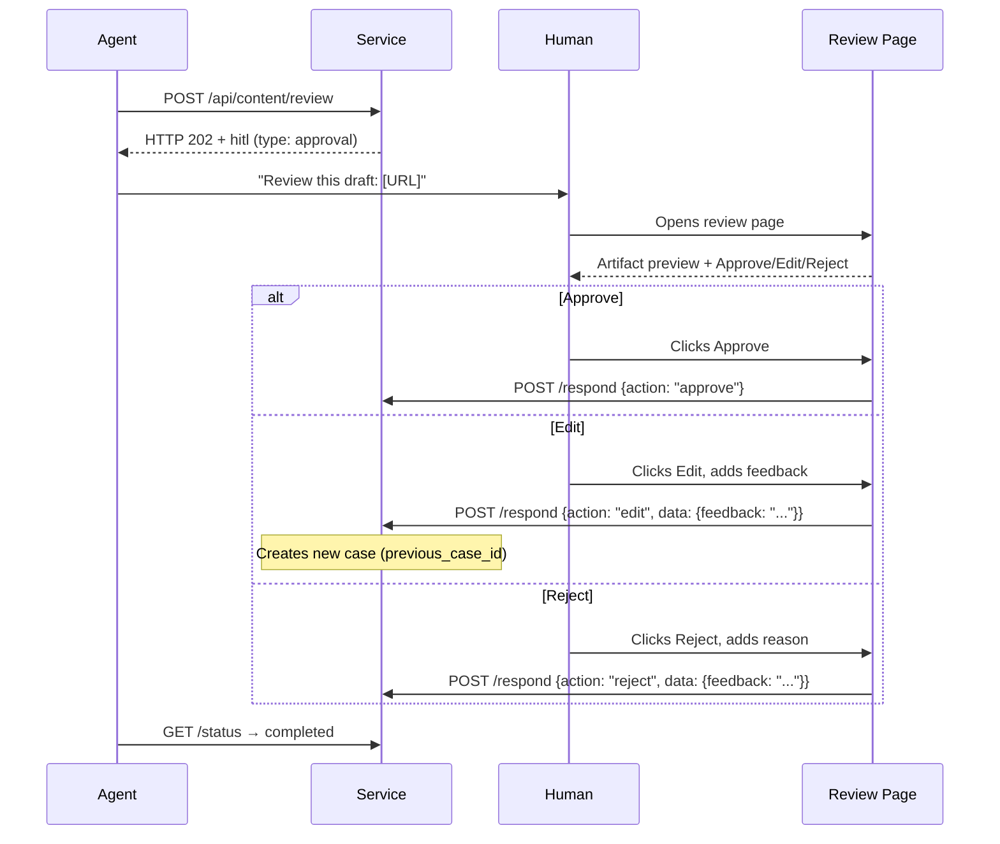
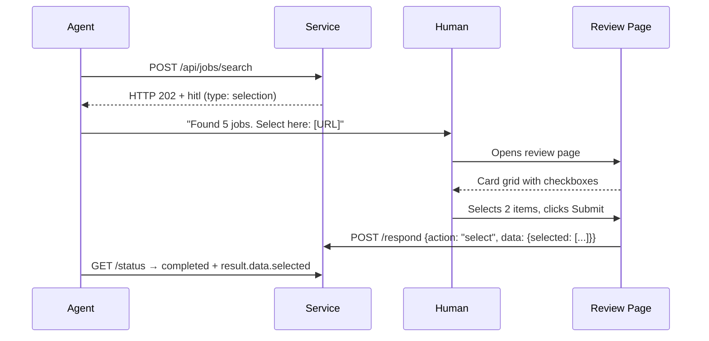
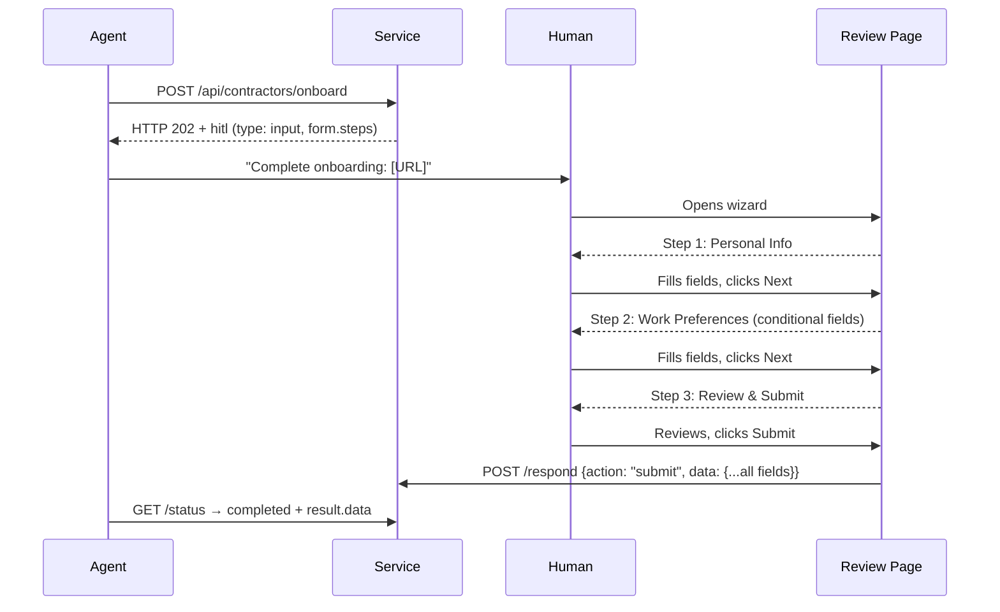
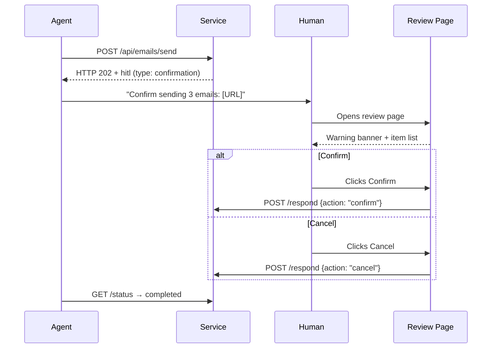
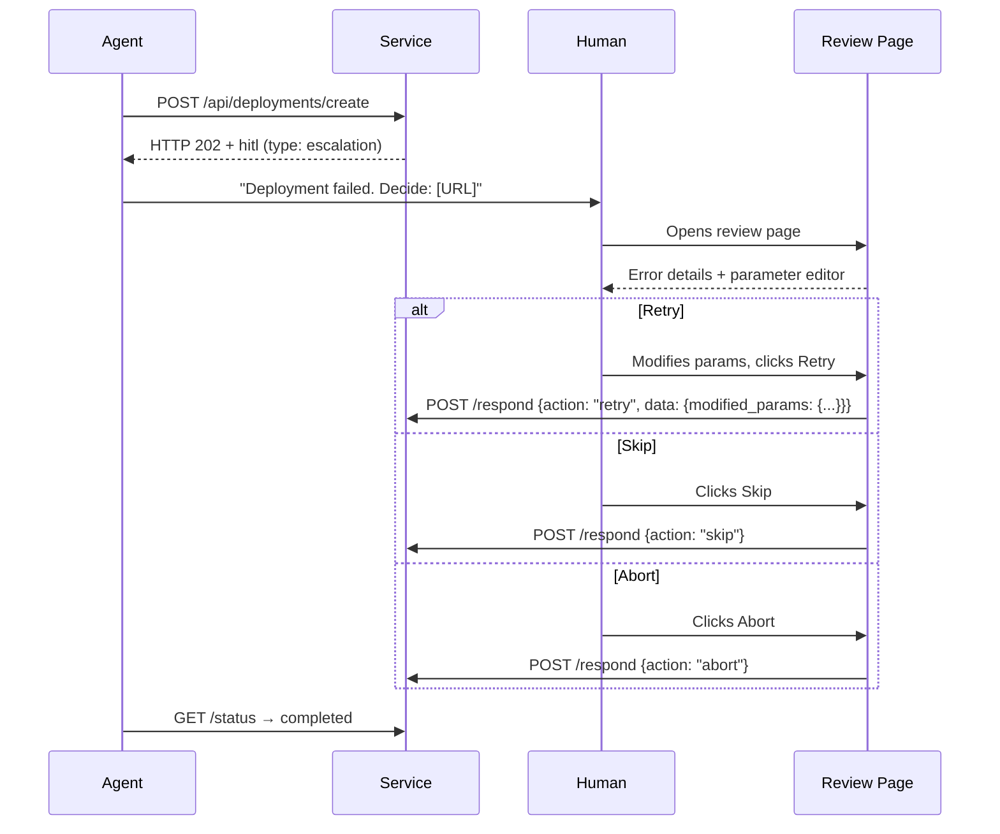

# HITL Protocol — Review Page Templates

Self-contained HTML templates for all five HITL review types. Built with [Pico CSS](https://picocss.com/) (semantic HTML, zero build, 10 KB gzipped).

## Templates

| Template | Review Type | Actions | Key UI Elements |
|----------|------------|---------|-----------------|
| [`approval.html`](approval.html) | Approval | approve, edit, reject | Artifact preview, feedback textarea |
| [`selection.html`](selection.html) | Selection | select | Card grid with checkboxes, counter |
| [`input.html`](input.html) | Input | submit | Dynamic form fields, multi-step wizard |
| [`confirmation.html`](confirmation.html) | Confirmation | confirm, cancel | Warning banner, item checklist |
| [`escalation.html`](escalation.html) | Escalation | retry, skip, abort | Error display, parameter editor |

## Features

- **WCAG 2.2 AA** — Labels, keyboard navigation, `aria-describedby` for errors, `role="alert"` for status
- **Dark Mode** — `prefers-color-scheme` auto-detect + manual toggle + `localStorage` persistence
- **Form Validation** — Validate on blur, `aria-invalid` + error messages, positive feedback
- **Mobile-first** — Pico CSS responsive grid, `min-width` breakpoints
- **View Transitions** — Progressive enhancement for multi-step wizard navigation
- **State Handling** — Active / Expired / Already-Responded banners, 409 duplicate detection
- **Self-contained** — Each template is a single HTML file, no build step required

## Template Variables

The server replaces these variables before serving the HTML:

| Variable | Type | Description |
|----------|------|-------------|
| `{{prompt}}` | string | Used in `<title>` and heading. HTML-escape before injection. |
| `{{hitl_data_json}}` | JSON | Injected into `<script type="application/json" id="hitl-data">`. Contains all review data. |

### `hitl_data_json` Structure

```json
{
  "case_id": "review_abc123",
  "prompt": "Select which jobs to apply for",
  "type": "selection",
  "status": "pending",
  "token": "K7xR2mN4pQ8sT1vW...",
  "respond_url": "/reviews/abc123/respond",
  "expires_at": "2026-02-23T10:00:00Z",
  "context": { }
}
```

The `status` field determines the template state:

| Status | Behavior |
|--------|----------|
| `pending`, `opened` | Show active review UI |
| `expired` | Show expired banner, hide form |
| `completed` | Show already-responded banner, hide form |

### Context by Review Type

**Approval** (`context.artifact`):
```json
{
  "artifact": {
    "title": "Blog Post Draft",
    "content": "Full text of the artifact...",
    "metadata": { "author": "AI Agent", "version": "1.2" }
  }
}
```

**Selection** (`context.items`):
```json
{
  "items": [
    { "id": "job_001", "title": "Senior Engineer", "description": "...", "metadata": {"location": "Berlin"} },
    { "id": "job_002", "title": "Tech Lead", "description": "..." }
  ]
}
```

**Input** (`context.form`):
```json
{
  "form": {
    "fields": [
      { "key": "salary", "label": "Expected Salary", "type": "number", "required": true }
    ]
  }
}
```

Multi-step wizard uses `form.steps` instead of `form.fields`:
```json
{
  "form": {
    "steps": [
      { "title": "Step 1", "fields": [...] },
      { "title": "Step 2", "fields": [...] },
      { "title": "Review", "fields": [] }
    ]
  }
}
```

**Confirmation** (`context.items`, `context.description`):
```json
{
  "description": "The following emails will be sent:",
  "items": [
    { "id": "email_1", "label": "Application to Company A" },
    { "id": "email_2", "label": "Application to Company B" }
  ]
}
```

**Escalation** (`context.error`, `context.params`):
```json
{
  "error": {
    "title": "Deployment Failed",
    "summary": "Memory limit exceeded during container startup",
    "details": "Error: OOMKilled — container used 2.1GB of 2GB limit"
  },
  "params": {
    "memory": "2GB",
    "replicas": "3"
  }
}
```

## Integration

### Express / Hono (string replacement)

```javascript
import { readFileSync } from 'fs';

const template = readFileSync('templates/selection.html', 'utf-8');

app.get('/review/:caseId', (req, res) => {
  const reviewCase = getCase(req.params.caseId);
  const hitlData = {
    case_id: reviewCase.case_id,
    prompt: reviewCase.prompt,
    type: reviewCase.type,
    status: reviewCase.status,
    token: req.query.token,
    respond_url: `/reviews/${reviewCase.case_id}/respond`,
    expires_at: reviewCase.expires_at,
    context: reviewCase.context
  };

  const html = template
    .replace('{{prompt}}', escapeHtml(reviewCase.prompt))
    .replace('{{hitl_data_json}}', JSON.stringify(hitlData));

  res.type('html').send(html);
});
```

### FastAPI (Jinja2)

```python
from fastapi.templating import Jinja2Templates

templates = Jinja2Templates(directory="templates")

@app.get("/review/{case_id}")
async def review_page(case_id: str, token: str, request: Request):
    case = get_case(case_id)
    return templates.TemplateResponse("selection.html", {
        "request": request,
        "prompt": case.prompt,
        "hitl_data_json": json.dumps({...})
    })
```

> **Note:** For Jinja2, replace `{{var}}` syntax with `{{ var }}` (spaces) or configure a custom delimiter.

### Next.js (Server Components)

Next.js reference implementations use `.tsx` Server Components instead of HTML templates. The data is passed as props, not template variables. See `implementations/reference-service/nextjs/`.

## Supported Field Types

| Type | HTML Element | Validation |
|------|-------------|------------|
| `text` | `<input type="text">` | minLength, maxLength, pattern |
| `textarea` | `<textarea>` | minLength, maxLength |
| `number` | `<input type="number">` | min, max |
| `date` | `<input type="date">` | — |
| `email` | `<input type="email">` | Built-in email validation |
| `url` | `<input type="url">` | Built-in URL validation |
| `boolean` | `<input type="checkbox" role="switch">` | — |
| `select` | `<select>` | required |
| `multiselect` | Checkbox group (pills) | At least one selected |
| `range` | `<input type="range">` + `<output>` | min, max |

## Review Type Flows

### Approval Flow



### Selection Flow



### Input Flow (Multi-Step)



### Confirmation Flow



### Escalation Flow



## Customization

### Theme Colors

Override Pico CSS variables to match your brand:

```html
<style>
  :root {
    --pico-primary: #0969da;
    --pico-primary-hover: #0550ae;
  }
</style>
```

### Adding a Logo

Add to the `<header>` nav:

```html
<ul><li> <strong>Review</strong></li></ul>
```

### Custom CSS

All templates use BEM-like classes prefixed with `hitl-` for easy targeting without conflicts.
