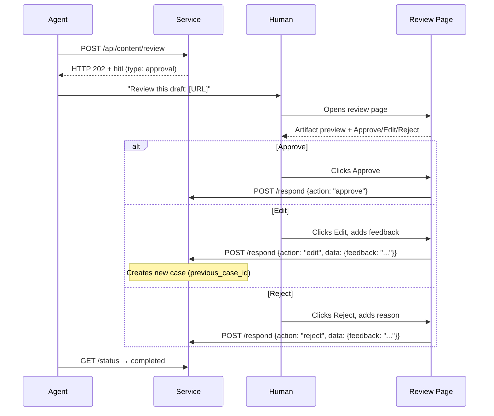
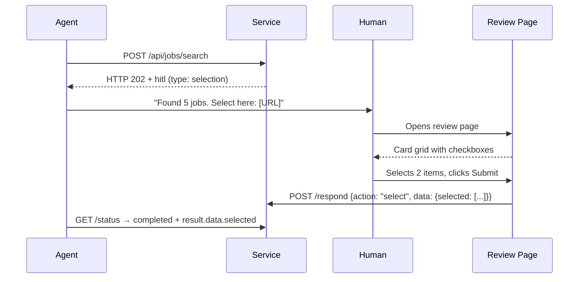
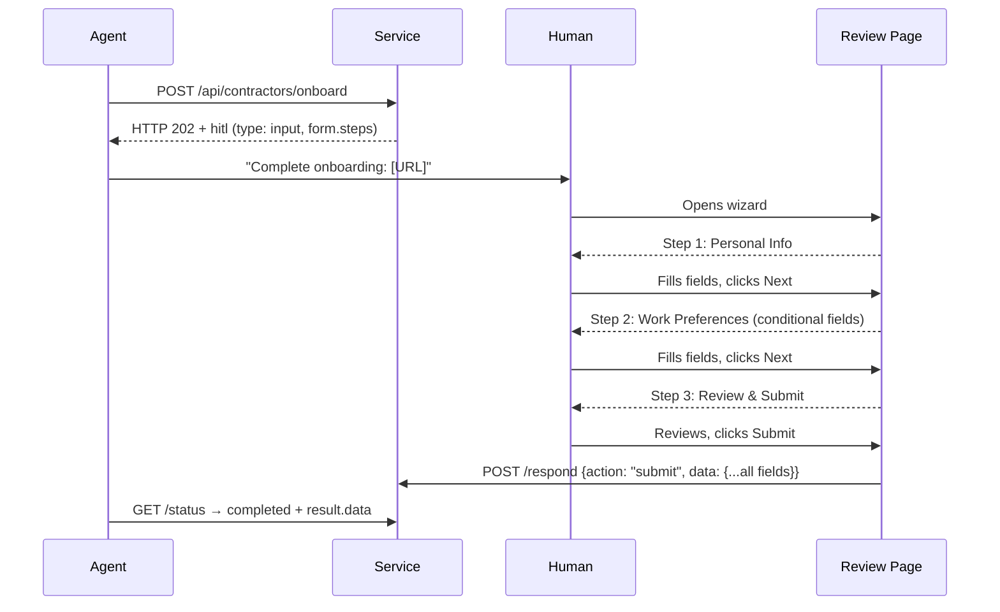
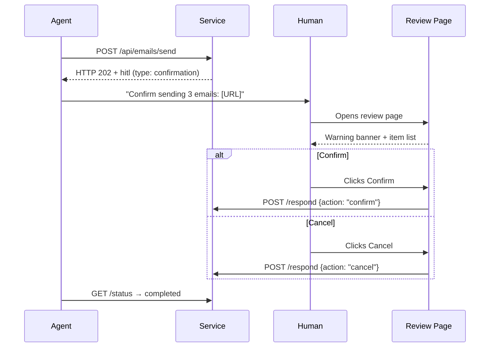
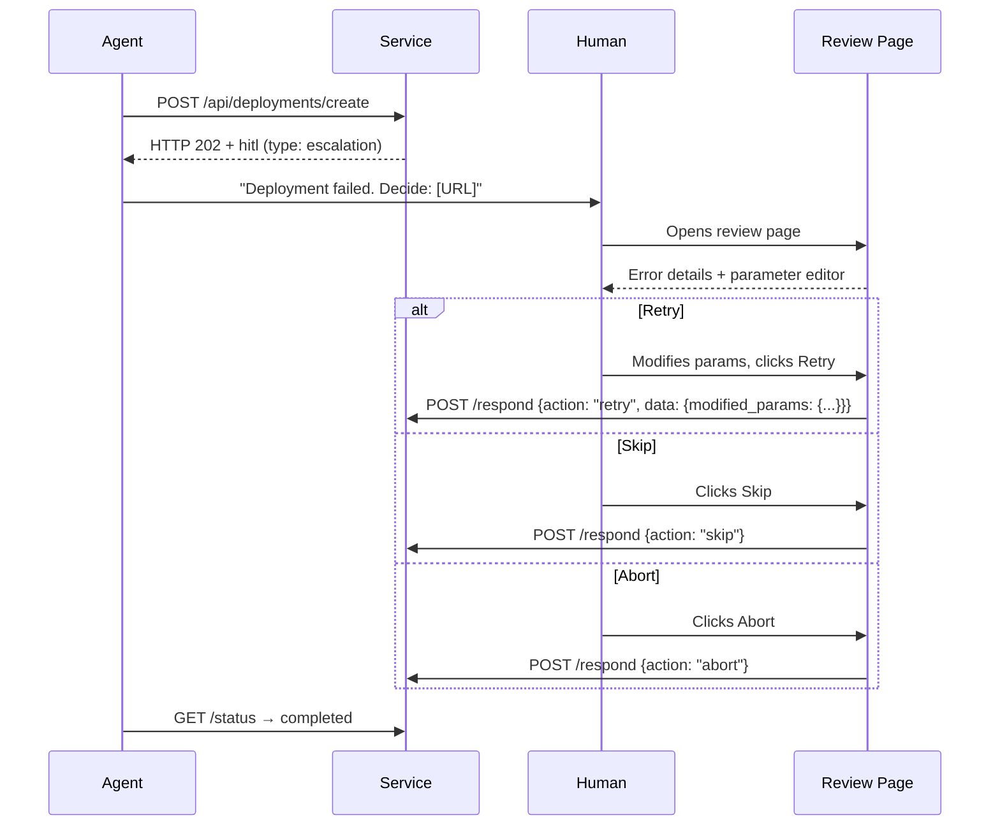

# HITL Protocol — Review Page Templates

Self-contained HTML templates for all five HITL review types. Built with [Pico CSS](https://picocss.com/) (semantic HTML, zero build, 10 KB gzipped).

## Templates

| Template | Review Type | Actions | Key UI Elements |
|----------|------------|---------|-----------------|
| [`approval.html`](approval.html) | Approval | approve, edit, reject | Artifact preview, feedback textarea |
| [`selection.html`](selection.html) | Selection | select | Card grid with checkboxes, counter |
| [`input.html`](input.html) | Input | submit | Dynamic form fields, multi-step wizard |
| [`confirmation.html`](confirmation.html) | Confirmation | confirm, cancel | Warning banner, item checklist |
| [`escalation.html`](escalation.html) | Escalation | retry, skip, abort | Error display, parameter editor |

## Features

- **Accessibility target: WCAG 2.2 AA** — Labels, keyboard navigation, error descriptions and status semantics are included; conformance requires browser and manual testing in the consuming application.
- **Dark Mode** — `prefers-color-scheme` auto-detect + manual toggle + `localStorage` persistence
- **Form Validation** — Validate on blur, `aria-invalid` + error messages, positive feedback
- **Mobile-first** — Pico CSS responsive grid, `min-width` breakpoints
- **View Transitions** — Progressive enhancement for multi-step wizard navigation
- **State Handling** — Active / Expired / Already-Responded banners, 409 duplicate detection
- **Self-contained** — Each template is a single HTML file, no build step required

## Template Variables

The server replaces these variables before serving the HTML:

| Variable | Type | Description |
|----------|------|-------------|
| `{{prompt}}` | string | Used in `<title>` and heading. HTML-escape before injection. |
| `{{hitl_data_json}}` | JSON | Injected into `<script type="application/json" id="hitl-data">`. Contains review data. Serialize with `serializeReviewData` from `@hitl-protocol/core`, which encodes `<` as a JSON Unicode escape to prevent script-data breakouts. |

### `hitl_data_json` Structure

```json
{
  "case_id": "review_abc123",
  "prompt": "Select which jobs to apply for",
  "type": "selection",
  "status": "pending",
  "token": "K7xR2mN4pQ8sT1vW...",
  "respond_url": "/reviews/abc123/respond",
  "expires_at": "2026-02-23T10:00:00Z",
  "context": { }
}
```

The `status` field determines the template state:

| Status | Behavior |
|--------|----------|
| `pending`, `opened`, `in_progress` | Show active review UI |
| `expired` | Show expired banner, hide form |
| `completed` | Show already-responded banner, hide form |
| `cancelled` | Show cancellation message, hide form |

These local v0.8 templates do not fetch `default_ref` values. The `sensitive` flag currently adds a CSS class rather than masking the value; consumers must implement the required privacy controls before using sensitive fields. Wizard and accessibility behavior need browser verification in the consuming application.

### Context by Review Type

**Approval** (`context.artifact`):
```json
{
  "artifact": {
    "title": "Blog Post Draft",
    "content": "Full text of the artifact...",
    "metadata": { "author": "AI Agent", "version": "1.2" }
  }
}
```

**Selection** (`context.items`):
```json
{
  "items": [
    { "id": "job_001", "title": "Senior Engineer", "description": "...", "metadata": {"location": "Berlin"} },
    { "id": "job_002", "title": "Tech Lead", "description": "..." }
  ]
}
```

**Input** (`context.form`):
```json
{
  "form": {
    "fields": [
      { "key": "salary", "label": "Expected Salary", "type": "number", "required": true }
    ]
  }
}
```

Multi-step wizard uses `form.steps` instead of `form.fields`:
```json
{
  "form": {
    "steps": [
      { "title": "Step 1", "fields": [...] },
      { "title": "Step 2", "fields": [...] },
      { "title": "Review", "fields": [] }
    ]
  }
}
```

**Confirmation** (`context.items`, `context.description`):
```json
{
  "description": "The following emails will be sent:",
  "items": [
    { "id": "email_1", "label": "Application to Company A" },
    { "id": "email_2", "label": "Application to Company B" }
  ]
}
```

**Escalation** (`context.error`, `context.params`):
```json
{
  "error": {
    "title": "Deployment Failed",
    "summary": "Memory limit exceeded during container startup",
    "details": "Error: OOMKilled — container used 2.1GB of 2GB limit"
  },
  "params": {
    "memory": "2GB",
    "replicas": "3"
  }
}
```

## Integration

### Express / Hono (string replacement)

```javascript
import { readFileSync } from 'fs';
import { verifyTokenForPurpose, expireCase, serializeReviewData } from '@hitl-protocol/core';

const template = readFileSync('templates/selection.html', 'utf-8');

app.get('/review/:caseId', (req, res) => {
  const reviewCase = getCase(req.params.caseId);
  const token = req.query.token;
  if (!reviewCase || typeof token !== 'string' || !verifyTokenForPurpose(token, reviewCase, 'review')) {
    return res.status(404).end();
  }
  // Apply any additional reviewer authorization before exposing case data.
  expireCase(reviewCase);
  const hitlData = {
    case_id: reviewCase.case_id,
    prompt: reviewCase.prompt,
    type: reviewCase.type,
    status: reviewCase.status,
    token,
    respond_url: `/reviews/${reviewCase.case_id}/respond`,
    expires_at: reviewCase.expires_at,
    context: reviewCase.context
  };

  const safePrompt = reviewCase.prompt.replace(/&/g, '&amp;').replace(/</g, '&lt;').replace(/>/g, '&gt;');
  const safeData = serializeReviewData(hitlData);
  const html = template.replace(/\{\{(?:prompt|hitl_data_json)\}\}/g,
    (placeholder) => placeholder === '{{prompt}}' ? safePrompt : safeData);

  res.set('Cache-Control', 'no-store').type('html').send(html);
});
```

The replacement runs once over the original template: text containing replacement metacharacters or literal template placeholders stays data. JSON inside a script element must escape `<`, including when the element has `type="application/json"`.

### FastAPI

The [FastAPI renderer](../implementations/reference-service/python/server.py) verifies the review token, HTML-escapes the prompt, serializes JSON with `<` escaped as `\u003c`, and substitutes placeholders with a single callback pass. When adapting to Jinja2, use its JSON-aware [`tojson` filter](https://jinja.palletsprojects.com/en/stable/templates/#jinja-filters.tojson) for script data; raw JSON and generic HTML escaping are not interchangeable in that context.

### Next.js (Server Components)

The [Next.js local demo](../implementations/reference-service/nextjs/app/review/[caseId]/page.tsx) reads the same HTML templates in a Server Component and applies the same escaped, single-pass substitution before rendering. It requires Node filesystem access and a full browser load of the review URL; consumers replacing this with React components must implement and verify their own interactive controls.

## Supported Field Types

| Type | HTML Element | Validation |
|------|-------------|------------|
| `text` | `<input type="text">` | minLength, maxLength, pattern |
| `textarea` | `<textarea>` | minLength, maxLength |
| `number` | `<input type="number">` | min, max |
| `date` | `<input type="date">` | — |
| `email` | `<input type="email">` | Built-in email validation |
| `url` | `<input type="url">` | Built-in URL validation |
| `boolean` | `<input type="checkbox" role="switch">` | — |
| `select` | `<select>` | required |
| `multiselect` | Checkbox group (pills) | At least one selected |
| `range` | `<input type="range">` + `<output>` | min, max |

## Review Type Flows

### Approval Flow


```mermaid
sequenceDiagram
    participant A as Agent
    participant S as Service
    participant H as Human
    participant R as Review Page

    A->>S: POST /api/content/review
    S-->>A: HTTP 202 + hitl (type: approval)
    A->>H: "Review this draft: [URL]"
    H->>R: Opens review page
    R-->>H: Artifact preview + Approve/Edit/Reject
    alt Approve
        H->>R: Clicks Approve
        R->>S: POST /respond {action: "approve"}
    else Edit
        H->>R: Clicks Edit, adds feedback
        R->>S: POST /respond {action: "edit", data: {feedback: "..."}}
        Note over S: Creates new case (previous_case_id)
    else Reject
        H->>R: Clicks Reject, adds reason
        R->>S: POST /respond {action: "reject", data: {feedback: "..."}}
    end
    A->>S: GET /status → completed
```

### Selection Flow


```mermaid
sequenceDiagram
    participant A as Agent
    participant S as Service
    participant H as Human
    participant R as Review Page

    A->>S: POST /api/jobs/search
    S-->>A: HTTP 202 + hitl (type: selection)
    A->>H: "Found 5 jobs. Select here: [URL]"
    H->>R: Opens review page
    R-->>H: Card grid with checkboxes
    H->>R: Selects 2 items, clicks Submit
    R->>S: POST /respond {action: "select", data: {selected: [...]}}
    A->>S: GET /status → completed + result.data.selected
```

### Input Flow (Multi-Step)


```mermaid
sequenceDiagram
    participant A as Agent
    participant S as Service
    participant H as Human
    participant R as Review Page

    A->>S: POST /api/contractors/onboard
    S-->>A: HTTP 202 + hitl (type: input, form.steps)
    A->>H: "Complete onboarding: [URL]"
    H->>R: Opens wizard
    R-->>H: Step 1: Personal Info
    H->>R: Fills fields, clicks Next
    R-->>H: Step 2: Work Preferences (conditional fields)
    H->>R: Fills fields, clicks Next
    R-->>H: Step 3: Review & Submit
    H->>R: Reviews, clicks Submit
    R->>S: POST /respond {action: "submit", data: {...all fields}}
    A->>S: GET /status → completed + result.data
```

### Confirmation Flow


```mermaid
sequenceDiagram
    participant A as Agent
    participant S as Service
    participant H as Human
    participant R as Review Page

    A->>S: POST /api/emails/send
    S-->>A: HTTP 202 + hitl (type: confirmation)
    A->>H: "Confirm sending 3 emails: [URL]"
    H->>R: Opens review page
    R-->>H: Warning banner + item list
    alt Confirm
        H->>R: Clicks Confirm
        R->>S: POST /respond {action: "confirm"}
    else Cancel
        H->>R: Clicks Cancel
        R->>S: POST /respond {action: "cancel"}
    end
    A->>S: GET /status → completed
```

### Escalation Flow


```mermaid
sequenceDiagram
    participant A as Agent
    participant S as Service
    participant H as Human
    participant R as Review Page

    A->>S: POST /api/deployments/create
    S-->>A: HTTP 202 + hitl (type: escalation)
    A->>H: "Deployment failed. Decide: [URL]"
    H->>R: Opens review page
    R-->>H: Error details + parameter editor
    alt Retry
        H->>R: Modifies params, clicks Retry
        R->>S: POST /respond {action: "retry", data: {modified_params: {...}}}
    else Skip
        H->>R: Clicks Skip
        R->>S: POST /respond {action: "skip"}
    else Abort
        H->>R: Clicks Abort
        R->>S: POST /respond {action: "abort"}
    end
    A->>S: GET /status → completed
```

## Customization

### Theme Colors

Override Pico CSS variables to match your brand:

```html
<style>
  :root {
    --pico-primary: #0969da;
    --pico-primary-hover: #0550ae;
  }
</style>
```

### Adding a Logo

Add to the `<header>` nav:

```html
<ul><li> <strong>Review</strong></li></ul>
```

### Custom CSS

All templates use BEM-like classes prefixed with `hitl-` for easy targeting without conflicts.
